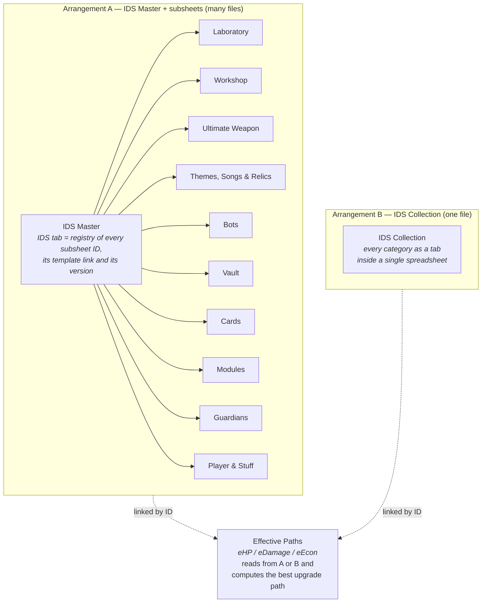

# The Tower — App Script

Google Apps Script project that powers the data tooling for the community
spreadsheets ("IDS Sheets™") of the mobile game **The Tower**.

It ships as **one Apps Script project with two faces**:

- a **Google Sheets add-on** (menu `Import Data` inside a sheet), and
- a **standalone web app** (`doGet`, executed as the accessing user).

Both faces serve the same three workflows and call the same server functions.

---

## Table of contents

- [What the project does](#what-the-project-does)
- [The domain model](#the-domain-model)
- [The three workflows](#the-three-workflows)
- [Repository layout](#repository-layout)
- [How it is put together](#how-it-is-put-together)
- [Authorization model](#authorization-model)
- [Development & deployment](#development--deployment)
- [Documentation](#documentation)

---

## What the project does

Players track their game progress in a family of Google Sheets. Those sheets get
new template versions regularly. Three problems follow:

| Problem | Workflow |
| --- | --- |
| "I'm new — how do I get these sheets?" | **Get Started** — copies every template into a `The Tower` Drive folder and cross-links their IDs. |
| "A new sheet version is out — I don't want to retype everything." | **Update Sheet** — copies the new template, migrates the old data into it, then renames/moves the new file and trashes the old one. |
| "Typing hundreds of levels by hand is miserable." | **Import Data From Game** — parses the game's `playerInfo.dat` save file and writes the values straight into the sheets. |

---

## The domain model

Users store their data in one of two mutually-substitutable arrangements, plus a
calculation sheet that consumes either:



The app can convert between the two arrangements in either direction
(`Convert to IDS Master` / `Convert to IDS Collection`).

Each sheet type is handled by one module in `src/`, listed in
[05 — Sheet modules reference](documentation/05-sheet-modules.md).

---

## The three workflows

| | Get Started | Update Sheet | Import Data From Game |
| --- | --- | --- | --- |
| Menu item | `Get Started` | `Update Sheet` | `Import Data From Game (playerInfo.dat)` |
| Server entry | `showGetStartedDialog` | `showUpdateDialog` | `openSaveFileDialog` |
| Web-app entry | `?page=getstarted` | *(default)* | `?page=savefile` |
| Add-on view | modal dialog | sidebar | modal dialog |
| Page | `20_getStartedApp.html` | `20_WebApp.html` | `20_SavedFileApp.html` |
| Detailed doc | [02](documentation/02-workflow-get-started.md) | [03](documentation/03-workflow-update-sheets.md) | [04](documentation/04-workflow-save-file-import.md) |

---

## Repository layout

```
.
├── src/                      # everything clasp pushes to Apps Script
│   ├── appsscript.json       # manifest: scopes, advanced services, webapp config
│   ├── 00_Errors.js          # error codes, logging, the failure envelope
│   ├── 00_Version.js         # the release constant and the update pointers
│   ├── 01_Main.js            # entry points: doGet, menu, dialogs, exportData/importData
│   ├── 02_Shared.js          # CacheManager, SheetsAPI, shared helpers, file/ID plumbing
│   ├── 02_SavedFile.js       # save-file header maps + gzip/NRBF binary parser
│   ├── 03..17_*.js           # one module per sheet type
│   ├── 20_*.html             # the three app shells (templated)
│   ├── 21..28_*.html         # UI fragments: *_section / *_styles / *_scripts
│   └── 29_addon_consent_dialog.html
├── documentation/            # the documentation set
├── docs/                     # save-format reference JSON (git-ignored, local only)
├── .github/
│   ├── workflows/deploy-apps-script.yml
│   ├── workflows/test-run-function.yml
│   ├── scripts/compare-src.js
│   └── scripts/run-function.js
├── .clasp.dev.json           # sandbox script ID
├── .clasp.prod.json          # production script ID
├── archive-deployments.ps1   # bulk-archive old deployments
├── bump.js                   # version bumper for src/00_Version.js
└── package.json
```

### The numbering convention

Apps Script has a flat file namespace; the numeric prefixes are the project's
only structure, for a reader rather than the runtime:

| Prefix | Layer |
| --- | --- |
| `00` | Error handling and versioning |
| `01`–`02` | Entry points and shared infrastructure |
| `03`–`17` | One file per sheet type |
| `20` | HTML shells — a full page per workflow |
| `21`–`28` | UI fragments, in triples: `_section` (markup), `_styles` (CSS), `_scripts` (JS) |
| `29` | Standalone add-on consent dialog |

---

## How it is put together

The client is the orchestrator. It decides which sheets to copy, which to
export, which to import, and in what order; the server is a collection of
stateless single-purpose functions reached through `google.script.run`. Nothing
throws across that boundary — every server function returns a success flag, and
a failure carries a code the client acts on.

Every sheet module implements the same contract, so migrating a sheet and
importing a save file converge on one intermediate representation and share a
single importer.

| Where to look | For |
| --- | --- |
| [01 — Architecture](documentation/01-architecture.md) | Caching, the Sheets and Drive wrappers, how the app finds anything inside a spreadsheet, version comparison, file moving and renaming |
| [05 — Sheet modules](documentation/05-sheet-modules.md) | The module contract and what each sheet type moves |
| [06 — Frontend](documentation/06-frontend.md) | Page assembly, client state, the picker and consent plumbing |
| [08 — Error handling](documentation/08-error-handling.md) | The failure envelope, error codes and Cloud Logging |

---

## Authorization model

`src/appsscript.json` requests these scopes:

| Scope | Purpose |
| --- | --- |
| `openid`, `userinfo.email` | Identify the user. |
| `drive.file` | **Per-file** Drive access — the app can only touch files the user explicitly hands it. |
| `spreadsheets.currentonly` | The active spreadsheet when running as an add-on. |
| `script.container.ui` | Menus, sidebars, modal dialogs. |

Under `drive.file` the app cannot read a sheet just because it knows its ID: the
user must select it in the **Google Picker**, which grants access to that
specific file. That is the "check access → open picker → re-check access →
continue" cycle in every workflow — see
[06 ▸ The access-grant cycle](documentation/06-frontend.md#the-access-grant-cycle).

Two script properties must be set on the Apps Script project for the Picker to
work: **`API_KEY`** and **`APP_ID`**.

---

## Development & deployment

```bash
npm install
clasp login          # with an account that owns both script projects
```

`npm run sandbox` pushes to the dev script; `npm run dev` pushes to production
HEAD, which is where a change is tested. Merging to `main` triggers CI, which
refuses to deploy unless production HEAD is exactly the code being merged — so
`npm run dev` is the act of testing, and CI only blesses what was actually
tested.

Full setup, versioning, the CI guard and the add-on release process:
[07 — Deployment & operations](documentation/07-deployment.md).

---

## Documentation

[documentation/](documentation/README.md) — one document per area, with an index
of common tasks and where to look for each.
