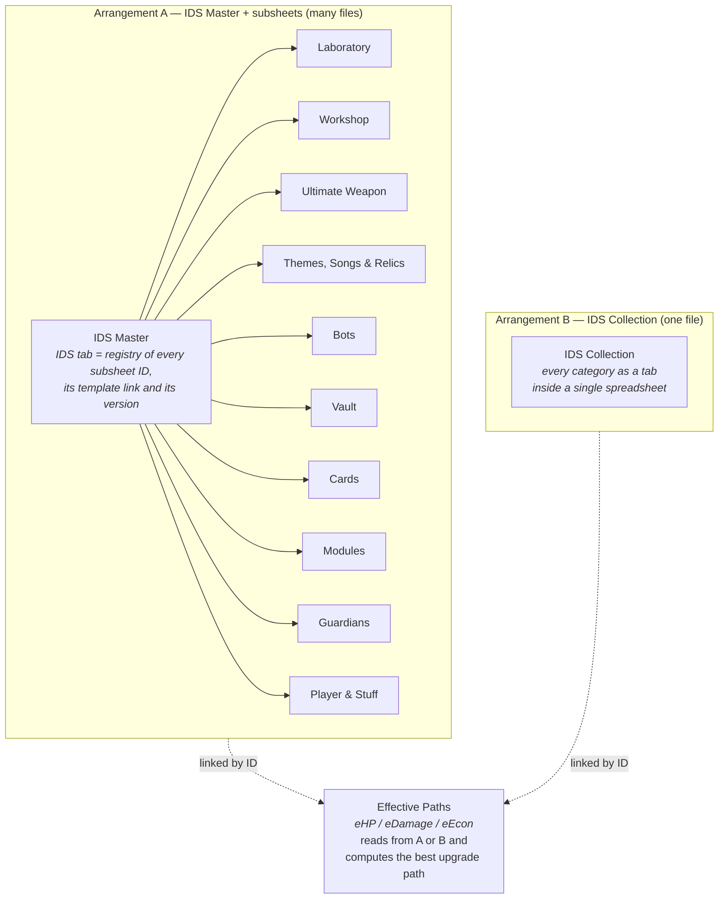
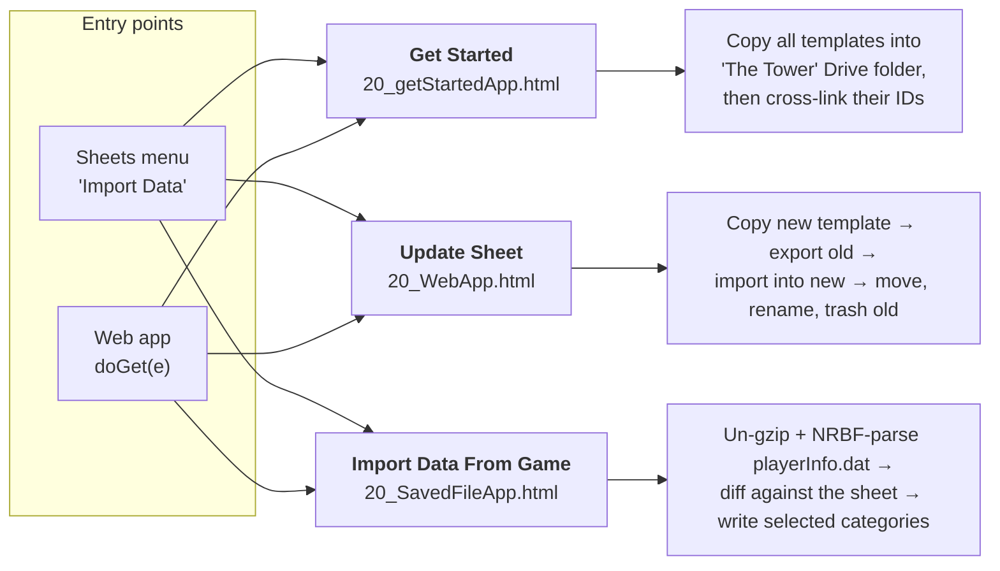
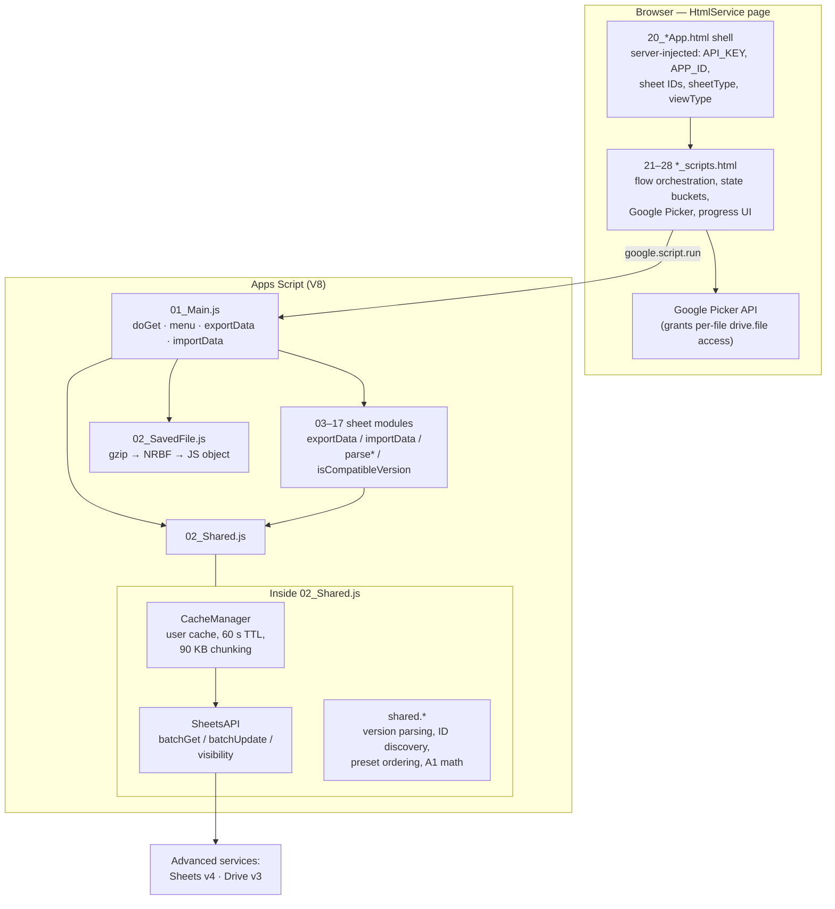
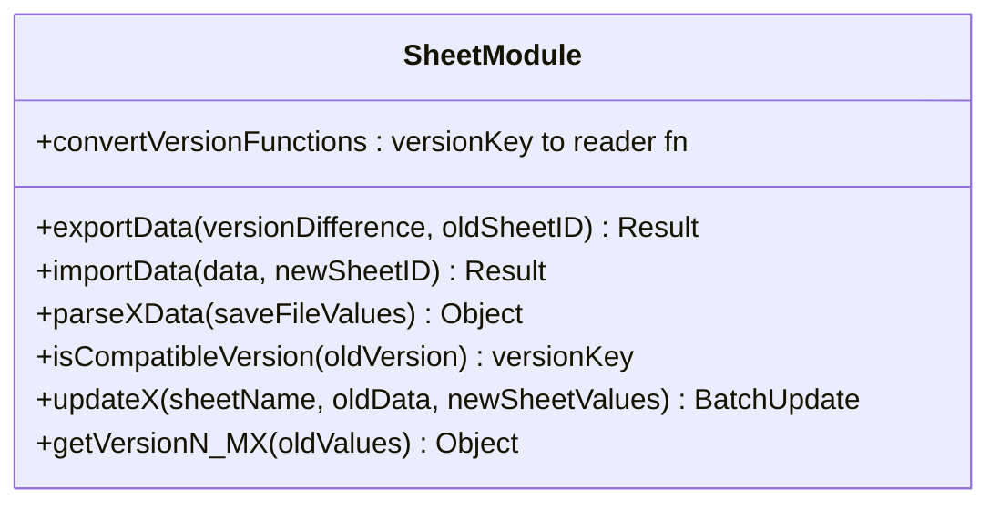
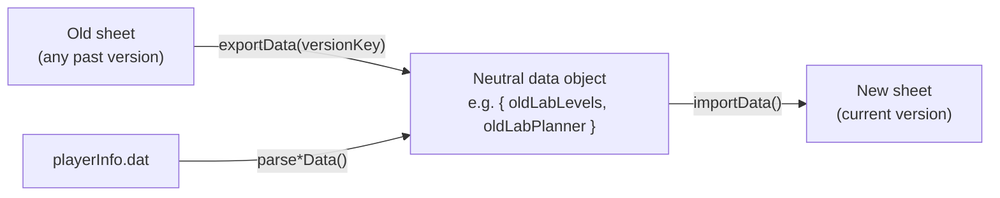
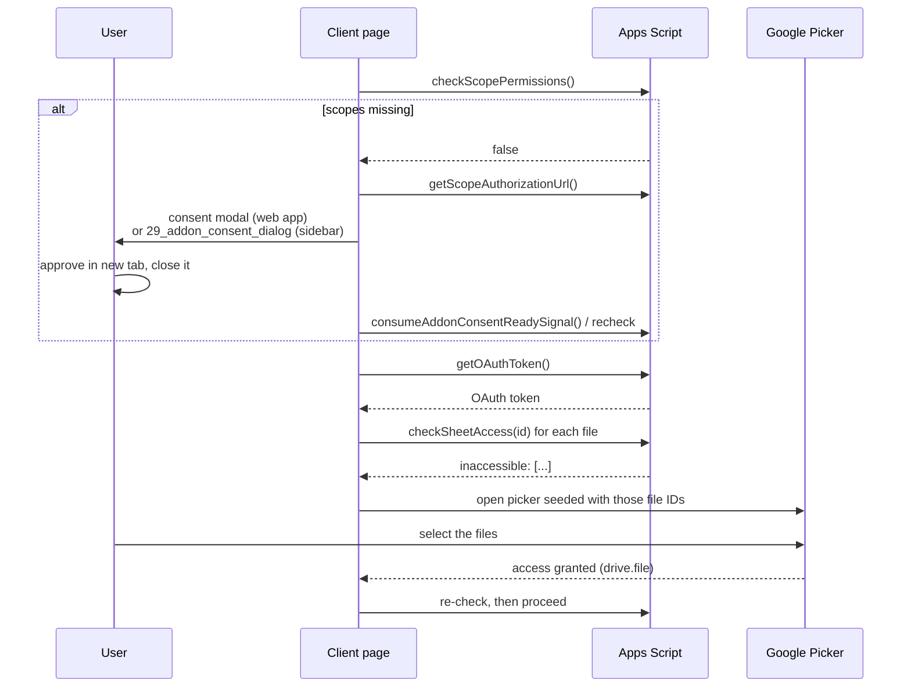
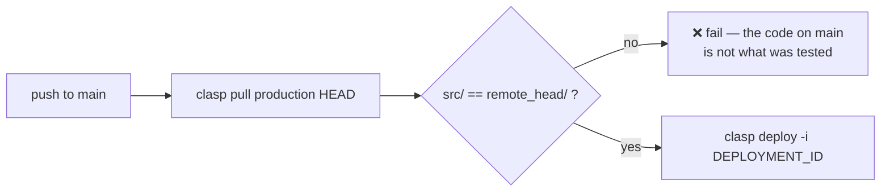

# The Tower — App Script

Google Apps Script project that powers the data tooling for the community
spreadsheets ("IDS Sheets™") of the mobile game **The Tower**.

It ships as **one Apps Script project with two faces**:

- a **Google Sheets add-on** (menu `Import Data` inside a sheet), and
- a **standalone web app** (`doGet`, executed as the accessing user).

Both faces serve the same three workflows and call the same server functions.

---

## Table of contents

- [What the project actually does](#what-the-project-actually-does)
- [The domain model](#the-domain-model)
- [The three workflows](#the-three-workflows)
- [Repository layout](#repository-layout)
- [Architecture](#architecture)
- [The sheet-module contract](#the-sheet-module-contract)
- [Version compatibility matrix](#version-compatibility-matrix)
- [Authorization model](#authorization-model)
- [Development & deployment](#development--deployment)
- [Deeper documentation](#deeper-documentation)

---

## What the project actually does

Players track their game progress in a family of Google Sheets. Those sheets get
new template versions regularly. Three problems follow, and this project solves
all three:

| Problem | Workflow |
| --- | --- |
| "I'm new — how do I get these sheets?" | **Get Started** — copies every template into a `The Tower` Drive folder and cross-links their IDs. |
| "A new sheet version is out — I don't want to retype everything." | **Update Sheet** — copies the new template, migrates the old data into it, then renames/moves the new file and trashes the old one. |
| "Typing hundreds of levels by hand is miserable." | **Import Data From Game** — parses the game's `playerInfo.dat` save file and writes the values straight into the sheets. |

---

## The domain model

Users store their data in one of two mutually-substitutable arrangements, plus a
calculation sheet that consumes either:



The app can convert between the two arrangements in either direction
(`Convert to IDS Master` / `Convert to IDS Collection`).

### Sheet types

`sheetVars()` in [src/01_Main.js](src/01_Main.js#L1-L19) is the single registry
mapping a sheet type name to the module that knows how to read and write it:

| Sheet type | Module | Source |
| --- | --- | --- |
| `Laboratory` | `lab` | [03_Laboratory.js](src/03_Laboratory.js) |
| `Workshop` | `workshop` | [04_Workshop.js](src/04_Workshop.js) |
| `Ultimate Weapon` | `ultimate` | [05_Ultimate_Weapons.js](src/05_Ultimate_Weapons.js) |
| `Themes, Songs & Relics` | `themesAndRelics` | [06_Themes_Songs_Relics.js](src/06_Themes_Songs_Relics.js) |
| `Themes & Songs` *(legacy, pre-v4.0)* | `themes` | [17_Themes_&_Songs.js](src/17_Themes_&_Songs.js) |
| `Relics` *(legacy, pre-v4.0)* | `relics` | [17_Relics.js](src/17_Relics.js) |
| `Bots` | `bots` | [07_Bots.js](src/07_Bots.js) |
| `Vault` | `vault` | [09_Vault.js](src/09_Vault.js) |
| `Cards` | `cards` | [10_Cards.js](src/10_Cards.js) |
| `Modules` | `modules` | [11_Modules.js](src/11_Modules.js) |
| `Guardians` | `guardians` | [12_Guardians.js](src/12_Guardians.js) |
| `Player & Stuff` | `playerStuff` | [13_Player_&_Stuff.js](src/13_Player_&_Stuff.js) |
| `IDS Collection` | `collection` | [14_IDS_Collection.js](src/14_IDS_Collection.js) |
| `IDS Master` | `master` | [15_IDS_Master.js](src/15_IDS_Master.js) |
| `Effective Paths` | `ePaths` | [16_ePaths.js](src/16_ePaths.js) |

---

## The three workflows



| | Get Started | Update Sheet | Import Data From Game |
| --- | --- | --- | --- |
| Menu item | `Get Started` | `Update Sheet` | `Import Data From Game (playerInfo.dat)` |
| Server entry | `showGetStartedDialog` | `showUpdateDialog` | `openSaveFileDialog` |
| Web-app entry | `?page=getstarted` | *(default)* | `?page=savefile` |
| Add-on view | modal dialog (1200×700) | sidebar | modal dialog (sized to screen) |
| Detailed doc | [Get Started](documentation/02-workflow-get-started.md) | [Update Sheets](documentation/03-workflow-update-sheets.md) | [Save-File Import](documentation/04-workflow-save-file-import.md) |

---

## Repository layout

```
.
├── src/                      # everything clasp pushes to Apps Script
│   ├── appsscript.json       # manifest: scopes, advanced services, webapp config
│   ├── 01_Main.js            # entry points: doGet, menu, dialogs, exportData/importData
│   ├── 02_Shared.js          # CacheManager, SheetsAPI, shared helpers, file/ID plumbing
│   ├── 02_SavedFile.js       # save-file header maps + gzip/NRBF binary parser
│   ├── 03..17_*.js           # one module per sheet type (see registry above)
│   ├── 20_*.html             # the three app shells (templated)
│   ├── 21..28_*.html         # UI fragments: *_section / *_styles / *_scripts
│   └── 29_addon_consent_dialog.html
├── documentation/            # this documentation set
├── docs/                     # save-format reference JSON (git-ignored, local only)
├── .github/
│   ├── workflows/deploy-apps-script.yml
│   └── scripts/compare-src.js
├── .clasp.dev.json           # sandbox script ID
├── .clasp.prod.json          # production script ID
├── archive-deployments.ps1   # bulk-archive old deployments
└── package.json
```

### The numbering convention

Apps Script has a flat file namespace, so the numeric prefixes are the project's
only structure. They are load-bearing for a reader, not for the runtime:

| Prefix | Layer |
| --- | --- |
| `01`–`02` | Entry points and shared infrastructure |
| `03`–`17` | One file per sheet type |
| `20` | HTML shells — a full page per workflow |
| `21`–`28` | UI fragments, in triples: `_section` (markup), `_styles` (CSS), `_scripts` (JS) |
| `29` | Standalone add-on consent dialog |

HTML fragments are stitched together at render time by `include()`
([01_Main.js](src/01_Main.js#L131-L133)), which is called from the shells via
Apps Script's `<?!= ... ?>` templating.

---

## Architecture



Three rules describe most of the backend:

1. **Everything goes through `SheetsAPI`, never `SpreadsheetApp`.** Reads are
   `Values.batchGet` (values *or* formulas); writes are accumulated into one
   `batchUpdate` array per import and flushed once.
2. **Everything is cached per user for 60 seconds.** `CacheManager` memoises
   spreadsheet metadata, range values and range formulas, transparently chunking
   anything over 90 000 bytes across multiple cache keys. A chunked entry with a
   missing chunk reads as a *miss*, never as a partial value.
3. **Every server function returns `{ success, message, ... }`.** Nothing
   throws across the `google.script.run` boundary; the client branches on
   `success` and surfaces `message` verbatim.

The client is deliberately the orchestrator: it decides which sheets to copy,
which to export, which to import, and in what order — the server stays a
collection of stateless single-purpose calls. See
[Architecture](documentation/01-architecture.md) for the full picture.

---

## The sheet-module contract

Every module in `03`–`17` implements the same five members. This is what makes
`exportData` / `importData` in [01_Main.js](src/01_Main.js) type-agnostic:



| Member | Responsibility |
| --- | --- |
| `convertVersionFunctions` | Getter returning `{ "v2.1": fn, "v3.0": fn, … }` — one reader per template generation. |
| `isCompatibleVersion(v)` | Picks the newest converter key that is `<=` the sheet's current version. Returns `null` when the sheet predates every converter. |
| `exportData(key, id)` | Runs the converter for `key`, producing a version-neutral plain object. |
| `importData(data, id)` | Reads the *new* sheet's layout, maps the neutral object onto it, and flushes one `batchUpdate`. |
| `parse*Data(values)` | Turns raw save-file fields into the **same** neutral object shape `importData` expects. |

That last row is the key design decision: the save-file importer and the
sheet-to-sheet migrator converge on one intermediate representation, so
`importData` is written once and serves both workflows.



---

## Version compatibility matrix

Each key is a **threshold**: a sheet on that version or newer (but older than the
next key) is read by that converter.

| Sheet type | Converter thresholds |
| --- | --- |
| Laboratory | `v1.0` |
| Workshop | `v1.0`, `v2.0`, `v2.1`, `v2.2.8` |
| Ultimate Weapon | `v1.0`, `v2.0`, `v3.1.1` |
| Themes, Songs & Relics | `v4.0` |
| Themes & Songs *(legacy)* | `v1.0`, `v2.1.6` |
| Relics *(legacy)* | `v1.0` |
| Bots | `v1.0`, `v2.0`, `v3.0`, `v3.2` |
| Vault | `v1.0`, `v3.1`, `v4.0` |
| Cards | `v1.0` |
| Modules | `v4.0`, `v4.7`, `v5.0`, `v5.2.1` *(`v6.4.3` present but commented out)* |
| Guardians | `v1.0`, `v2.1`, `v2.2`, `v3.1` |
| Player & Stuff | `v2.0`, `v3.2`, `v4.0`, `v4.2` |
| IDS Master | `v2.0`, `v4.0` |
| IDS Collection | `v1.3.5` → `v4.2` (14 thresholds) |
| Effective Paths | `v4.11.02.00` → `v5.09.00.00` (10 thresholds) |

Version strings are compared numerically segment-by-segment by
`shared.compareVersions`, which tolerates any prefix (`v`, `V`, none) and any
segment count.

---

## Authorization model

`src/appsscript.json` requests deliberately narrow scopes:

| Scope | Why |
| --- | --- |
| `openid`, `userinfo.email` | Identify the user. |
| `drive.file` | **Per-file** Drive access — the app can only touch files the user explicitly hands it. |
| `spreadsheets.currentonly` | The active spreadsheet when running as an add-on. |
| `script.container.ui` | Menus, sidebars, modal dialogs. |

`drive.file` is the reason the UI is shaped the way it is. The app cannot read a
sheet just because it knows its ID — the user must select it in the **Google
Picker**, which is what grants the app access to that specific file. Hence the
recurring "check access → open picker → re-check access → continue" cycle in
every workflow.



The add-on sidebar cannot show a cross-origin consent modal, so it opens a
separate modal dialog (`29_addon_consent_dialog.html`), which signals completion
through `UserProperties` (`markAddonConsentReadySignal` →
`consumeAddonConsentReadySignal`, polled every 1.2 s).

Two script properties must be set on the Apps Script project for the Picker to
work: **`API_KEY`** and **`APP_ID`**. They are injected into every page template.

---

## Development & deployment

### Prerequisites

```bash
npm install          # installs @google/clasp v2
clasp login          # once, with an account that owns both script projects
```

### npm scripts

| Command | Effect |
| --- | --- |
| `npm run sandbox` | Push `src/` to the **dev** script (`.clasp.dev.json`). |
| `npm run dev` | Push `src/` to the **production** script HEAD (no deployment). |
| `npm run draft` | Push to production and cut a new version for add-on draft testing. |
| `npm run archive <version> [dev\|prod]` | Bulk-archive (`clasp undeploy`) every deployment at or below `<version>`. |

Each script copies the right `.clasp.*.json` to `.clasp.json`, runs clasp, then
deletes `.clasp.json` again — that file is git-ignored and never persists.

### Environments

| | Dev / sandbox | Production |
| --- | --- | --- |
| Config | `.clasp.dev.json` | `.clasp.prod.json` |
| Script ID | `1oXmFuPuj…XCinhE` | `14cE_sgi8…OxgKL` |
| Pushed by | `npm run sandbox` | `npm run dev`, then CI deploys |

### The CI deploy guard

Pushing to `main` triggers
[deploy-apps-script.yml](.github/workflows/deploy-apps-script.yml), which does
**not** push code. It:

1. `clasp pull`s the current production HEAD into `remote_head/`;
2. runs [compare-src.js](.github/scripts/compare-src.js) against `src/`;
3. **fails the build** if they differ;
4. otherwise redeploys the existing deployment ID.



The rule this encodes: **`npm run dev` is the act of testing, and CI only blesses
what was actually tested.** The comparison normalises line endings, trailing
whitespace and JSON key order so that clasp's own round-tripping cannot cause a
false mismatch.

Required repository secrets: `CLASP_REFRESH_TOKEN`, `CLASP_CLIENT_ID`,
`CLASP_CLIENT_SECRET`, `DEPLOYMENT_ID`.

---

## Deeper documentation

| Document | Contents |
| --- | --- |
| [01 — Architecture](documentation/01-architecture.md) | Caching and chunking, `SheetsAPI`, how sheets are discovered by scanning for labels, version detection, file moving/renaming. |
| [02 — Get Started workflow](documentation/02-workflow-get-started.md) | Template copying, `The Tower` folder, ID cross-linking, retry model. |
| [03 — Update Sheets workflow](documentation/03-workflow-update-sheets.md) | Single-sheet update, subsheets-only, combined master+subsheets, both conversions, legacy Themes merge, the move/rename/trash step. |
| [04 — Save-file import workflow](documentation/04-workflow-save-file-import.md) | `playerInfo.dat`, gzip + NRBF parsing, per-category parsers, the diff view, import gating. |
| [05 — Sheet modules reference](documentation/05-sheet-modules.md) | Per-module reference: ranges read and written, converter history, neutral-object keys. |
| [06 — Frontend](documentation/06-frontend.md) | The include system, page shells, status/consent/picker plumbing, client state buckets. |
| [07 — Deployment & operations](documentation/07-deployment.md) | clasp configs, npm scripts, CI guard, add-on release process, deployment archiving. |
