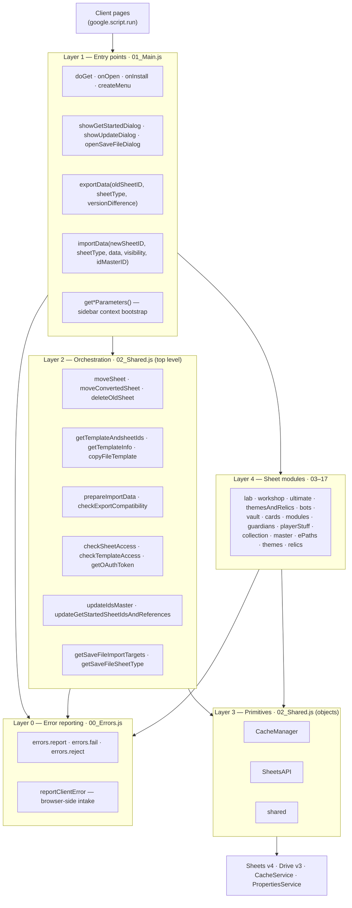
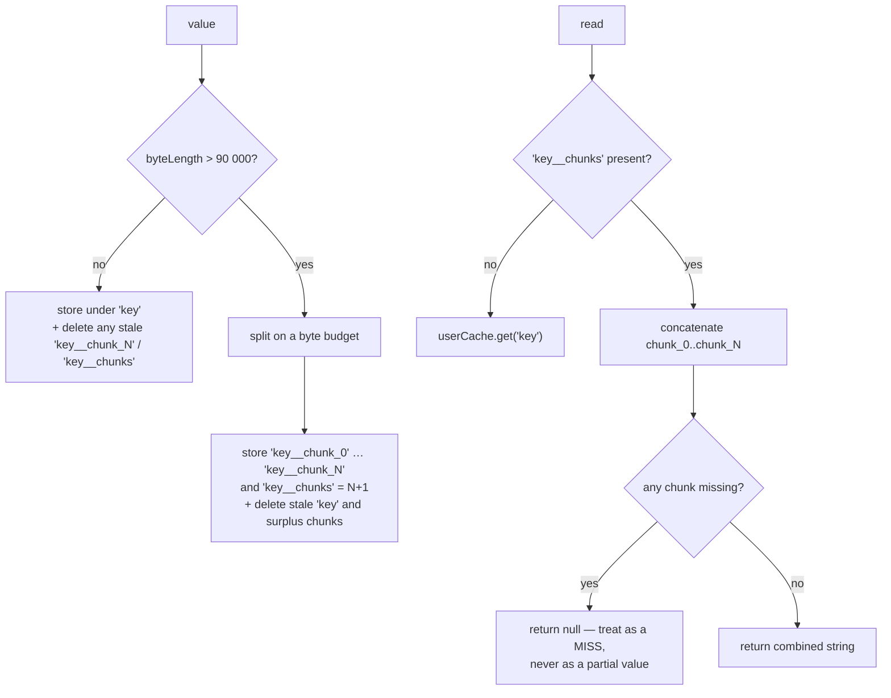
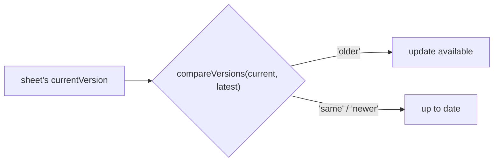
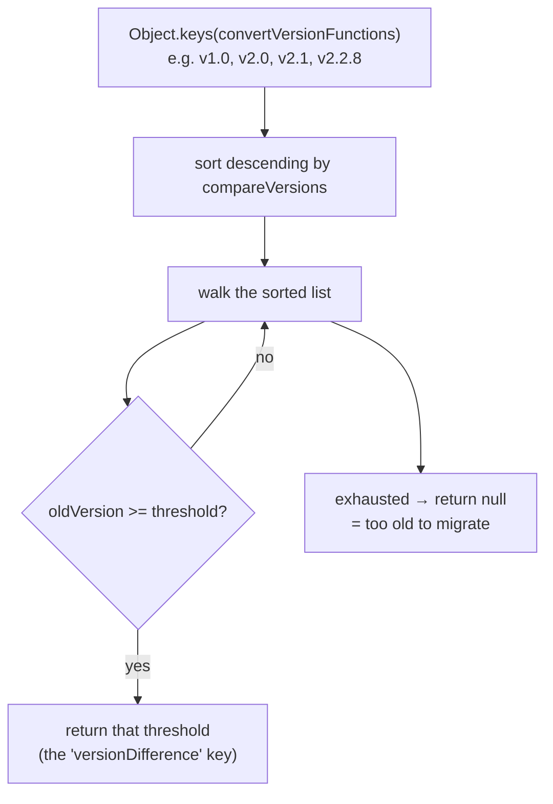
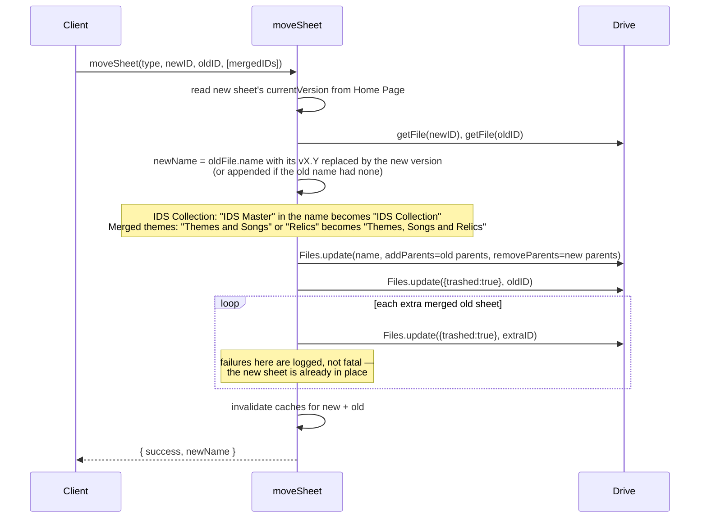

# 01 — Architecture

The infrastructure every workflow shares. Everything server-side other than the
sheet modules lives in [src/02_Shared.js](../src/02_Shared.js); the sheet
modules themselves are [05](05-sheet-modules.md), and each workflow's own
sequence is [02](02-workflow-get-started.md),
[03](03-workflow-update-sheets.md) and
[04](04-workflow-save-file-import.md).

- [Layers](#layers)
- [CacheManager](#cachemanager)
- [SheetsAPI](#sheetsapi)
- [Discovery by label scanning](#discovery-by-label-scanning)
- [Version detection and comparison](#version-detection-and-comparison)
- [File operations](#file-operations)
- [Preset ordering](#preset-ordering)
- [Error convention](#error-convention)

---

## Layers



The client calls into **Layer 1 and Layer 2 directly** — there is no single
façade. Any top-level `function` in a `.js` file is callable via
`google.script.run`. Which ones each workflow uses is listed in that workflow's
own document.

---

## CacheManager

A per-user cache in front of every Sheets and Drive read.
([02_Shared.js:1-498](../src/02_Shared.js#L1-L498))

| Property | Value |
| --- | --- |
| Backing store | `CacheService.getUserCache()` |
| TTL | **60 seconds** (`cacheTimeMinutes = 1`) |
| Chunk threshold | **90 000 bytes** (`CHUNK_SIZE`) |

### What it caches

| Method | Key format | Holds |
| --- | --- | --- |
| `getSpreadsheet(typeName, sheetID)` | `"<Type> newSpreadsheet"` etc. | Spreadsheet metadata: sheet IDs, titles, hidden flags |
| `getSheetValues(id, ranges)` | `<id>\|<range>\|VALUE` | Cell values |
| `getSheetFormulas(id, ranges)` | `<id>\|<range>\|FORMULA` | Cell formulas |
| `getFile(fileID)` | `File\|<id>` | Drive metadata: `id, name, parents, owners/me, capabilities/canEdit, trashed` |

The spreadsheet cache is keyed by a **logical name**, not by ID — `"Laboratory
oldSpreadsheet"`, `"Workshop newSpreadsheet"`, `"idMasterSpreadsheet"`. The
stored entry carries the sheet ID it was built from; a request with a different
ID invalidates and refetches. A request with *no* ID returns whatever is cached,
which is how `spreadsheets(name)` can be called without an ID mid-flow.

### Chunking

Apps Script's cache rejects values over ~100 KB.



- Byte lengths are computed by hand (`_byteLength`, `_chunkString`). Surrogate
  pairs count as 4 bytes and are never split across a chunk boundary.
- A partial read is a miss: if eviction takes one chunk, `_retrieveValue`
  returns `null` and the caller refetches from the API.

### Cache invalidation

`RemoveSpreadsheet(typeName)` deletes the metadata entry *and* every
`VALUE`/`FORMULA` entry for every sheet it lists, in all their chunked variants
(`_entryKeys`). It reads through `_retrieveValue`, so chunked entries are
found.

Called after `moveSheet`, `moveConvertedSheet` and `updateIdsMaster` — the three
places where a file's identity or contents change underneath a cached copy.

---

## SheetsAPI

A wrapper over the Sheets v4 advanced service.
([02_Shared.js:500-745](../src/02_Shared.js#L500-L745))

| Method | Notes |
| --- | --- |
| `fetchSpreadsheet(id)` | Fetches only `spreadsheetId,sheets(properties(sheetId,title,hidden))`. |
| `getSheetByName(ss, name)` | Exact title match against cached metadata. |
| `getSheetBySubstring(ss, sub)` | Case-insensitive substring match — used where tab names vary (`"Lab Planner"`). |
| `batchGetValues(id, ranges, useCache=true)` | Values. Cached by default. |
| `batchGetFormulas(id, ranges, useCache=true)` | Same ranges with `valueRenderOption: "FORMULA"`. |
| `batchUpdateValues(id, updates)` | One call, `valueInputOption: "USER_ENTERED"`. |
| `applySheetVisibility(newSs, visibilityMap)` | Diffs desired vs. actual `hidden` and issues one `batchUpdate` of `updateSheetProperties`. |

### The batching discipline

Import functions never write incrementally. They build a `batchUpdate` array of
`{ range, values }` entries across every sub-update and flush once at the end:

```javascript
var batchUpdate = [];
batchUpdate = batchUpdate.concat(labResult.batchUpdate || []);
batchUpdate = batchUpdate.concat(labPlannerResult.batchUpdate || []);
batchUpdate = shared.addIDUpdatesToBatch(batchUpdate, "Laboratory", newSheetID, idsData, data.idMasterID);
SheetsAPI.batchUpdateValues(newSheetID, batchUpdate);
```

Values and formulas are fetched with `batchGet` in one call per sheet. On a
combined update the client runs 11 of these flows in parallel via `Promise.all`.

---

## Discovery by label scanning

The app never hard-codes cell addresses in user sheets. It **scans for a text
label and reads at a fixed offset from it**.

### `shared.findSheetTypeID(id, sheetName, sheetType, values)`

Finds a sheet's ID in an `IDS` tab. Matches a cell that contains the sheet type
**and** a standalone `ID` token, and does *not* contain `"script"`.

```
       j      j+1     j+2         j+3
   ┌────────┬──────┬───────────┬────────┐
 i │ "Lab…  │      │ <sheetID> │  "✅"  │   ← accessStatus
   │  ID"   │      │           │        │
   └────────┴──────┴───────────┴────────┘
```

Returns `{ id, cell: {row, col, range}, accessStatus: {row, col, range, value} }`.
`accessStatus.value === "✅"` is what `checkNewSheetReference` requires before an
import may proceed.

### `shared.findSheetTypeURL(id, sheetName, sheetType, values)`

Finds a sheet type's **template link and versions** in the IDS Master's `IDS`
tab. Matches on sheet type alone (no `ID` token), excluding cells containing
`"script"` or `"More IDs are available"`.

```
       j            j+1        j+2       …    j+5        j+6
   ┌───────────┬───────────┬──────────┬───┬──────────┬───────────┐
 i │ "Workshop"│           │<sheetID> │   │ template │  current  │
   │           │           │          │   │ version  │  version  │
   ├───────────┼───────────┼──────────┴───┴──────────┴───────────┤
 i+1│           │=HYPERLINK│  (template copy URL)                 │
   └───────────┴───────────┴──────────────────────────────────────┘
```

Returns the sheet's ID, the location of the template link, and both versions —
the latest the template offers and the one the user is on. Mind which is which:
the field named `version` is the latest, `oldVersion` is the user's. The
template URL is pulled from the *formula* grid and unwrapped with
`shared.extractUrlFromHyperlink`.

Under `copyMode: "update"` a sheet is skipped unless the user's version is older
than the template's.

### `shared.findSheetTemplateID(sheetID, sheetName, sheetType)`

For a standalone sheet with no IDS Master: scans a sheet's own `Home Page`
formulas for a `HYPERLINK` containing `"copy"`, and pairs it with the latest
version read from the same tab.

### Other helpers

| Helper | Purpose |
| --- | --- |
| `isSheetId(value)` | Whether a value is a sheet ID: 44 characters of `[A-Za-z0-9_-]`. Keeps a placeholder a formula left behind from being mistaken for one. |
| `extractSheetId(input)` | Accepts a bare ID or any `/spreadsheets/d/<id>` URL. Null for anything else, including a non-string. |
| `columnToLetter(n)` | 1-based column index → A1 letters. |
| `getColumnOffsetFromRange("eHP!AJ1:AY50")` | 0-based column offset of a range's start — lets update functions work in range-relative coordinates. |
| `extractUrlFromHyperlink(formula)` | First quoted argument of a `HYPERLINK(...)`. |
| `getDVTValue(oldValue, dvtRanges)` | Maps a `"12 \| something"` level string onto the matching entry in a Data-Validation-Table named range, so dropdown cells receive a value the dropdown actually accepts. |
| `addIDUpdatesToBatch(batch, type, newID, idsData, masterID)` | Appends the two writes every import performs: `This Sheet ID` ← new sheet, `IDS Master's` ← master. |

---

## Version detection and comparison

### `shared.findSheetVersion(sheetID, sheetName, sheetType, values)`

Scans a `Home Page` grid for two labels and reads the cell **one row below**
each:

| Looking for (case-insensitive substring) | Yields |
| --- | --- |
| `"version change"`, `"this version"`, `"version check"` | `currentVersion` |
| `"latest remote version"`, `"latest version"` | `latestVersion` |

`Effective Paths` uses a different layout and is delegated to
`shared.getEPathsVersion`, which looks for `"Current Version:"` /
`"Latest Version:"` and concatenates the **next two cells** (the version is split
across a merged-looking pair).

### `shared.compareVersions(a, b)`

Extracts the first `\d+(\.\d+)*` run from each string, compares segment by
segment with missing segments treated as `0`, and returns `"newer" | "older" |
"same"` — describing `a` relative to `b`.



### `isCompatibleVersion` — picking a converter



The returned key is passed to the client as **`versionDifference`** and threaded
through `checkExportCompatibility` → `exportData(…, versionDifference)`.

---

## File operations

### `copyFileTemplate(templateID, sheetType, templateVersion, parentFolderID)`

`Drive.Files.copy` into `Copy of <sheetType> <version>`, optionally into a parent
folder. Returns `fileId`, `fileUrl`, and the `gid` of the sheet the user should
land on (`IDS`, or `Home Page` for an IDS Collection) so the client can deep-link
to the right tab.

### `moveSheet(sheetType, newSheetID, oldSheetID, mergedOldSheetIDs)`

The final step of every migration:



The new file **inherits the old file's name and folder**.

`moveConvertedSheet` is the variant used by *Convert to IDS Master/Collection*:
same rename-and-move, but it does **not** trash the source.

---

## Preset ordering

Sheet templates give preset slots fixed meanings; the game lets players name and
order presets freely. `shared.templatePresetNames = ["Farming", "Tourney"]`
([02_Shared.js:1238](../src/02_Shared.js#L1238)) names the two fixed slots.

`shared.resolvePresetOrder(presetNames, forcedNames)` pulls any preset literally named `Farming` or `Tourney`
into slots 1 and 2 **wherever it appears in the save file**, then fills the
remaining slots with the rest in their original relative order, defaulting empty
slots to `"Preset N"`. It returns both the slot-ordered `order` and the
`indices` into the original arrays, so parallel arrays (levels, unlocks) can be
reordered identically.

---

## Error convention

No server function throws across the `google.script.run` boundary. Every one
returns a success flag and, on failure, an error code the client switches on.
The envelope, the codes and what happens to each kind of failure are documented
in [08 — Error handling](08-error-handling.md).

A few envelopes carry extra fields:

| Field | On | Meaning |
| --- | --- | --- |
| `failedUpdates` | `importData` | Per-category failures inside a multi-category import (IDS Collection, IDS Master). |
| `collection: true` | `getTemplateAndsheetIds` | The sheet has no `IDS` tab — it is an IDS Collection, not an IDS Master. |
| `versionFiltered: true` | `getTemplateInfo` | Skipped because it is already up to date under `copyMode: "update"`. |

User-visible references to Google Sheets™ carry the `™` symbol
(`"New spreadsheet™ not found"`).
