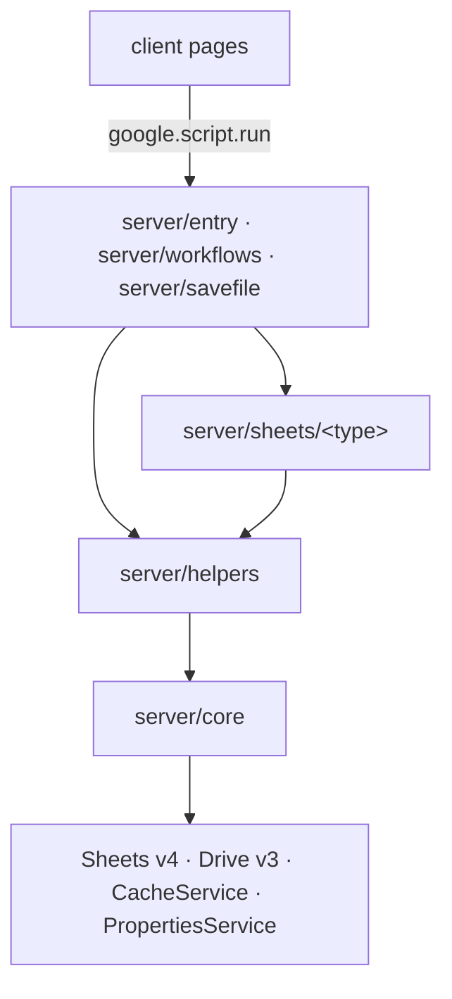

# 01 — Architecture

The infrastructure every workflow shares. Sheet types are in [05](05-sheet-modules.md); the
workflows in [02](02-workflow-get-started.md), [03](03-workflow-update-sheets.md) and
[04](04-workflow-save-file-import.md).

## Layers

```mermaid
flowchart TB
    C["client pages"] -->|google.script.run| E["server/entry · server/workflows · server/savefile"]
    E --> S["server/sheets/&lt;type&gt;"]
    E --> H["server/helpers"]
    S --> H
    H --> K["server/core"]
    K --> G["Sheets v4 · Drive v3 · CacheService · PropertiesService"]
```

Calls run downward only. All server files share one global namespace, but none uses another's
symbols while loading, so push order never matters. Every top-level `function` is client-callable.

## Cache

`CacheManager` puts a per-user cache in front of every Sheets and Drive read; entries live 60
seconds.

- Spreadsheet metadata is keyed by a logical name such as "Laboratory newSpreadsheet". A different
  ID refetches; no ID returns whatever is cached.
- Values, formulas and Drive file metadata are keyed by file ID.
- A value too big for one cache entry is split into chunks; a missing chunk counts as a miss.
- `RemoveSpreadsheet` drops a spreadsheet and every cached range of it. `moveSheet`,
  `moveConvertedSheet` and `updateIdsMaster` call it.

## Sheets API

`SheetsAPI` wraps Sheets v4: metadata, tab lookup by exact name or substring, cached reads of
values and formulas, one-call writes, and restoring which tabs are hidden. Imports collect every
write and flush them in one call.

## Finding things in a sheet

The app never hard-codes a cell address: it finds a text label and reads at a fixed offset from it.

| Function | Finds |
| --- | --- |
| `labelUtils.findSheetTypeID` | A sheet's ID in an `IDS` tab, and whether access is granted |
| `labelUtils.findSheetTypeURL` | In the Master's `IDS` tab: a sheet type's ID, template link, latest and current version |
| `labelUtils.findSheetTemplateID` | A standalone sheet's template link and latest version, from its `Home Page` |
| `labelUtils.addIDUpdatesToBatch` | The two writes every import makes: the sheet's own ID and its Master's |

`sheetRefs` parses sheet IDs, links, column letters and range offsets. `dropdownUtils.getDVTValue`
turns a level into a value the target dropdown accepts.

## Versions

- `versionUtils.findSheetVersion` reads a sheet's current and latest version from its `Home Page`
  labels; Effective Paths uses `getEPathsVersion`.
- `versionUtils.compareVersions(a, b)` compares numeric segments and says whether `a` is
  `"older"`, `"same"` or `"newer"`.
- A sheet type's `isCompatibleVersion(old)` returns its newest converter at or below `old` — the
  `versionDifference` passed to `exportData` — or null when the sheet is too old.

## File operations

- `copyFileTemplate` copies a template, optionally into a folder, and returns the new file and the
  tab to open.
- `moveSheet` gives the new sheet the old one's name (with the new version) and folder, then trashes
  the old sheet — both old sheets when Themes & Songs and Relics were merged.
- `moveConvertedSheet` renames and moves the same way but keeps the source, for conversions.
- `deleteOldSheet` trashes a sheet; a sheet already gone counts as success.

## Presets

Templates have two fixed preset slots, Farming and Tourney. `presetUtils.resolvePresetOrder` moves
presets with those names into their slots wherever they sit in the save file, keeps the rest in
order, and returns the index mapping so related lists reorder the same way.

## Errors

No server function throws across `google.script.run`; it returns a failure envelope with a code.
See [08](08-error-handling.md).
