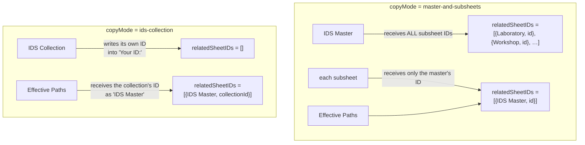
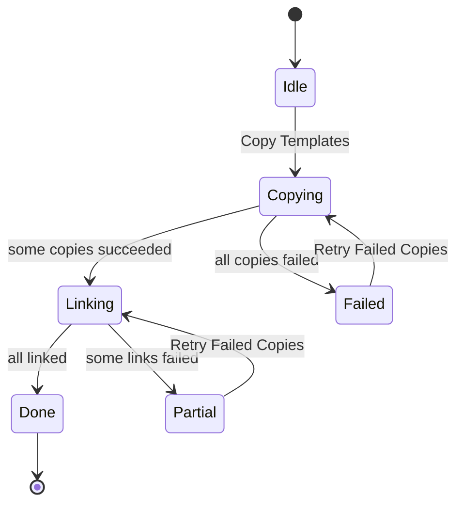

# 02 — Get Started workflow

Onboarding for a new player: copy every template sheet into the user's Drive and
wire their IDs together so they arrive at a working, cross-linked set of sheets.

**Entry points**

| | |
| --- | --- |
| Add-on | `Import Data ▸ Get Started` → `showGetStartedDialog()` (modal, 1200×700) |
| Web app | `?page=getstarted` or `?getStarted=true` |
| Page | [20_getStartedApp.html](../src/20_getStartedApp.html) |
| Logic | [23_getStarted_scripts.html](../src/23_getStarted_scripts.html) |

---

## What the user sees

An explainer panel (what IDS Sheets are, manual vs. quick setup), a dropdown with
two choices, and a **Copy Templates** button:

| Choice | Copies |
| --- | --- |
| `IDS Master and subsheets (multiple files)` | IDS Master + 10 subsheets |
| `IDS Collection (single file)` | one IDS Collection file |

An **Effective Paths** sheet is copied in both cases. Below the button, direct
`/copy` links to every template are rendered for anyone preferring to do it by
hand.

---

## Template registry

Template IDs are hard-coded on the **client**, in
`GET_STARTED_TEMPLATE_CONFIG` ([23_getStarted_scripts.html:2-60](../src/23_getStarted_scripts.html#L2-L60)):

```javascript
GET_STARTED_TEMPLATE_CONFIG = {
  "effective-paths":      [ { sheetType: "Effective Paths",  templateID: "1YwZtKP6…" } ],
  "ids-collection":       [ { sheetType: "IDS Collection",   templateID: "1QwlXL4Y…" } ],
  "master-and-subsheets": [ { sheetType: "IDS Master",       templateID: "1osjoqKm…" },
                            { sheetType: "Laboratory",       templateID: "165-Juji…" },
                            /* Workshop, Ultimate Weapon, Themes Songs & Relics, Bots,
                               Vault, Cards, Modules, Guardians, Player & Stuff */ ],
};
```

A near-identical `CONVERT_TO_TEMPLATES` map lives in
[21_shared_scripts.html](../src/21_shared_scripts.html#L40-L92) for the
conversion flows. **New template releases require editing both maps.**

### The sidebar special case

When run from inside a sheet (`viewType === "sidebar"`), `authorizeGetStarted`
calls `getGetStartedParameters()`. If the active spreadsheet *is* an Effective
Paths sheet (it has `eHP`, `eDamage` or `eEcon` tabs) and is not itself the
template, its ID replaces the Effective Paths template — so the user's existing
sheet is duplicated instead of a fresh template.

---

## The flow

```mermaid
sequenceDiagram
    autonumber
    participant U as User
    participant C as Client
    participant S as Apps Script
    participant D as Drive

    U->>C: Copy Templates
    C->>S: getOrCreateGetStartedFolder()
    S->>D: search folder "The Tower"
    alt not found
        S->>D: Files.create(folder) + Permissions.create(anyone/reader)
    end
    S-->>C: { id, name, url }

    C->>S: checkTemplateAccess(id) ×N  (parallel)
    S-->>C: accessible / inaccessible

    opt some templates inaccessible
        C->>U: Google Picker seeded with those template IDs
        U->>C: select them
        C->>S: re-check
    end

    par one per template
        C->>S: copyFileTemplate(templateID, sheetType, version, folderID)
        S->>D: Files.copy → "Copy of [type] [version]"
        S-->>C: { fileId, fileUrl, gid }
    end

    C->>C: work out relatedSheetIDs per file
    par one per created file
        C->>S: updateGetStartedSheetIdsAndReferences(fileId, sheetType, relatedSheetIDs)
        S->>S: write IDs into IDS / Home Page
        S->>D: rename file to "[sheetType] [currentVersion]"
        S-->>C: { success, fileName }
    end

    C->>U: render links; offer "Retry Failed Copies" if anything failed
```

---

## ID cross-linking

This is the step that turns a pile of copies into a connected set.
`applyGetStartedIDUpdates` decides, per file, which IDs it needs to know about:



Note that `Effective Paths` is excluded from `masterRelatedIDs` — the IDS Master
does not track it. The relationship is one-directional: Effective Paths points at
the master, not the reverse.

### Server side

`updateGetStartedSheetIdsAndReferences(sheetID, sheetType, relatedSheetIDs)`
([02_Shared.js:3042](../src/02_Shared.js#L3042)) has three branches:

| `sheetType` | Behaviour |
| --- | --- |
| `IDS Collection` | Finds `"Your ID:"` on `Home Page`, writes its own ID there. |
| `IDS Master` | Delegates to `updateIdsMaster(sheetID, idDataEntries)` — writes `This Sheet ID` plus one row per subsheet type into the `IDS` tab. |
| anything else | `shared.addIDUpdatesToBatch` — writes `This Sheet ID` = itself, `IDS Master's` = the master's ID. |

All three branches then rename the file to `<sheetType> <currentVersion>` (read
from its own `Home Page`). Rename failures are caught and logged; they do not
fail the ID update.

---

## Retry model

Failure is expected — Drive copy quotas, transient API errors, a user dismissing
the picker. The client keeps five persistent arrays across retries:

| Array | Holds |
| --- | --- |
| `allCreatedFiles` | Every file successfully copied, in any attempt |
| `allFailedCopyFiles` | Templates that could not be copied |
| `allFailedIDUpdateFiles` | Files copied but not linked |
| `lastFailedCopyTemplates` | Copy retry queue |
| `lastFailedIDUpdateFiles` | ID-update retry queue |

`retryFailedCopies()` re-runs only the failed halves, and re-derives the
relationships from `allCreatedFiles` so a subsheet copied on attempt 2 still gets
linked to a master copied on attempt 1. In `master-and-subsheets` mode it
deliberately re-includes the master in the retry batch whenever any subsheet is
being retried — the master's `IDS` tab has to learn about the newcomer.



---

## Related server functions

| Function | Source | Purpose |
| --- | --- | --- |
| `getOrCreateGetStartedFolder()` | [02_Shared.js:2982](../src/02_Shared.js#L2982) | Find/create `The Tower`; makes new folders anyone-readable. |
| `copyFileTemplate(...)` | [02_Shared.js:2425](../src/02_Shared.js#L2425) | Drive copy, returns file ID + landing `gid`. |
| `moveGetStartedFileToFolder(fileId, folderID)` | [02_Shared.js:2503](../src/02_Shared.js#L2503) | Renames to `Effective Paths <version>` and relocates. Used when an existing Effective Paths sheet is adopted. |
| `updateGetStartedSheetIdsAndReferences(...)` | [02_Shared.js:3042](../src/02_Shared.js#L3042) | The cross-linking step above. |
| `checkTemplateAccess(templateID)` | [02_Shared.js:1993](../src/02_Shared.js#L1993) | `drive.file` reachability probe. |

---

## Gotchas

- **Template IDs are duplicated** between `GET_STARTED_TEMPLATE_CONFIG` and
  `CONVERT_TO_TEMPLATES`. Updating one and not the other means Get Started and
  Convert-to-Master hand out different template generations.
- **`templateVersion` is not set** in either client map, so copies are initially
  named `Copy of <type>` with no version. The correct name is applied later, by
  the ID-update step, from the sheet's own `Home Page`.
- **A new `The Tower` folder is shared with anyone who has the link.** Existing
  folders are left alone.
