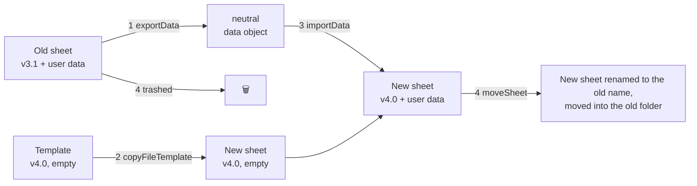
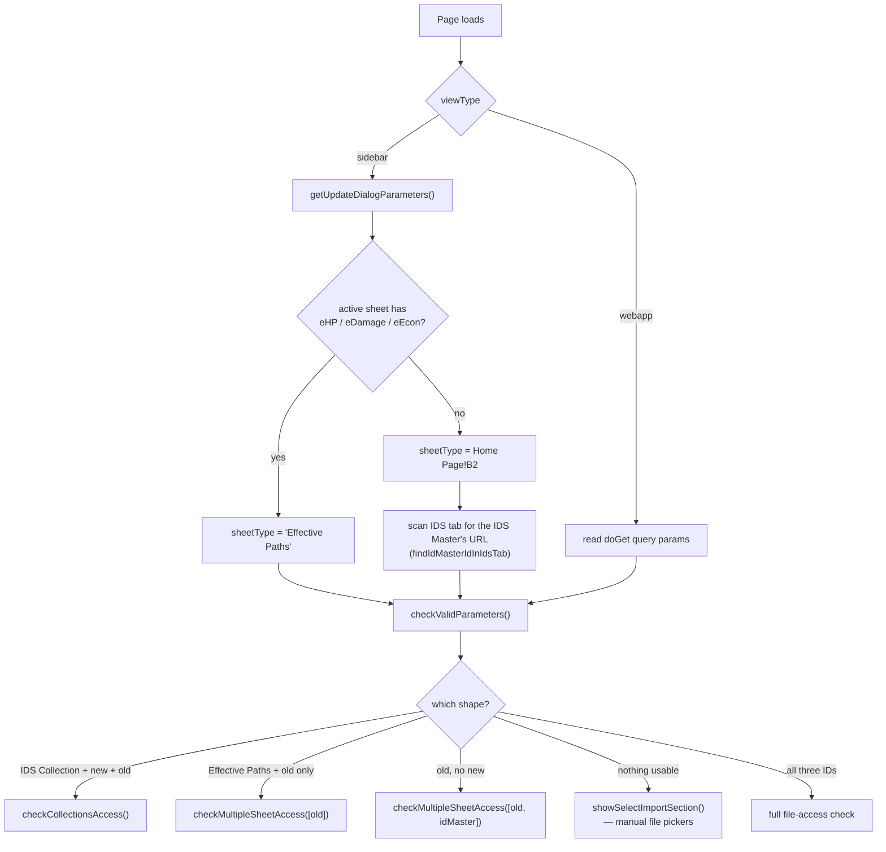
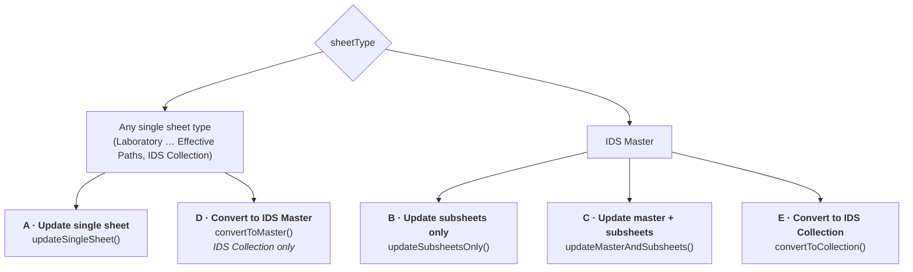
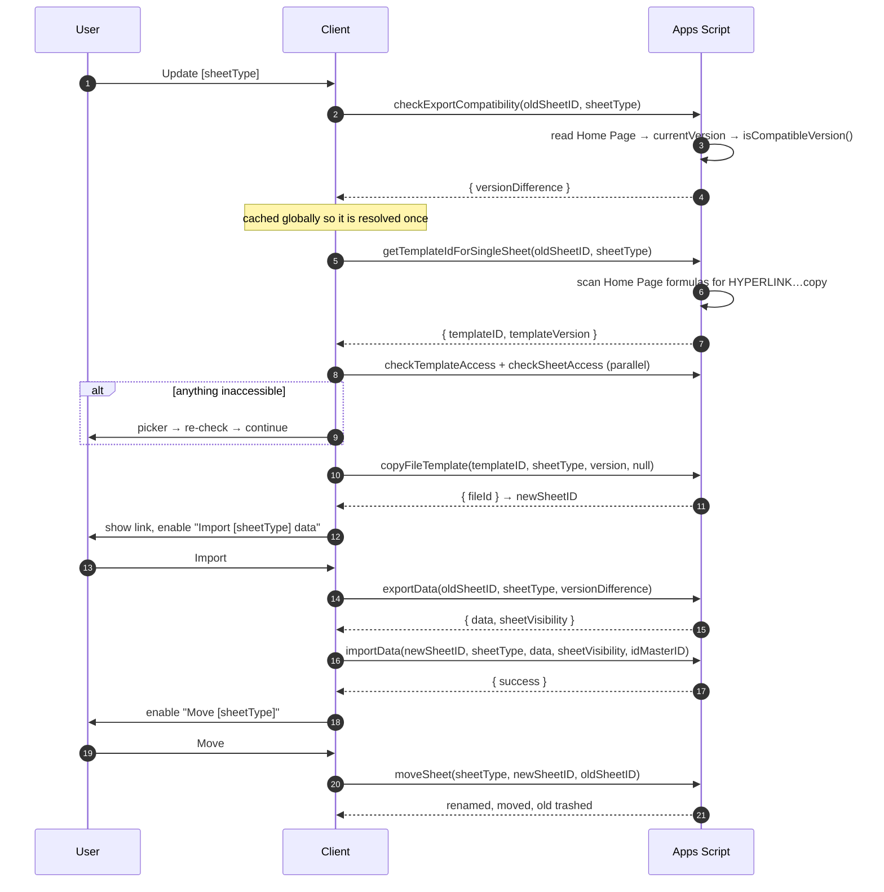
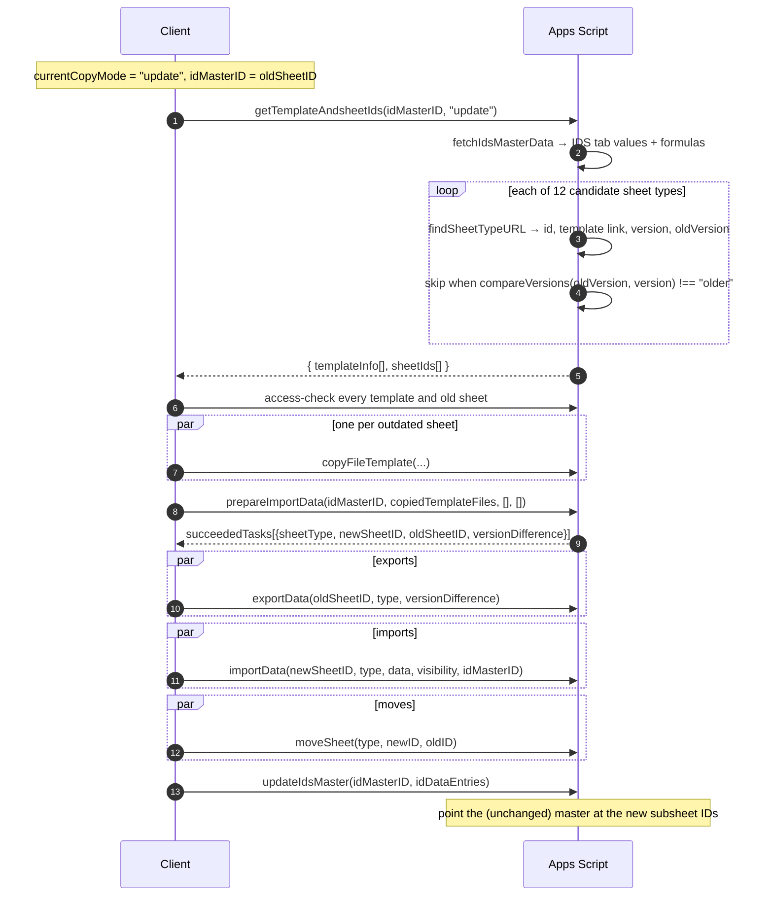
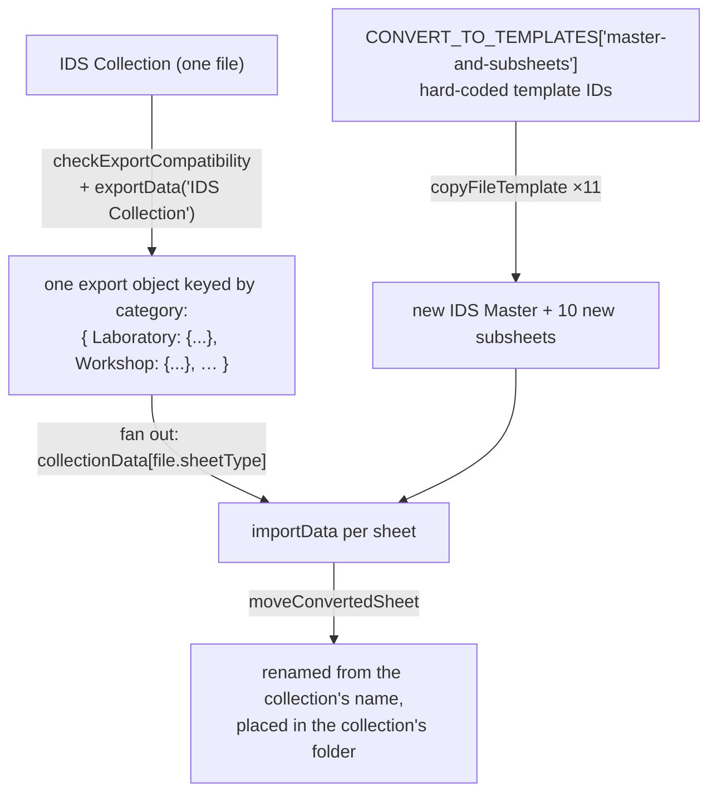
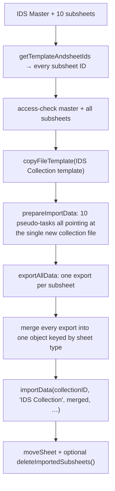
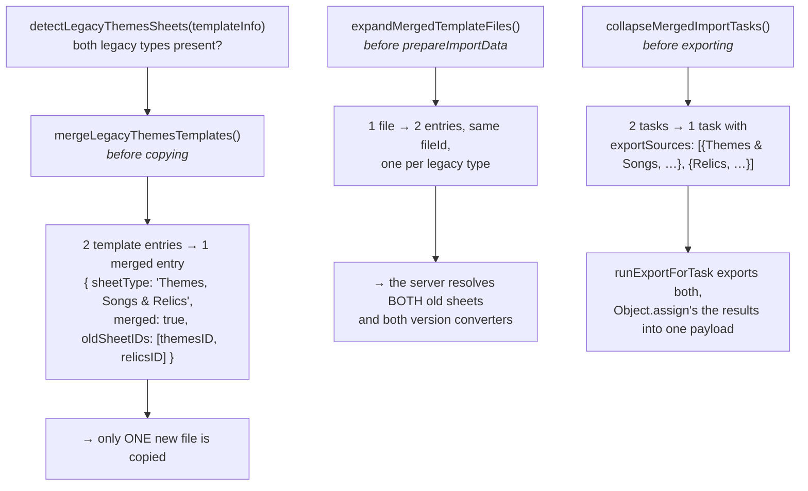
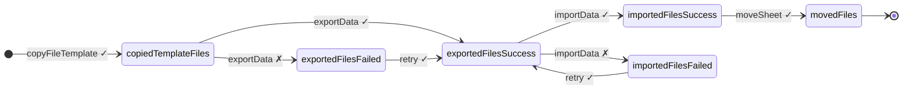

# 03 — Update Sheets workflow

The largest and most stateful part of the app. A new template version is
released; this workflow copies it, migrates the user's data into the copy, and
then puts the copy where the old sheet used to be.

**Entry points**

| | |
| --- | --- |
| Add-on | `Import Data ▸ Update Sheet` → `showUpdateDialog()` (sidebar) |
| Web app | default `doGet` route, optionally with `?oldSheetID=&idMasterID=&sheetType=` |
| Page | [20_WebApp.html](../src/20_WebApp.html) |
| Logic | [21_shared_scripts.html](../src/21_shared_scripts.html) + [25_fileAccess_scripts.html](../src/25_fileAccess_scripts.html) + [24_selectImport_scripts.html](../src/24_selectImport_scripts.html) |

---

## The core idea

Google Sheets templates cannot be updated in place — formulas, layout and named
ranges all change. So an "update" is really:



The user is deliberately given a pause between steps 3 and 4: the new sheet's
link is shown, `Move Sheets` stays disabled until the import succeeds, and they
are told to eyeball the data before committing.

---

## Bootstrapping the context



`showContinueSection()` then decides which buttons appear:

| Situation | UI |
| --- | --- |
| Any file not owned/editable by the user | Hard stop, list the files |
| Some files inaccessible | `Grant Access to Files` → picker |
| All accessible, `sheetType === "IDS Master"` | `renderIdMasterOptions()` — the three master buttons |
| All accessible, `sheetType === "IDS Collection"` | `Update IDS Collection` + `Convert to IDS Master` |
| All accessible, anything else | `Update <sheetType>` |

---

## The five flows



Flags on the client select behaviour throughout:

| Flag | Set by | Means |
| --- | --- | --- |
| `isUpdateSingleSheetFlow` | A, E | One sheet, one template, one export/import pair |
| `isCombinedUpdate` | C, D | The IDS Master is exported/imported alongside its subsheets |
| `isConvertToMasterFlow` | D | Source is an IDS Collection, targets are a whole master set |
| `isConvertToCollectionFlow` | E | Source is a master set, target is one IDS Collection |
| `hasSubsheetsToUpdate` | B, C, D | At least one subsheet is being replaced |
| `mergeLegacyThemesSheets` | auto-detected | Pre-v4.0 master: merge `Themes & Songs` + `Relics` |
| `masterIdsWritten` | C | The master wrote its own IDs during import — skip `updateIdsMaster` |

---

### Flow A — Update a single sheet



`sheetVisibility` is captured during export (which tabs were hidden) and
re-applied to the new sheet before its data lands, so the user's hidden-tab
preferences survive the migration.

---

### Flow B — Update subsheets only

The user is on an up-to-date IDS Master and only its subsheets have new versions.



The candidate sheet-type list in `getTemplateAndsheetIds`
([02_Shared.js:1765](../src/02_Shared.js#L1765)) is ordered deliberately:

```javascript
["Laboratory", "Workshop", "Ultimate Weapon",
 "Themes, Songs & Relics",   // looked up FIRST …
 "Themes & Songs", "Bots",
 "Relics",                    // … because "Relics" also matches it by name
 "Vault", "Cards", "Modules", "Guardians", "Player & Stuff"]
```

Once `Themes, Songs & Relics` is found, the two legacy types are skipped
(`foundMergedThemes`).

---

### Flow C — Update master and subsheets

The hardest case: the IDS Master itself is outdated, so a *new* master is created
whose `IDS` tab must point at the *new* subsheets — none of which exist yet when
the master is exported.

```mermaid
sequenceDiagram
    autonumber
    participant C as Client
    participant S as Apps Script

    C->>S: getTemplateIdForSingleSheet(oldMaster, "IDS Master")
    C->>S: getTemplateAndsheetIds(oldMaster, "all")
    C->>C: split into templatesWithUpdates / templatesWithSameVersion
    C->>C: mergeLegacyThemesTemplates() if pre-v4.0

    C->>S: copyFileTemplate(masterTemplate) → new master
    Note over C: newSheetID = idMasterID = new master
    par copies
        C->>S: copyFileTemplate(each outdated subsheet)
    end

    C->>S: prepareImportData(oldMaster, copiedTemplateFiles, …)
    S-->>C: succeededTasks

    par exports
        C->>S: exportAllData(subsheet tasks)
    and master export
        C->>S: stageMasterExport() → export the OLD master
    end

    C->>C: remapMasterIdsToNewSheets(masterExport.oldIdsData)
    Note over C: every subsheet that exported successfully is<br/>repointed to its new copy; the rest keep their old IDs

    par imports
        C->>S: importAllData(subsheets + master, in one batch)
    end
    C->>C: masterIdsWritten = master import succeeded

    par moves
        C->>S: moveSheet(each subsheet)
    end
    C->>S: moveSheet(master)
    alt masterIdsWritten
        C->>S: getIdsMasterGid(newMaster)
        Note over S: IDs already written during import — only the gid is needed
    else
        C->>S: updateIdsMaster(newMaster, idDataEntries)
    end
    C->>S: updateSheetID(subsheet, newMasterID, type) for same-version subsheets
    Note over C: sheets that were NOT replaced still need to learn the new master's ID
```

Three subtleties worth remembering:

- **The master exports in parallel with its subsheets**, not after them. Nothing
  in its own export depends on them; only the ID remap does, and that waits for
  `Promise.all`.
- **`remapMasterIdsToNewSheets` only repoints sheets that actually exported.**
  A subsheet stuck in `copiedTemplateFiles` or a failure bucket never received
  the user's data, so the master deliberately keeps pointing at the old one.
- **`cachedTemplatesWithSameVersion`** holds subsheets that were already current.
  They are not copied, but after the move they get `updateSheetID(...)` so their
  `IDS Master's` cell names the new master.

---

### Flow D — Convert IDS Collection → IDS Master + subsheets

`convertToMaster()` reuses Flow C's machinery with a different data source.



Two differences from Flow C:

| | Flow C | Flow D |
| --- | --- | --- |
| Templates | Read from the IDS Master's `IDS` tab | Hard-coded in `CONVERT_TO_TEMPLATES` |
| Export | One `exportData` per subsheet | **One** `exportData` on the collection, then fanned out |
| Move | `moveSheet` (trashes the old sheet) | `moveConvertedSheet` (**keeps** the collection) |

---

### Flow E — Convert IDS Master + subsheets → IDS Collection

`convertToCollection()` is the mirror image and runs as an
`isUpdateSingleSheetFlow`:



`deleteImportedSubsheets(cachedSheetIds)` offers to trash the now-redundant
subsheets after a successful conversion.

---

## Legacy Themes merge

IDS Masters older than v4.0 have two separate sheets — `Themes & Songs` and
`Relics` — that v4.0 replaced with `Themes, Songs & Relics`. Three client
helpers in [25_fileAccess_scripts.html](../src/25_fileAccess_scripts.html#L1-L98)
handle the 2→1 collapse:



The merged task carries `oldSheetIDs: [both]`, which `moveSheet` receives as
`mergedOldSheetIDs` so **both** old files are trashed. `moveSheet` also renames
`"Themes & Songs"` or `"Relics"` in the inherited filename to
`"Themes, Songs & Relics"`.

---

## Client state buckets

The whole flow is a pipeline of arrays. Every file moves left to right, one
bucket at a time, and any failure parks it in a `*Failed` bucket that the next
attempt picks up again.



`prepareImportData(idMasterID, copied, importFailed, exportFailed)` takes all
three pending buckets so that pressing `Import` again retries exactly what did
not land.

| Bucket | Entry shape |
| --- | --- |
| `copiedTemplateFiles` | `{ success, sheetType, fileId, gid, version }` |
| `exportedFilesSuccess` | `+ oldSheetID, oldSheetIDs, idMasterID, exportData, sheetVisibility` |
| `exportedFilesFailed` | `+ error` |
| `importedFilesSuccess` | same as exported, post-import |
| `movedFiles` | `+ newName` |

Also cached to avoid repeat server calls: `cachedTemplateInfo`,
`cachedSheetIds`, `cachedMasterTemplateInfo`, `cachedTemplatesWithSameVersion`,
`versionDifference`, `masterVersionDifference`.

---

## Server functions in this workflow

| Function | Role |
| --- | --- |
| `getTemplateAndsheetIds(idMasterID, copyMode)` | Walk the IDS tab, resolve every subsheet's template + old ID. `copyMode: "update"` filters to outdated ones. |
| `getTemplateInfo(idsMasterData, sheetType, copyMode)` | Per-type resolution used by the above. |
| `getTemplateIdForSingleSheet(sheetID, sheetType)` | Template link from a sheet's own `Home Page` — no master needed. |
| `checkExportCompatibility(oldSheetID, sheetType)` | `{ oldVersion, versionDifference }` or a refusal if too old. |
| `compareSheetVersions(sheetID, sheetType)` | `"older" / "same" / "newer"` for the master-options screen. |
| `prepareImportData(...)` | Turns copied files into `{sheetType, newSheetID, oldSheetID, idMasterID, versionDifference}` tasks; rejects sheets whose version is *newer* than the template. |
| `exportData` / `importData` | The generic dispatchers in [01_Main.js](../src/01_Main.js). |
| `moveSheet` / `moveConvertedSheet` | Rename, relocate, trash. |
| `updateIdsMaster` / `getIdsMasterGid` / `updateSheetID` | Repoint IDs after the move. |
| `deleteOldSheet(sheetID)` | Trash a single sheet; idempotent. |

---

## Failure handling

| Failure | Behaviour |
| --- | --- |
| Template inaccessible | Picker opens seeded with that template ID; flow resumes on grant |
| Old sheet not owned/editable | Hard stop with the file list — no partial work |
| Old version newer than the template | Task rejected in `prepareImportData` |
| Old version below every converter | `isCompatibleVersion` → `null` → "incompatible for export" |
| Export fails | File parked in `exportedFilesFailed`; `Import` retries it |
| Import fails | File parked in `importedFilesFailed`; `Import` retries it |
| Master creation fails (Flow C) | Whole flow aborts before any subsheet is copied |
| Merged-sheet extra trash fails | Logged only — the new sheet is already in place |
| `moveSheet` fails | Old sheet is not trashed; the new sheet keeps its `Copy of …` name |

The reset helpers `resetIDSMasterState()` and `resetToCollectionState()` clear
every flag and cache and re-render the option screen after an aborted flow.

---

## Adding a new template version

1. Add `versionN_M: function (oldSheetID) { … }` to the sheet module, plus its
   `getVersionN_M*` readers.
2. Register it in `convertVersionFunctions`.
3. Update `importData` (and the module's `update*` helpers) for the new layout.
4. If the sheet is reachable through an IDS Collection, mirror the change in
   [14_IDS_Collection.js](../src/14_IDS_Collection.js).
5. If the template ID changed, update **both** `GET_STARTED_TEMPLATE_CONFIG` and
   `CONVERT_TO_TEMPLATES`.

See [05 — Sheet modules reference](05-sheet-modules.md) for the details.
