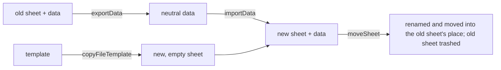

# 03 — Update Sheet

Copies a new template version, moves the user's data into it, then puts the copy where the old
sheet was.

| | |
| --- | --- |
| Add-on | `Import Data ▸ Update Sheet` → `showUpdateDialog()` (sidebar) |
| Web app | default route, optionally `?oldSheetID=&idMasterID=&sheetType=` |
| Page | `client/pages/update.html`, scripts in `client/update/` |

## Shape of an update

```mermaid
flowchart LR
    A["old sheet + data"] -->|exportData| N["neutral data"]
    T["template"] -->|copyFileTemplate| B["new, empty sheet"]
    N -->|importData| C["new sheet + data"]
    B --> C
    C -->|moveSheet| D["renamed and moved into the old sheet's place; old sheet trashed"]
```

After the import the user checks the new sheet, then presses **Move**.

## Starting point

The sidebar reads its context from the open spreadsheet (`getUpdateDialogParameters`); the web app
reads its query string. Anything that is not a valid sheet ID counts as missing, and missing IDs
send the user to manual file pickers. Once every file is accessible, `showContinueSection` shows:

| Sheet | Buttons |
| --- | --- |
| IDS Master | `renderIdMasterOptions`: update subsheets, update Master and subsheets (only when the Master is older than its template), convert to IDS Collection |
| IDS Collection | update it, convert to IDS Master |
| anything else | update it |

## The five flows

**A — Update one sheet.** `checkExportCompatibility` picks the converter,
`getTemplateIdForSingleSheet` finds the template link on the sheet's `Home Page`, then copy →
export → import → `moveSheet`. Hidden tabs are restored on the new sheet.

**B — Update subsheets only.** `getTemplateAndsheetIds` reads the Master's `IDS` tab and keeps the
subsheets whose template is newer. Each is copied, then `prepareImportData` resolves its old sheet
and converter, and export, import and move run in parallel. `updateIdsMaster` points the Master at
the new subsheets.

**C — Update Master and subsheets.** A new Master is copied along with the outdated subsheets. The
old Master exports alongside them (`stageMasterExport`); its sheet IDs are repointed at the new
copies (`remapMasterIdsToNewSheets`), so the new Master's import writes the right IDs and the move
step only fetches its tab. Subsheets that were already current are not copied, but learn the new
Master's ID through `updateSheetID`.

**D — Convert IDS Collection → Master.** Templates come from `SHEET_TEMPLATES`. The Collection
exports once, keyed by sheet type, and each new file imports its part; the Collection's preset
names go to the new Master. `moveConvertedSheet` names and places the new files after the
Collection without trashing it.

**E — Convert Master → IDS Collection.** Every subsheet and the Master export, the results merge
into one object keyed by sheet type, and the new Collection imports it. The old subsheets can then
be trashed.

## Legacy Themes merge

Masters older than v4.0 hold Themes & Songs and Relics as two sheets, which v4.0 merged into
Themes, Songs & Relics. The client copies one new sheet for both, exports both old sheets into one
payload, and `moveSheet` trashes both.

## Retrying

Each file moves through copied → exported → imported → moved; a failure parks it. Pressing
**Import** again retries exactly what did not land, and nothing already resolved is looked up
twice.

| Failure | Result |
| --- | --- |
| A template or sheet is not accessible | The picker opens for it; the flow resumes after the grant |
| A sheet is not owned or editable by the user | Hard stop before any work |
| The sheet is newer than its template, or older than every converter | That sheet is refused |
| Export or import fails | The file is parked for the next Import |
| The new Master cannot be created (C) | The flow stops before copying subsheets |
| The move fails | The old sheet is kept; the copy keeps its "Copy of …" name |
