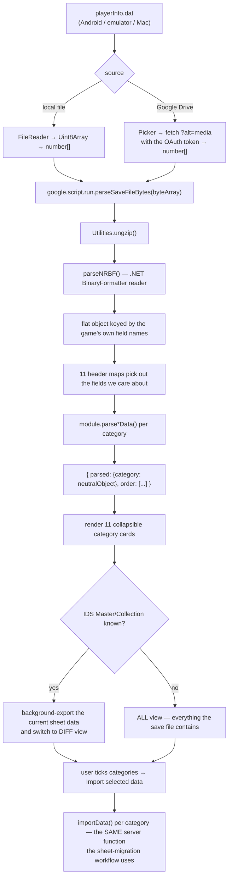
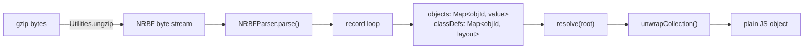
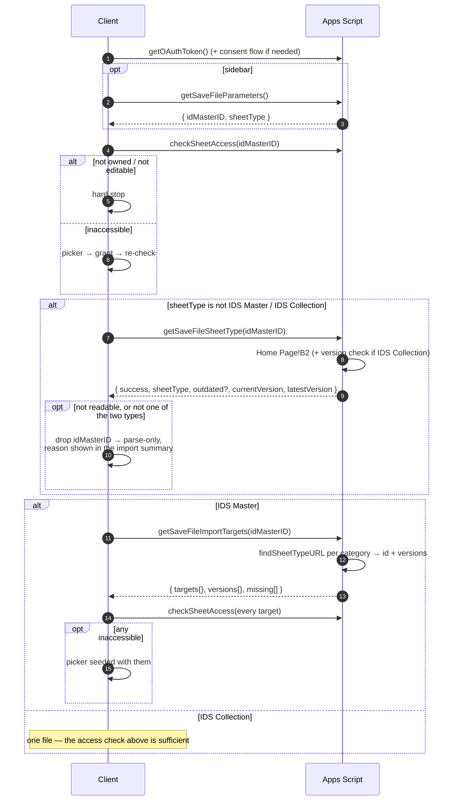
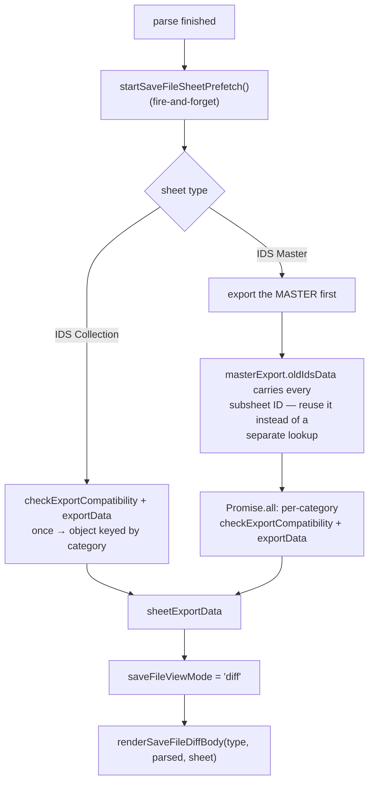
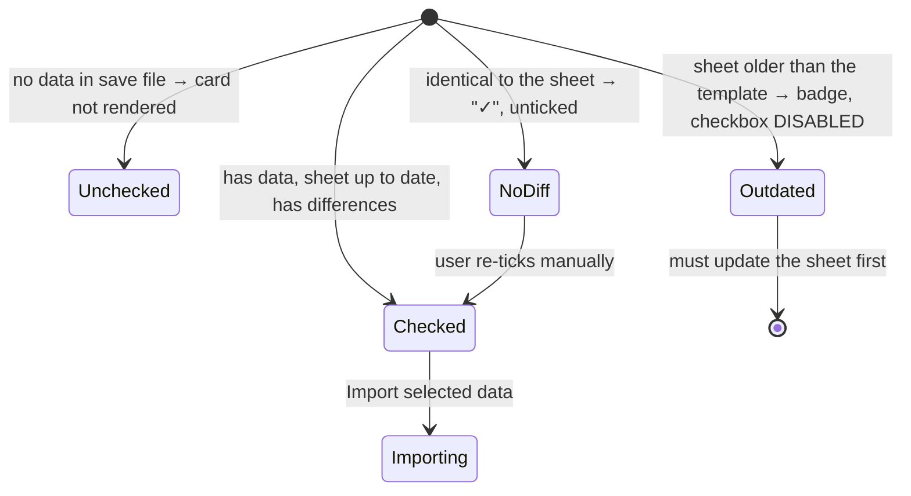
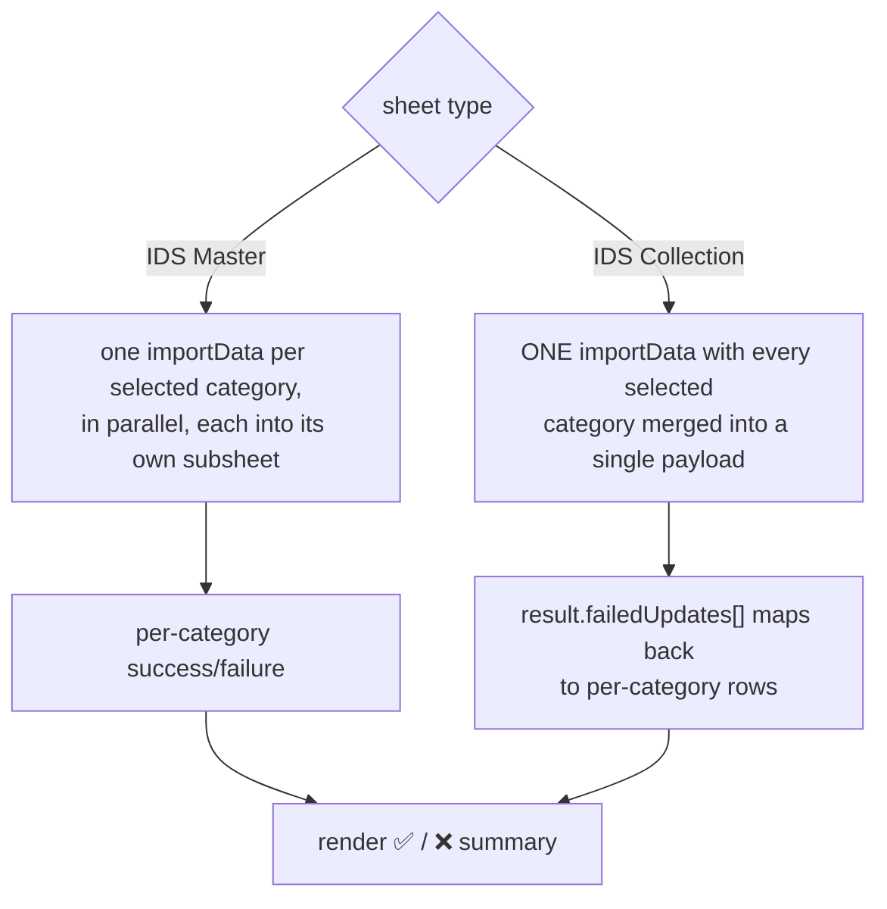

# 04 — Save-file import workflow

Reads the game's own save file, `playerInfo.dat`, and writes the values straight
into the user's sheets — replacing hours of manual data entry.

**Entry points**

| | |
| --- | --- |
| Add-on | `Import Data ▸ Import Data From Game (playerInfo.dat)` → `openSaveFileDialog()` |
| Web app | `?page=savefile` or `?saveFile=true` |
| Page | [20_SavedFileApp.html](../src/20_SavedFileApp.html) |
| Parser | [02_SavedFile.js](../src/02_SavedFile.js) |
| Client | [28_saveFile_scripts.html](../src/28_saveFile_scripts.html) (~3 500 lines) |
| Guide | [28_saveGuide_section.html](../src/28_saveGuide_section.html) |

---

## End-to-end



---

## The binary parser

`playerInfo.dat` is a **GZIP-compressed .NET `BinaryFormatter` stream** (NRBF —
.NET Remoting Binary Format). There is no native support for it in Apps Script,
so [02_SavedFile.js](../src/02_SavedFile.js) implements a reader.



### Record types handled

`SerializationHeader`, `ClassWithId`, `SystemClassWithMembersAndTypes`,
`ClassWithMembersAndTypes`, `BinaryObjectString`, `BinaryArray`,
`MemberPrimitiveTyped`, `MemberReference`, `ObjectNull`,
`ObjectNullMultiple256`, `ObjectNullMultiple`, `ArraySinglePrimitive`,
`ArraySingleObject`, `ArraySingleString`, `BinaryLibrary`, `MessageEnd`.

Notable implementation details:

| Detail | Why |
| --- | --- |
| `lps()` — 7-bit varint length prefix, then UTF-8 | How .NET writes strings |
| `Int64` / `UInt64` return **BigInt** | Total-coins-style counters exceed `Number.MAX_SAFE_INTEGER`; `bigIntJsonReplacer_` serialises them as strings |
| `blobToUint8Array_` masks `& 0xff` | Apps Script `Blob.getBytes()` returns *signed* bytes |
| Two-pass design | Objects are collected by ID first, then `resolve()` follows `_ref` pointers |
| `readArrayElements` handles null runs | `ObjectNullMultiple256`/`ObjectNullMultiple` compress long null spans in the stream |

### `unwrapCollection()` — the friendly bit

Raw .NET generics are unusable as-is, so they are collapsed:

| .NET class | Becomes |
| --- | --- |
| `List<T>` | `_items.slice(0, _size)` — a plain array |
| `Dictionary<K,V>` | plain object built from `KeyValuePairs` |
| `KeyValuePair<K,V>` | `{ key, value }` |
| enum (`{ value__, _class }`) | the numeric `value__` |

---

## Header maps

`parseSaveFileBytes` holds 11 maps translating **our** field names to the game's
save-file keys ([02_SavedFile.js:1-108](../src/02_SavedFile.js#L1-L108)):

```javascript
const workshopHeaders = {
  presetNames:            "workshopPresetName",
  upgradeAttackLevels:    "upgradeWorkshopLevel",
  enhancementAttackLevels:"enhancementLevel",
  // …
};
```

| Map | Category | Fields |
| --- | --- | --- |
| `labHeaders` | Laboratory | 1 |
| `workshopHeaders` | Workshop | 18 |
| `ultimateWeaponHeaders` | Ultimate Weapon | 4 |
| `themesAndRelicsHeaders` | Themes, Songs & Relics | 7 |
| `botHeaders` | Bots | 7 |
| `vaultHeaders` | Vault | 1 |
| `cardsHeaders` | Cards | 6 |
| `moduleHeaders` | Modules | 6 |
| `guardianHeaders` | Guardians | 4 |
| `PlayerStuffHeaders` | Player & Stuff | 19 |
| `MasterHeaders` | IDS Master | 6 (preset names + global presets) |

`extractDataByHeaders` pulls each key out of the parsed object (`null` when
absent) and hands the result to the category's `parse*Data`, which returns the
**same neutral object shape** that `importData` consumes in the sheet-migration
workflow. That is the whole trick: one importer, two producers.

```javascript
var labValues = extratctDataByHeaders(labHeaders);
var laboratoryData = lab.parseLabData(labValues);   // → { oldLabLevels, labOrder }
```

Result:

```javascript
{
  parsed: { "Laboratory": {...}, "Workshop": {...}, …, "IDS Master": {...} },
  order:  ["Laboratory", "Workshop", …, "IDS Master"]   // display order
}
```

---

## Access and target resolution



`getSaveFileImportTargets` ([02_Shared.js:2290](../src/02_Shared.js#L2290))
returns, per category:

```javascript
versions[sheetType] = {
  currentVersion,           // the user's sheet
  latestVersion,            // the newest template
  upToDate: compareVersions(current, latest) !== "older",
};
```

The IDS Master is special-cased: it is not a row in its own `IDS` tab, so its
version comes from its own `Home Page` via `compareSheetVersions`.

---

## Diff view

When the target sheet is known, the client **exports the current sheet data
through the normal export pipeline** and diffs it against the parsed save file —
so the user sees exactly what will change before committing.



Each category has a bespoke renderer — `renderLaboratoryDiff`,
`renderWorkshopDiff`, `renderModulesInventoryDiff`, `renderGuardiansDiff`,
`renderPlayerDiff`, … — because the shapes differ wildly (flat levels vs.
per-preset grids vs. module inventories with substats). They share small
primitives:

| Helper | Role |
| --- | --- |
| `sfNormLevel` / `sfNormGeneric` / `sfNormBool` | Normalise before comparing — a `"12 \| Something"` DVT string compares as `12` |
| `sfDiffRow(old, new, name)` | One `old → new` row |
| `sfDiffAddItem` / `sfDiffRemItem` | Added / removed entries |
| `sfDiffBlock` / `sfDiffSub` / `sfDiffGrid` | Layout |
| `sfDiffNoneHtml()` | Emits `sfDiffNone`, which the card renderer detects to mark a category "✓ no differences" and untick it |

A per-category export failure lands as `{ __error: "…" }` and renders as
"Could not load your sheet data for this category" rather than failing the page.

---

## Category cards and import gating



The gate is hard. `runSaveFileImport` refuses the whole batch if any selected
category is **not linked** in the IDS Master or **out of date**, and renders
`renderSaveFileUpdateRequired` with the exact `current → latest` versions
instead. Writing v3.1-shaped data into a v4.0 sheet would silently corrupt it.

An IDS Collection is checked as a single unit: if the collection is outdated,
every card is badged.

---

## Import



```javascript
// IDS Master path
runAppsScript("importData", targets[type], type, sfImportPayload(type, parsedSaveData[type]), {}, idMasterID)

// IDS Collection path
runAppsScript("importData", idMasterID, "IDS Collection", filteredPayloads, {}, idMasterID)
```

Note the empty `{}` for `sheetVisibility` — unlike the migration workflow there
is no source sheet whose hidden tabs need copying.

### The wave-cap preference

`Player & Stuff` is the one category whose payload is transformed before import
(`sfImportPayload` → `sfPlayerWaveData`):

| Mode | Effect |
| --- | --- |
| **Capped waves** (default) | Per-tier `wave` clamped to **4500**, dissonance waves clamped to **5000** |
| **Max waves** | Raw values written as-is |

The choice is persisted per user in `UserProperties` via
`getSaveFilePlayerWaveCapPreference` / `setSaveFilePlayerWaveCapPreference`
([02_SavedFile.js:198-215](../src/02_SavedFile.js#L198-L215)), so it survives
across sessions.

---

## The save-file guide

[28_saveGuide_section.html](../src/28_saveGuide_section.html) is a collapsible,
step-by-step guide for getting `playerInfo.dat` off a device — Android 12 and
older (file manager access to `/Android/data`), Android 13+ (ADB / Shizuku
routes), emulators, and macOS. It is pure markup; the only behaviour is
`toggleSaveFileGuide()` / `toggleSaveGuideCard()` plus the shared click-to-copy
helpers in [21_header_scripts.html](../src/21_header_scripts.html), which are
used for the shell snippets.

---

## Save-format reference

`docs/*.json` (git-ignored, local only) documents how each category is encoded in
the save file: field names, enum values, indexing rules and the value
transformations the parsers apply. One file per category:

`bot_`, `cards_`, `guardian_`, `lab_`, `module_`, `player_`, `relics_`,
`themes_`, `ultimate_weapon_`, `vault_`, `workshop_` + `_save_format.json`.

`module_save_format.json` is the most detailed — it carries the complete substat
`effectID` encoding table.

---

## Adding a new save-file field

1. Confirm the game's key name (compare against `docs/<category>_save_format.json`).
2. Add `ourName: "gameKey"` to the category's header map in
   [02_SavedFile.js](../src/02_SavedFile.js).
3. Read `data.ourName` inside the module's `parse*Data` and emit it under the key
   `importData` already expects.
4. If `importData` does not yet write it, extend the module's `update*` function
   and the corresponding branch in
   [14_IDS_Collection.js](../src/14_IDS_Collection.js).
5. Add a diff renderer branch in
   [28_saveFile_scripts.html](../src/28_saveFile_scripts.html) so the change is
   visible before import.

Every `parse*Data` guards with `data.hasOwnProperty(...)` / null checks — an
older save file missing a field must parse cleanly, just without that value.
