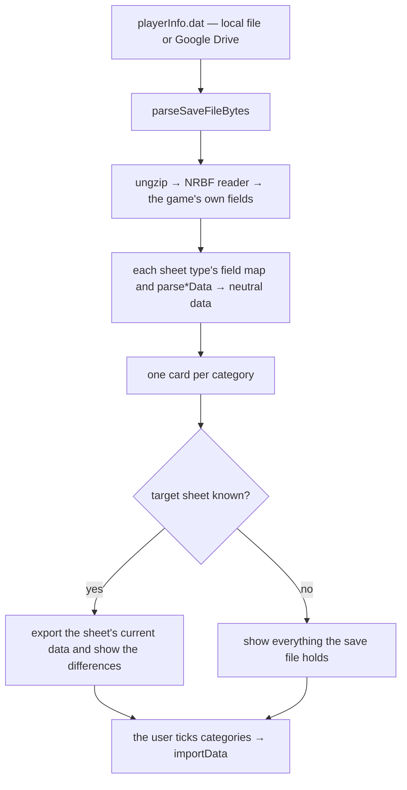

# 04 — Save-file import

Reads the game's save file, `playerInfo.dat`, and writes its values into the user's sheets.

| | |
| --- | --- |
| Add-on | `Import Data ▸ Import Data From Game (playerInfo.dat)` → `openSaveFileDialog()` |
| Web app | `?page=savefile` |
| Page | `client/pages/save_file.html`, scripts in `client/save_file/` |
| Server | `server/savefile/`, each sheet type's `_savefile.js`, `server/workflows/save_file_targets.js` |

## Flow

```mermaid
flowchart TB
    A["playerInfo.dat — local file or Google Drive"] --> B["parseSaveFileBytes"]
    B --> C["ungzip → NRBF reader → the game's own fields"]
    C --> D["each sheet type's field map and parse*Data → neutral data"]
    D --> E["one card per category"]
    E --> F{"target sheet known?"}
    F -->|yes| G["export the sheet's current data and show the differences"]
    F -->|no| H["show everything the save file holds"]
    G --> I["the user ticks categories → importData"]
    H --> I
```

`importData` is the same importer the Update Sheet workflow uses.

## The parser

`playerInfo.dat` is a gzip-compressed .NET BinaryFormatter (NRBF) stream.
`server/savefile/nrbf_reader.js` reads its records, follows object references, and turns .NET
lists, dictionaries and enums into plain JavaScript values; 64-bit counters come back as BigInt.
Each sheet type's field map picks the fields it needs and its `parse*Data` returns the neutral shape
`importData` takes. A category that fails to parse is reported without stopping the others.

## Targets and access

The target is an IDS Master or an IDS Collection, from the add-on's open sheet or a link the user
gives. For a Master, `getSaveFileImportTargets` finds every subsheet and its versions from the
`IDS` tab, and each one goes through the access cycle. A Collection is one file.

A category whose sheet is not linked or is older than its template cannot be imported: its card is
badged and disabled until the sheet is updated. For a Collection, an outdated file blocks every
card.

## Diff view

When the target is known, the client exports the sheet's current data in the background through
the normal export and compares it with the save file, category by category. Identical categories
are marked "no differences" and unticked. A category whose sheet could not be read shows a notice
instead.

## Import

- **IDS Master:** one `importData` per ticked category, in parallel, into its own subsheet.
- **IDS Collection:** one `importData` with every ticked category; failures come back per
  category.

**Player & Stuff** waves are capped before import (tier waves and dissonance waves each have their
own cap) unless the user picks **Max waves**. The choice is saved per user.

## The guide

`client/save_file/guide_section.html` explains how to get `playerInfo.dat` off Android (old and new
versions), emulators and macOS, with copyable commands.

## A new save-file field

1. Find the game's key in `docs/<category>_save_format.json` (local only).
2. Add it to the type's field map in `_savefile.js` and read it in `parse*Data`; it must tolerate
   the field being absent.
3. If `importData` does not write it yet, extend `_write.js` and the IDS Collection's import.
4. Show it in the diff and body renderers in `client/save_file/`.
