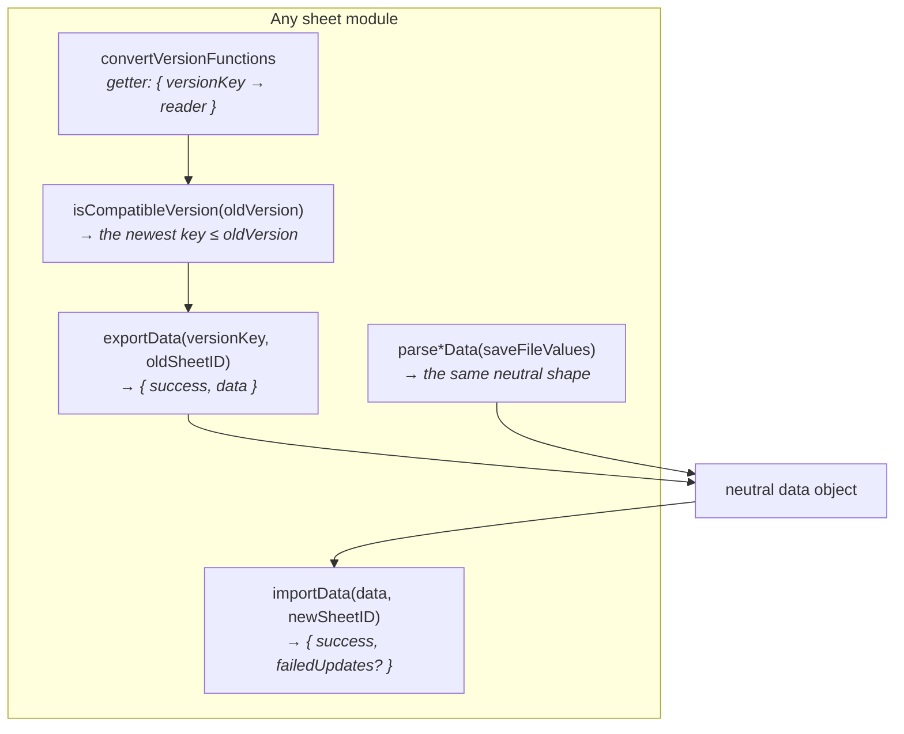
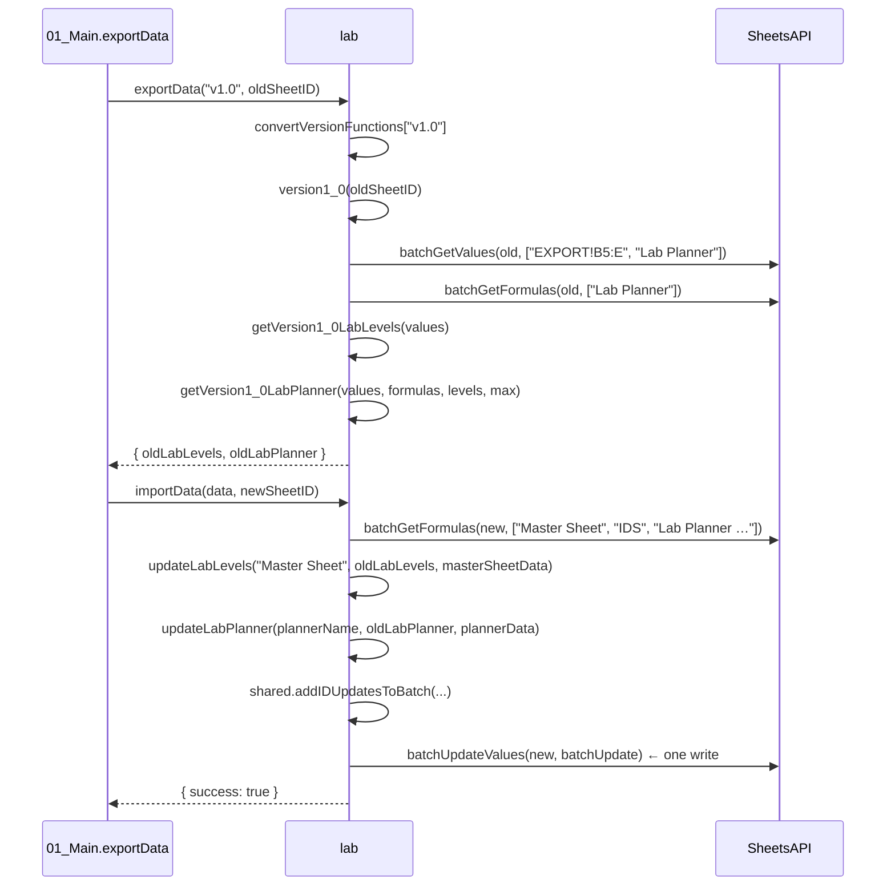
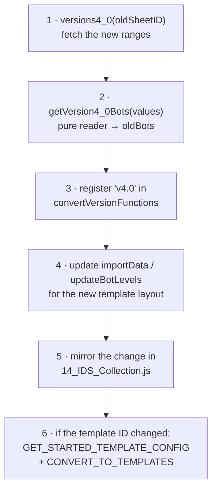

# 05 — Sheet modules reference

One module per sheet type, all implementing the same contract. This document is
the per-module reference plus the recipes for extending them.

- [The contract](#the-contract)
- [Anatomy of a module](#anatomy-of-a-module)
- [Module reference](#module-reference)
- [The two aggregate modules](#the-two-aggregate-modules)
- [Adding a new version converter](#adding-a-new-version-converter)
- [Adding a new sheet type](#adding-a-new-sheet-type)

---

## The contract



Internally each module is organised with `// #region` markers in a fixed order:

| Region | Contains |
| --- | --- |
| `Export Functions` | `exportData` — dispatch only |
| `Import Functions` | `importData` — read the new sheet, build one `batchUpdate` |
| `Update Functions` | `updateX(sheetName, oldData, newSheetValues, …)` — produce `batchUpdate` entries. **Also called directly by [14_IDS_Collection.js](../src/14_IDS_Collection.js)** |
| `Convert Versions` | `versionN_M(oldSheetID)` — one per template generation; fetches ranges and delegates |
| `Get <thing>` | `getVersionN_MThing(values)` — pure readers, no API calls |
| `Parse Data` | `parse*Data(values)` — save-file entry point |
| `Convert Version Functions Getter` | the `convertVersionFunctions` getter |
| `Compatibility Check` | `isCompatibleVersion` |

The `update*` functions are the reason the IDS Collection is not a duplicate
implementation: it holds every category as a tab in one file, so its
`importData` simply calls each module's `update*` against its own ranges.

---

## Anatomy of a module

Using [03_Laboratory.js](../src/03_Laboratory.js) as the smallest complete
example:



Two conventions run through every module:

- **`importData` guards every section with `data.hasOwnProperty(key)`.** A
  partial payload — an older export, or a save file lacking a field — updates
  only what it carries and leaves the rest of the sheet untouched.
- **Import reads the *new* sheet before writing it.** Row labels are located in
  the new template's own grid, so a re-laid-out template needs no coordinate
  changes here.

---

## Module reference

### Laboratory — [03_Laboratory.js](../src/03_Laboratory.js)

| | |
| --- | --- |
| Object | `lab` |
| Versions | `v1.0` |
| Exports from | `EXPORT!B5:E`, `*Lab Planner*` (values **and** formulas) |
| Imports into | `Master Sheet`, `*Lab Planner*`, `IDS` |
| Neutral keys | `oldLabLevels`, `oldLabPlanner` |
| Save-file map | `labHeaders` → `researchLevel` |

`parseLabData` maps the save file's sparse `researchLevel` array through a
~120-entry `labNamesByIndex` table. Unknown indices become
`Unknown Lab <index>` and are logged rather than dropped. The planner tab is
found by *substring* (`getSheetBySubstring(ss, "Lab Planner")`) because its name
carries a version suffix.

### Workshop — [04_Workshop.js](../src/04_Workshop.js)

| | |
| --- | --- |
| Object | `workshop` |
| Versions | `v1.0`, `v2.0`, `v2.1`, `v2.2.8` |
| Exports from | `EXPORT!B2:M` (levels), `EXPORT!P2:V` (plus levels), `Desired Ratios` |
| Neutral keys | `oldWorkshopLevels`, `oldWorkshopPlusLevels`, `oldWorkshopPlusRatios` |
| Save-file map | `workshopHeaders` — 18 fields |

The most preset-heavy module: attack/defense/utility × upgrade/enhancement ×
per-preset arrays. `parseWorkshopData` runs everything through
`shared.resolvePresetOrder(names, ["Farming", "Tourney"])` so the sheet's fixed
preset slots receive the right columns regardless of the player's own ordering.

### Ultimate Weapon — [05_Ultimate_Weapons.js](../src/05_Ultimate_Weapons.js)

| | |
| --- | --- |
| Object | `ultimate` |
| Versions | `v1.0`, `v2.0`, `v3.1.1` |
| Exports from | `EXPORT!C5:H`, `UW Cost Calculator v3` (formulas) |
| Imports into | `Master Sheet`, `UW Cost Calculator v3`, `IDS` |
| Neutral keys | `oldUltimate`, `oldUltimateCostCalculator` |

The cost calculator is exported as **formulas**, so user-entered targets
(`# Of UWs Wanted`, per-weapon goals) survive rather than being flattened to
values. Level cells are dropdowns, so writes go through `shared.getDVTValue`
against `DVT_UW_UG_*` named ranges.

### Themes, Songs & Relics — [06_Themes_Songs_Relics.js](../src/06_Themes_Songs_Relics.js)

| | |
| --- | --- |
| Object | `themesAndRelics` |
| Versions | `v4.0` |
| Exports from | `Themes & Songs`, `Relics` (full tabs) |
| Neutral keys | `oldThemesNames`, `oldRelics` |
| Save-file map | `themesAndRelicsHeaders` — tower/background/menu/guardian skins, profile banners, songs, relics |

This sheet type replaced two older ones. See
[Legacy Themes merge](03-workflow-update-sheets.md#legacy-themes-merge).

### Themes & Songs *(legacy)* — [17_Themes_&_Songs.js](../src/17_Themes_&_Songs.js)

`themes`. Versions `v1.0`, `v2.1.6`. Key `oldThemesNames`. Export-only in
practice — nothing copies this template any more.

### Relics *(legacy)* — [17_Relics.js](../src/17_Relics.js)

`relics`. Version `v1.0`. Key `oldRelics`. Same status.

### Bots — [07_Bots.js](../src/07_Bots.js)

| | |
| --- | --- |
| Object | `bots` |
| Versions | `v1.0`, `v2.0`, `v3.0`, `v3.2` |
| Exports from | `EXPORT!C4:N` (`C5:G` pre-v3.0) |
| Imports into | `Master Sheet`, `IDS` |
| Neutral key | `oldBots` |
| Save-file map | `botHeaders` — flame/thunder/golden/amplify/bot-bot presets + synchronicity |

The widening export range across versions tracks the game adding bot presets.

### Vault — [09_Vault.js](../src/09_Vault.js)

| | |
| --- | --- |
| Object | `vault` |
| Versions | `v1.0`, `v3.1`, `v4.0` |
| Exports from | `EXPORT!B4:C` (v4.0) |
| Neutral key | `oldVault` (older versions used `oldVaultHarmony` / `oldVaultPower`) |

`version3_1` and `version1_0` **early-return** with "Vault is from an old version
- no data to transfer". The old reading code is left in place below the return,
unreachable, as reference. Pre-v4.0 vault layouts are effectively not migrated.

### Cards — [10_Cards.js](../src/10_Cards.js)

| | |
| --- | --- |
| Object | `cards` |
| Versions | `v1.0` |
| Exports from | `Card Preset`, `Card and Mastery Tracker`, `EXPORT!B5:D`, `EXPORT!C2` |
| Imports into | `Master Sheet`, `Card Preset`, `Card and Mastery Tracker`, `IDS` |
| Neutral keys | `oldCardsLevel`, `oldCardsPreset`, `oldCardsTracker` |
| Save-file map | `cardsHeaders` — levels, mastery, preset names, preset slots/cards, unlocked slots |

`EXPORT!C2` is the unlocked-slot count, kept separate from the level grid.

### Modules — [11_Modules.js](../src/11_Modules.js)

| | |
| --- | --- |
| Object | `modules` |
| Versions | `v4.0`, `v4.7`, `v5.0`, `v5.2.1` (a `v6.4.3` exists but is **commented out** of the getter) |
| Exports from | `Inventory`, `Presets`, `Tracker` (values + formulas) |
| Imports into | `Inventory`, `Presets`, `Planner v2`, `Tracker`, `IDS` |
| Neutral keys | `oldModulesInventory`, `oldModulesPresets`, `oldModulesPlanner`, `oldModulesTracker` |
| Save-file map | `moduleHeaders` — equipped, inventory, assist slots, levels, presets, reroll currency |

The most intricate parser. Each module carries a name, rarity, level and a list
of substat `effects` that must be decoded into `[label, rarity]` pairs; the
inventory is **deduplicated**, keeping only the highest-rarity copy of each
name+category. `findModuleTypesRowIndex` locates the Cannon/Armor/Generator/Core
blocks in the target sheet dynamically. See `docs/module_save_format.json` for
the full `effectID` table.

`version6_4_3` is present and complete but not wired into
`convertVersionFunctions` — enabling it is a one-line change once the
corresponding template ships.

### Guardians — [12_Guardians.js](../src/12_Guardians.js)

| | |
| --- | --- |
| Object | `guardians` |
| Versions | `v1.0`, `v2.1`, `v2.2`, `v3.1` |
| Exports from | `EXPORT!B4:O` (`B5:F` before v3.1) |
| Neutral key | `oldGuardians` |
| Save-file map | `guardianHeaders` — chip slot/unlocked/level, presets |

Chip levels are dropdowns → `DVT_*` named ranges via `shared.getDVTValue`.

### Player & Stuff — [13_Player_&_Stuff.js](../src/13_Player_&_Stuff.js)

| | |
| --- | --- |
| Object | `playerStuff` |
| Versions | `v2.0`, `v3.2`, `v4.0`, `v4.2` |
| Exports from | `EXPORT!B3:H` (tiers), `EXPORT!J3:K` (stats), `Perk Preset` |
| Imports into | `Master Sheet`, `Perk Preset`, `IDS` |
| Neutral keys | `oldPlayerStuffTierData`, `oldPlayerStuffStatsData`, `oldPerksPreset` |
| Save-file map | `PlayerStuffHeaders` — 19 fields |

The only category with a **client-side transform** before import:
`sfPlayerWaveData` clamps per-tier waves to 4500 and dissonance waves to 5000
unless the user opts into "Max waves". `oldPerksPreset` also honours
`shouldRemoveUsedPerks`.

### Effective Paths — [16_ePaths.js](../src/16_ePaths.js)

| | |
| --- | --- |
| Object | `ePaths` |
| Versions | `v4.11.02.00` … `v5.09.00.00` (10 thresholds) |
| Reads/writes | `eHP!AJ1:AY50`, `eDamage!AI1:AY100`, `eEcon!AK1:AZ65`, plus lab-cost columns `eHP!L3:L5`, `eHP!AH3:AH5`, `eDamage!L3:L5`, `eEcon!O3:O5`, `eEcon!X3:X5`, `eEcon!AH3:AH5` |
| Neutral keys | `{ eHP: { oldData }, eDamage: { oldData }, eEcon: { oldData } }` |
| Save-file | **none** — this sheet is computed, not imported from the game |

The outlier of the family:

- Four-segment zero-padded versions (`v5.09.00.00`), which
  `compareVersions` handles because it parses numeric segments generically.
- Not detected via `Home Page!B2` but by the presence of `eHP`/`eDamage`/`eEcon`
  tabs.
- Uses `shared.getEPathsVersion`, not `shared.findSheetVersion`.
- Works in **range-relative** coordinates via
  `shared.getColumnOffsetFromRange`, so a whole block can shift columns between
  versions without touching the readers.

---

## The two aggregate modules

### IDS Master — [15_IDS_Master.js](../src/15_IDS_Master.js)

| | |
| --- | --- |
| Object | `master` |
| Versions | `v2.0`, `v4.0` |
| Reads/writes | `IDS`, `Presets Presets` |
| Neutral keys | `oldIdsData` (sheet type → sheet ID), `oldPresetsData` |
| Save-file map | `MasterHeaders` — `globalPresets` + per-category preset names |

`oldIdsData` is what the combined-update flow rewrites
(`remapMasterIdsToNewSheets`) before importing, so the new master points at the
new subsheets. `importData` also writes `This Sheet ID` = itself, which is why a
combined update can skip `updateIdsMaster` afterwards and only fetch the tab's
`gid`.

`parseMasterData` reads the game's *global* preset names so the master's
`Presets Presets` tab can label preset slots consistently across every subsheet.
The last global preset is deliberately skipped — the game stores a dummy entry
there.

### IDS Collection — [14_IDS_Collection.js](../src/14_IDS_Collection.js)

| | |
| --- | --- |
| Object | `collection` |
| Versions | 14 thresholds, `v1.3.5` → `v4.2` |
| Size | ~6 700 lines — every version carries its own full range map |

The single-file arrangement. Its export produces one object **keyed by sheet
type**, so it slots straight into the same fan-out the multi-file arrangement
uses:

```javascript
{ "Laboratory": { oldLabLevels, oldLabPlanner },
  "Workshop":   { oldWorkshopLevels, … },
  … }
```

Its `importData` delegates to every other module's `update*` function against
its own consolidated tabs:

| Category | Values ranges | Formula ranges |
| --- | --- | --- |
| Laboratory | `EXPORT_Lab!B5:E`, `Lab Planner` | `Lab Planner` |
| Workshop | `EXPORT_WS!B2:M`, `EXPORT_WS!P2:V`, `Desired Ratios` | |
| Ultimate Weapon | `EXPORT_UW!C5:H` | `UW Cost Calculator v3` |
| Themes / Relics | `Themes & Songs`, `Relics` | |
| Bots | `EXPORT_Bots!C4:N` | |
| Vault | `EXPORT_Vault!B4:C` | |
| Cards | `Card Preset`, `Card and Mastery Tracker`, `EXPORT_Cards!B5:D`, `EXPORT_Cards!C2` | |
| Modules | `Modules Inventory`, `Modules Presets`, `Modules Tracker` | `Modules Tracker` |
| Guardians | `EXPORT_Guardians!B4:O` | |
| Player & Stuff | `EXPORT_Player!B3:H`, `EXPORT_Player!J3:K`, `Perk Preset` | |

It also holds the master `dvtNamedRanges*` tables (UW, Bots, Modules, Guardians)
mapping every dropdown column to its `DVT_*` named range.

Failures are collected per category into `failedUpdates: [{ sheetType, message }]`
rather than aborting — one broken category must not block the other nine. The
save-file client maps those entries back onto its category cards.

> A new template version means **two** edits: the module's own converter *and*
> the matching branch in the IDS Collection.

---

## Adding a new version converter

Say `Bots v4.0` ships with a wider export range.



Rules to keep in mind:

- **Never delete an old converter.** A user on `v1.0` still needs `version1_0`.
- **`getVersionN_M*` readers must not call the API.** They take raw values and
  return plain objects, which keeps them cheap and unit-testable by eye.
- **Return the same neutral keys.** `importData` branches on key presence, so a
  new converter emitting `oldBotsV2` instead of `oldBots` silently imports
  nothing.
- **Order in the getter does not matter.** `isCompatibleVersion` sorts by
  version, not by declaration.

---

## Adding a new sheet type

1. Create `NN_<Name>.js` exporting a `const <name> = { … }` implementing the
   full contract.
2. Register it in `sheetVars()` — [01_Main.js:1-19](../src/01_Main.js#L1-L19).
3. Add it to the candidate list in `getTemplateAndsheetIds`
   ([02_Shared.js:1768](../src/02_Shared.js#L1768)), minding the ordering trap:
   a type whose name is a substring of another must be looked up after it.
4. Add it to the client type lists:
   - `showSelectImportSection()` in [24_selectImport_scripts.html](../src/24_selectImport_scripts.html)
   - `CONVERT_TO_TEMPLATES` in [21_shared_scripts.html](../src/21_shared_scripts.html)
   - `GET_STARTED_TEMPLATE_CONFIG` in [23_getStarted_scripts.html](../src/23_getStarted_scripts.html)
   - the `sheetTypes` lists in [25_fileAccess_scripts.html](../src/25_fileAccess_scripts.html) and `getSaveFileImportTargets`
5. For save-file support: add a header map and a `parse*Data` call in
   [02_SavedFile.js](../src/02_SavedFile.js), and a diff renderer in
   [28_saveFile_scripts.html](../src/28_saveFile_scripts.html).
6. Add the category to [14_IDS_Collection.js](../src/14_IDS_Collection.js) if it
   should live in the single-file arrangement too.

The sheet template itself must provide: a `Home Page` with version labels and a
`HYPERLINK(..."copy"...)` template link, and an `IDS` tab with `This Sheet ID`
and `IDS Master's` rows in the layout described in
[01 — Discovery by label scanning](01-architecture.md#discovery-by-label-scanning).
