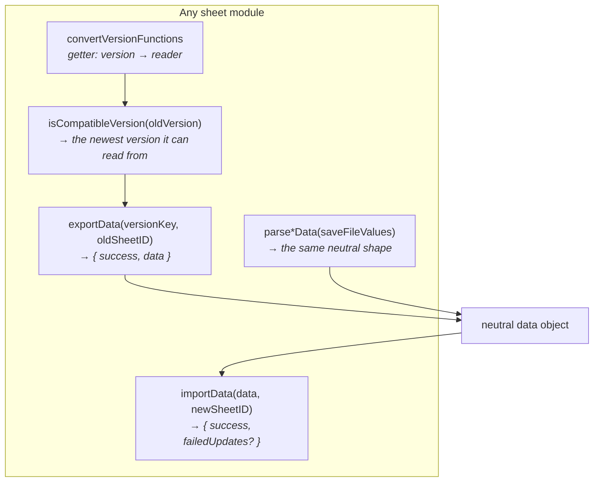
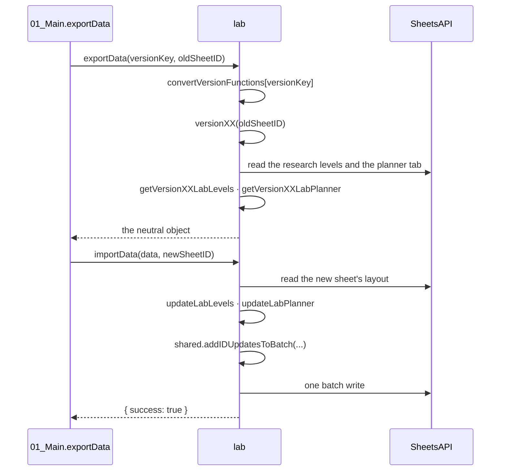
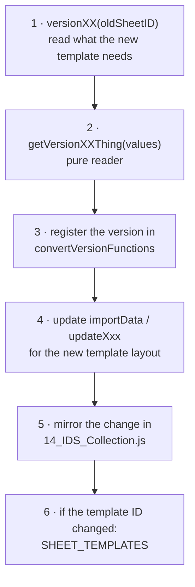

# 05 — Sheet modules reference

One module per sheet type, all implementing the same contract.

- [The contract](#the-contract)
- [Anatomy of a module](#anatomy-of-a-module)
- [Module reference](#module-reference)
- [The two aggregate modules](#the-two-aggregate-modules)
- [Adding a new version converter](#adding-a-new-version-converter)
- [Adding a new sheet type](#adding-a-new-sheet-type)

---

## The contract

Export and save-file parsing both produce the same neutral object, so
`importData` serves the sheet-migration workflow and the save-file workflow
alike.

Internally each module is organised with `// #region` markers in a fixed order:

| Region | Contains |
| --- | --- |
| `Export Functions` | `exportData` — dispatch only |
| `Import Functions` | `importData` — read the new sheet, build one batch update |
| `Update Functions` | `updateXxx(...)` — produce the write entries. **Also called directly by [14_IDS_Collection.js](../src/14_IDS_Collection.js)** |
| `Convert Versions` | `versionXX(oldSheetID)` — one per template generation; fetches what it needs and delegates |
| `Get <thing>` | `getVersionXXThing(values)` — pure readers, no API calls |
| `Parse Data` | `parseXxxData(values)` — save-file entry point |
| `Convert Version Functions Getter` | the `convertVersionFunctions` getter |
| `Compatibility Check` | `isCompatibleVersion` |

The IDS Collection holds every category as a tab in one file. Its `importData`
calls each module's `updateXxx` against its own tabs.

---

## Anatomy of a module

Using [03_Laboratory.js](../src/03_Laboratory.js) as the smallest complete
example:

Two conventions run through every module:

- **`importData` guards every section it might write.** A partial payload — an
  older export, or a save file lacking a field — updates only what it carries
  and leaves the rest of the sheet untouched.
- **Import reads the *new* sheet before writing it.** Row labels are located in
  the new template's own grid.

---

## Module reference

| Sheet type | Object | Source |
| --- | --- | --- |
| Laboratory | `lab` | [03_Laboratory.js](../src/03_Laboratory.js) |
| Workshop | `workshop` | [04_Workshop.js](../src/04_Workshop.js) |
| Ultimate Weapon | `ultimate` | [05_Ultimate_Weapons.js](../src/05_Ultimate_Weapons.js) |
| Themes, Songs & Relics | `themesAndRelics` | [06_Themes_Songs_Relics.js](../src/06_Themes_Songs_Relics.js) |
| Themes & Songs *(legacy)* | `themes` | [17_Themes_&_Songs.js](../src/17_Themes_&_Songs.js) |
| Relics *(legacy)* | `relics` | [17_Relics.js](../src/17_Relics.js) |
| Bots | `bots` | [07_Bots.js](../src/07_Bots.js) |
| Vault | `vault` | [09_Vault.js](../src/09_Vault.js) |
| Cards | `cards` | [10_Cards.js](../src/10_Cards.js) |
| Modules | `modules` | [11_Modules.js](../src/11_Modules.js) |
| Guardians | `guardians` | [12_Guardians.js](../src/12_Guardians.js) |
| Player & Stuff | `playerStuff` | [13_Player_&_Stuff.js](../src/13_Player_&_Stuff.js) |
| Effective Paths | `ePaths` | [16_ePaths.js](../src/16_ePaths.js) |

### Laboratory

Moves the research levels and the Lab Planner. The planner is carried as
formulas, so the user's own planning survives. Reads the research levels from
the save file, mapping the game's sparse level array onto lab names; an index
with no known name is carried through under a placeholder rather than dropped.

The planner tab's name carries a version suffix, so it is found by substring.

### Workshop

Moves the upgrade and enhancement levels for attack, defense and utility, the
plus-levels and the desired ratios. Everything is per preset, so save-file
parsing runs through `shared.resolvePresetOrder` before it reaches the sheet's
fixed preset slots.

### Ultimate Weapon

Moves the weapon levels and the cost calculator. The calculator is carried as
formulas, so user-entered targets survive. Level cells are dropdowns, so writes
go through `shared.getDVTValue`.

### Themes, Songs & Relics

Moves the themes, songs and relics tabs. From the save file it reads the tower,
background, menu and guardian skins, profile banners, songs and relics.

This sheet type replaced two older ones — see
[Legacy Themes merge](03-workflow-update-sheets.md#legacy-themes-merge).

### Themes & Songs, Relics *(legacy)*

The two sheet types that `Themes, Songs & Relics` replaced. Still readable so
old sheets can be migrated; nothing copies these templates any more.

### Bots

Moves the bot presets and synchronicity.

### Vault

Moves the vault data. Sheets older than the current template generation
early-return with "Vault is from an old version - no data to transfer"; the
older reading code is left in place, unreachable, as reference.

### Cards

Moves the card levels, mastery, presets, the tracker and the unlocked-slot
count.

### Modules

Moves the inventory, presets, planner and tracker. Each module in the inventory
carries a name, rarity, level and substat effects that must be decoded into
label/rarity pairs; the inventory is **deduplicated**, keeping only the
highest-rarity copy of each name and category. `findModuleTypesRowIndex` locates
the Cannon/Armor/Generator/Core blocks in the target sheet. See
`docs/module_save_format.json` for the substat encoding.

One converter is written but not wired into `convertVersionFunctions`, waiting
on the matching template.

### Guardians

Moves the guardian data — chips, levels and presets. Chip levels are dropdowns,
so writes go through `shared.getDVTValue`.

### Player & Stuff

Moves the tiers, the player stats and the perk presets. The only category with a
client-side transform before import: waves are clamped unless the user opts into
"Max waves" — see
[04 ▸ The wave-cap preference](04-workflow-save-file-import.md#the-wave-cap-preference).

### Effective Paths

Moves the HP, damage and economy blocks along with their lab-cost columns. It
has no save-file input: this sheet is computed, not imported from the game.

It differs from every other module:

- Versions are four-segment and zero-padded. `shared.compareVersions` parses
  numeric segments generically, so they compare correctly anyway.
- Detected by the presence of its own tabs, not by the sheet type on the
  `Home Page`.
- Reads its version through `shared.getEPathsVersion`, not
  `shared.findSheetVersion`.
- Works in range-relative coordinates via `shared.getColumnOffsetFromRange`.

---

## The two aggregate modules

### IDS Master — [15_IDS_Master.js](../src/15_IDS_Master.js)

Object `master`. Moves the `IDS` registry — which sheet type lives at which ID —
and the preset names.

The registry is what the combined-update flow rewrites
(`remapMasterIdsToNewSheets`) before importing, so the new master points at the
new subsheets. `importData` also writes the master's own ID, so a combined
update skips `updateIdsMaster` afterwards and only fetches the tab's `gid`.

From the save file it reads the game's *global* preset names. The last one is
skipped: the game stores a dummy entry there.

### IDS Collection — [14_IDS_Collection.js](../src/14_IDS_Collection.js)

Object `collection`. The single-file arrangement: every category that would
otherwise be its own subsheet, as a tab in one spreadsheet.

Its export produces one object keyed by sheet type, which slots into the same
fan-out the multi-file arrangement uses. Its import delegates to every other
module's `updateXxx` against its own tabs, and holds the dropdown named-range
tables those writes need.

Failures are collected per category into `failedUpdates` rather than aborting.
The save-file client maps those entries back onto its category cards.

> A new template version means **two** edits: the module's own converter *and*
> the matching branch in the IDS Collection.

---

## Adding a new version converter

Rules:

- **Never delete an old converter.** A user on the oldest supported template
  still needs its reader.
- **`getVersionXX*` readers must not call the API.** They take raw values and
  return plain objects.
- **Return the same neutral keys.** `importData` branches on key presence, so a
  converter that renames one silently imports nothing.
- **Order in the getter does not matter.** `isCompatibleVersion` sorts by
  version, not by declaration.

---

## Adding a new sheet type

1. Create `NN_<Name>.js` exporting an object implementing the full contract.
2. Register it in `sheetVars()` — [01_Main.js](../src/01_Main.js#L1-L19).
3. Add it to the candidate list in `getTemplateAndsheetIds`
   ([02_Shared.js:2093](../src/02_Shared.js#L2093)), minding the ordering trap:
   a type whose name is a substring of another must be looked up after it.
4. Add it to the client type lists:
   - `showSelectImportSection()` in [24_selectImport_scripts.html](../src/24_selectImport_scripts.html)
   - `SHEET_TEMPLATES` in [21_templates_scripts.html](../src/21_templates_scripts.html)
   - the sheet-type lists in [25_fileAccess_scripts.html](../src/25_fileAccess_scripts.html) and `getSaveFileImportTargets`
5. For save-file support: add a header map and a `parseXxxData` call in
   [02_SavedFile.js](../src/02_SavedFile.js), and a diff renderer in
   [28_saveFile_scripts.html](../src/28_saveFile_scripts.html).
6. Add the category to [14_IDS_Collection.js](../src/14_IDS_Collection.js) if it
   should live in the single-file arrangement too.

The sheet template itself must provide: a `Home Page` with version labels and a
template copy link, and an `IDS` tab carrying its own ID and the IDS Master's,
in the layout described in
[01 — Discovery by label scanning](01-architecture.md#discovery-by-label-scanning).
