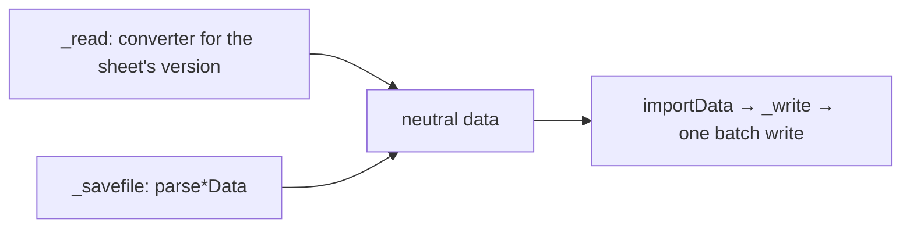

# 05 — Sheet types

Each sheet type lives in `server/sheets/<type>/`, with one file and one object per role.

## The contract

| File | Role |
| --- | --- |
| `<type>.js` | The contract the rest of the app calls: `exportData`, `importData`, `convertVersionFunctions`, `isCompatibleVersion` |
| `_read.js` | One converter per template generation, plus pure readers that turn sheet values into data |
| `_write.js` | `update*` functions that turn data into batched writes; the IDS Collection calls them too |
| `_savefile.js` | The save-file field map and `parse*Data` |
| `_catalog.js` | Game ID-to-name tables, where a type has them |

```mermaid
flowchart LR
    R["_read: converter for the sheet's version"] --> N["neutral data"]
    P["_savefile: parse*Data"] --> N
    N --> I["importData → _write → one batch write"]
```

Export and save-file parsing produce the same neutral data, so one importer serves both workflows.
`importData` reads the new sheet before writing it and only writes the sections the data carries.

## What each type moves

| Type | Moves |
| --- | --- |
| Laboratory | Research levels, and the Lab Planner as formulas so the user's planning survives |
| Workshop | Upgrade and enhancement levels, plus-levels and desired ratios, per preset |
| Ultimate Weapons | Weapon levels (dropdown cells) and the cost calculator as formulas |
| Themes, Songs & Relics | Skins, banners, songs and relics |
| Bots | Bot presets and synchronicity |
| Vault | Vault upgrades; sheets from before the current layout have nothing to move |
| Cards | Levels, mastery, presets, the tracker and unlocked slots |
| Modules | Inventory (deduplicated, highest rarity kept), presets, planner and tracker; readers split per tab |
| Guardians | Chips, levels (dropdown cells) and presets |
| Player & Stuff | Tiers, stats and perk presets |
| Effective Paths | The HP, damage and economy tabs; no save-file input. Each tab's writer and readers share a file, versions have four segments, and it is detected by its own tabs |
| Legacy | Themes & Songs and Relics, the two types Themes, Songs & Relics replaced; read-only, for migration |

**IDS Master** moves the `IDS` registry (which sheet lives at which ID) and the preset names. Its
import writes its own IDs, so a combined update only fetches the tab afterwards. From the save file
it reads the game's global preset names, skipping the game's dummy last entry.

**IDS Collection** is every category as a tab in one file. Its export is one object keyed by sheet
type; its import calls each type's writers against its own tabs and reports failures per category.
Its converters are split by template generation.

## A new template version

1. Add a converter and its readers to `_read.js`. Readers never call the API.
2. Register the version in `convertVersionFunctions`.
3. Update `importData` and `_write.js` for the new layout.
4. Mirror it in the IDS Collection — converter and import.
5. If the template file changed, update `SHEET_TEMPLATES`.

Never delete an old converter, and keep the neutral data's key names: `importData` silently skips a
key it does not recognise.

## A new sheet type

1. Add `server/sheets/<type>/` and register the contract object in `sheetVars()`.
2. Add it to `getTemplateAndsheetIds` after any type whose name contains it, and to the default list
   in `getSaveFileImportTargets`.
3. Add it to `SHEET_TEMPLATES`, the manual file pickers and the conversion type list.
4. For save-file support, add `_savefile.js`, its call in `server/savefile/parse.js`, and renderers
   in `client/save_file/`.
5. Add it to the IDS Collection if it belongs in the single file.

The template needs a `Home Page` with version labels and a copy link, and an `IDS` tab holding its
own ID and its Master's.
