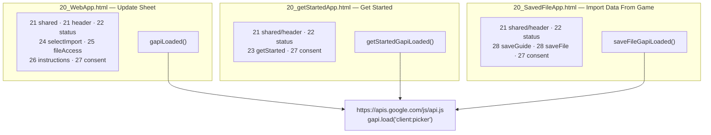
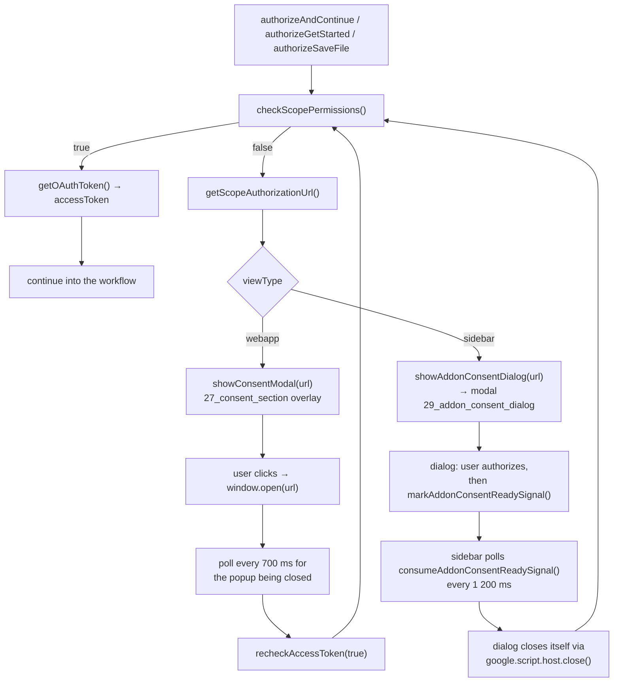
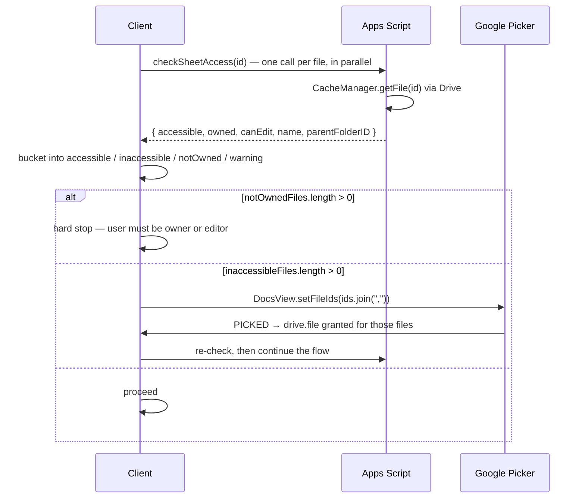

# 06 — Frontend

The client is not a thin view. It owns flow control, retry state and every
decision about *which* server call happens next — the backend is a set of
stateless single-purpose functions.

- [The include system](#the-include-system)
- [Page shells](#page-shells)
- [Fragment inventory](#fragment-inventory)
- [Server injection](#server-injection)
- [Calling the server](#calling-the-server)
- [The consent flow](#the-consent-flow)
- [The access-grant cycle](#the-access-grant-cycle)
- [Status and mobile](#status-and-mobile)
- [Client state](#client-state)
- [Conventions](#conventions)

---

## The include system

Apps Script serves a single HTML file per page. To keep that manageable, every
page is assembled from numbered fragments through `include()`
([01_Main.js:131-133](../src/01_Main.js#L131-L133)):

```javascript
function include(filename) {
  return HtmlService.createHtmlOutputFromFile(filename).getContent();
}
```

Fragments come in triples: `NN_name_section.html` (markup),
`NN_name_styles.html` (a `<style>` block), `NN_name_scripts.html` (a `<script>`
block).

```html
<head>
  <?!= include('21_shared_styles'); ?>
  <?!= include('25_fileAccess_styles'); ?>
</head>
<body>
  <?!= include('25_fileAccess_section'); ?>

  <script> /* server-injected globals */ </script>

  <?!= include('21_shared_scripts'); ?>
  <?!= include('25_fileAccess_scripts'); ?>
</body>
```

Order is load-bearing: **styles in `<head>`, sections next, the globals
`<script>` before any fragment script, then the scripts.** Fragment scripts run
at parse time and read those globals immediately — `21_shared_scripts` logs
`newSheetID`/`sheetType` on its first line, and `22_status_scripts` touches
`#desktopInstructions` as soon as it loads.

---

## Page shells



Each shell ends with the same script tag, differing only in its `onload`
bootstrap:

```html
<script src="https://apis.google.com/js/api.js" onload="gapiLoaded()"></script>
```

Only `20_WebApp.html` pulls in `21_shared_scripts.html` — the picker helpers,
access-check wrappers and template-copy machinery. The other two pages carry
their own narrower equivalents.

`20_SavedFileApp.html` additionally resizes itself when opened as an add-on
dialog, via `google.script.host.setWidth/setHeight` clamped to 80–85 % of the
screen.

---

## Fragment inventory

| Fragment | Section | Styles | Scripts | Purpose |
| --- | :-: | :-: | :-: | --- |
| `21_header` | ✓ | ✓ | ✓ | Branding, creator-code chips, shared click-to-copy |
| `21_shared` | | ✓ | ✓ | Picker, access checks, template copying, combined update |
| `22_status` | ✓ | ✓ | ✓ | The one-line status bar; mobile detection |
| `22_error` | ✓ | ✓ | ✓ | The error panel, `AppError`, and the shared `runAppsScript` |
| `23_getStarted` | ✓ | ✓ | ✓ | Get Started explainer + quick setup |
| `24_selectImport` | ✓ | ✓ | ✓ | Manual file selection when params are missing |
| `25_fileAccess` | ✓ | ✓ | ✓ | The update workflow's buttons and orchestration |
| `26_instructions` | ✓ | ✓ | | Picker usage tips (desktop vs. mobile) |
| `27_consent` | ✓ | ✓ | ✓ | Missing-scope modal and recheck loop |
| `28_saveGuide` | ✓ | ✓ | | Where to find `playerInfo.dat` |
| `28_saveFile` | ✓ | ✓ | ✓ | Parse, diff, select, import |
| `29_addon_consent_dialog` | *(whole page)* | | | Sidebar-only consent dialog |

`21_header_scripts.html` holds the shared clipboard helper used by both the
creator-code chips and the save-guide shell snippets. It tries
`navigator.clipboard`, falls back to `document.execCommand("copy")` (the
Clipboard API is blocked in some sandboxed Apps Script iframes), and as a last
resort selects the text so `Ctrl+C` still works.

---

## Server injection

Server values reach the client through Apps Script templating in the shell:

```javascript
const API_KEY = "<?= API_KEY ?>";           // ScriptProperties — Picker developer key
const APP_ID  = "<?= APP_ID ?>";            // ScriptProperties — Picker app ID
const viewType = "<?= viewType ?>";         // "webapp" | "sidebar"
let newSheetID = "<?= newSheetID ?>";
let oldSheetID = "<?= oldSheetID ?>";
let idMasterID = "<?= idMasterID ?>";
let sheetType  = "<?= sheetType ?>";
const getStarted = false;                    // page flags read by 27_consent_scripts
const saveFile   = false;
```

`getStarted` / `saveFile` are the mechanism by which the **shared** consent
script knows which page-specific `authorize*()` to resume after the user grants
scopes.

The sheet IDs are `let`, not `const` — the flows reassign them freely
(`newSheetID = copyResult.fileId`, `sheetType = "IDS Master"` during a
conversion).

---

## Calling the server

`22_error_scripts` defines the one promise wrapper every page uses. It rejects
with a **normalised** error — the same shape a failed envelope has — so no
caller has to guess what it got:

```javascript
function runAppsScript(method, ...args) {
  return new Promise(function (resolve, reject) {
    google.script.run
      .withSuccessHandler(resolve)
      .withFailureHandler(function (error) {
        reject(AppError.normalize(error, { source: method }));
      })
      [method](...args);
  });
}
```

A resolved call can still be a failure — that is what the envelope is for:

```javascript
const result = await runAppsScript("importData", newSheetID, sheetType, data);
if (AppError.check(result, "importData")) return;   // panel shown, reference included
```

See [08 — Error handling](08-error-handling.md) for `AppError` in full.

Bulk operations then become plain `Promise.all` fan-outs with per-item progress:

```javascript
const copyPromises = templates.map(t => new Promise(resolve => {
  google.script.run
    .withSuccessHandler(r => { completed++; updateStatus(); resolve(r); })
    .withFailureHandler(e => { completed++; failed++; updateStatus(); resolve({success:false}); })
    .copyFileTemplate(t.id, t.sheetType, t.version, parentFolderID);
}));
await Promise.all(copyPromises);
```

Two habits worth copying when adding flows:

- **`resolve` on failure, never `reject`.** A single failed sheet must not take
  down `Promise.all` for the other ten.
- **Update the DOM inside the handler**, not after the `await`. The user watches
  each sheet land in the summary as it completes.
- **Report what you swallowed.** A resolved-on-failure item still has to reach
  the log: `AppError.log(error, "copyTemplates")` records it without putting a
  panel in front of someone whose other ten sheets copied fine.

---

## The consent flow

`drive.file` and friends are not granted by simply opening the page. The flow
differs between web app and add-on because a sidebar cannot host the
cross-origin consent screen.



The signal itself is a timestamp in `UserProperties` under
`ADDON_CONSENT_READY_SIGNAL`; `consume…` reads **and deletes** it, so it fires
exactly once.

`27_consent_scripts.html` is shared by all three pages *and* by the dialog. The
dialog overrides `authorizeAndContinue` and stubs `setStatusText` /
`setStatusWithSpinner` onto the modal's own badge, which lets it reuse the whole
recheck machinery without a status bar.

`consentScopeCheckOutcome` (`"idle" | "granted" | "missing_scopes" | "error"`)
distinguishes *"still not authorized"* — expected, keep the manual button hidden
— from *"something actually broke"* — reveal `Recheck scope access`.

---

## The access-grant cycle

Because of `drive.file`, knowing a sheet ID is not enough. This loop recurs
throughout the app:



| Bucket | Meaning |
| --- | --- |
| `accessibleFilesCache` | Reachable and editable |
| `inaccessibleFilesCache` | Needs a picker grant |
| `notOwnedFilesCache` | Reachable but the user is neither owner nor editor — **blocking** |
| `warningFilesCache` | Editable but not owned — non-blocking amber warning |
| `templateAccessibleFilesCache` / `templateInaccessibleFilesCache` | Same, for template files |

Picker specifics:

- The view is seeded with `setFileIds(...)` so only the files that need granting
  are offered.
- Size comes from `calculatePickerSize()`, and on mobile
  `google.picker.Feature.NAV_HIDDEN` is enabled.
- `setOrigin(google.script.host.origin)` is required for the picker to render
  inside an Apps Script iframe.
- `pickerCallback` is a large branch on the current flow — a picker completion
  has to resume whichever step opened it (`isUpdateSingleSheetFlow`,
  `isCombinedUpdate`, `sheetType === "IDS Master"`, …).

---

## Status and mobile

One status line drives every page ([22_status_scripts.html](../src/22_status_scripts.html)):

| Function | Use |
| --- | --- |
| `setStatusWithSpinner(msg)` | Work in progress |
| `setStatusText(msg)` | Terminal state |

`detectMobile()` combines user-agent keywords, `ontouchstart`/`maxTouchPoints`
and a `≤768 px` width check. Beyond swapping the instruction panel, mobile
substitutes shorter status strings from a lookup table — the long desktop
messages wrap badly in a narrow sidebar.

`sanitizeGetStartedUrl(url)` allow-lists only
`https://docs.google.com/spreadsheets/d/…` and
`https://drive.google.com/drive/folders/…` before any URL is rendered into a
link. Save-file rendering has its own `escSaveFileHtml` for the same reason —
sheet and file names are user-controlled and end up inside `innerHTML`.

---

## Client state

All page state is module-level `let`s in the fragment scripts. There is no
framework and no store.

### Update workflow ([21_shared_scripts.html](../src/21_shared_scripts.html#L1-L40))

```
accessToken · pickerInited · isMobile · parentFolderID
selectedFiles
accessibleFilesCache · inaccessibleFilesCache · notOwnedFilesCache · warningFilesCache
templateAccessibleFilesCache · templateInaccessibleFilesCache
copiedTemplateFiles → exportedFilesSuccess/Failed → importedFilesSuccess/Failed → movedFiles
currentCopyMode · cachedTemplateInfo · cachedSheetIds
cachedMasterTemplateInfo · cachedTemplatesWithSameVersion
versionDifference · masterVersionDifference
isUpdateSingleSheetFlow · isCombinedUpdate · isConvertToMasterFlow ·
isConvertToCollectionFlow · hasSubsheetsToUpdate · hasMasterUpdate · masterIdsWritten
```

See [Client state buckets](03-workflow-update-sheets.md#client-state-buckets).

### Save-file workflow ([28_saveFile_scripts.html](../src/28_saveFile_scripts.html#L1-L26))

```
parsedSaveData · lastSaveFileResult · saveFilePendingDriveFile
saveFileSheetType · saveFileImportTargets · saveFileCollectionOutdated
saveFileViewMode ("all" | "diff") · sheetExportData · sheetExportFetched · sheetExportPromise
saveFileSelectedTypes (Set | null — null means "default selection")
saveFilePendingAccessIds · saveFileNotOwnedFiles · saveFileWarningFiles
saveFilePlayerWavesAtCap
```

### Get Started ([23_getStarted_scripts.html](../src/23_getStarted_scripts.html#L61-L76))

```
getStartedSelectedFolder · getStartedPickerReady · getStartedLastCopyMode
allCreatedFiles · allFailedCopyFiles · allFailedIDUpdateFiles
lastFailedCopyTemplates · lastFailedIDUpdateFiles
```

---

## Conventions

- **Buttons live in `_section.html` with `style="display: none"` and
  `disabled`**, and are revealed by the flow. `showContinueSection()` and
  `renderIdMasterOptions()` are the two big visibility switchboards.
- **`™` on user-visible Google product names** ("Google Sheet™",
  "IDS Master Sheet™") — Google branding guidance. Some server messages carry it
  too.
- **Emoji as status vocabulary**: ✅ success · ❌ failure · ⚠️ partial ·
  🔐 access needed · ⛔ blocked · 📂 files · 🔄 update · 🎉 all done.
- **Commented-out UI is left in place** (`copyButton`, `copyUpdateButton`,
  `updateMasterOnlyButton`). These are superseded flows kept for reference; the
  live buttons are the ones without comment markers.
- **Never `reject` inside a `Promise.all` fan-out** — resolve with a failure
  object instead.
