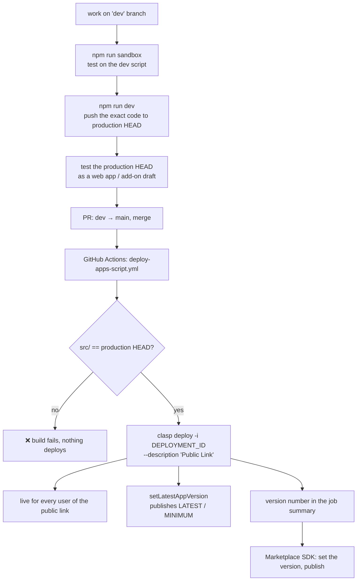
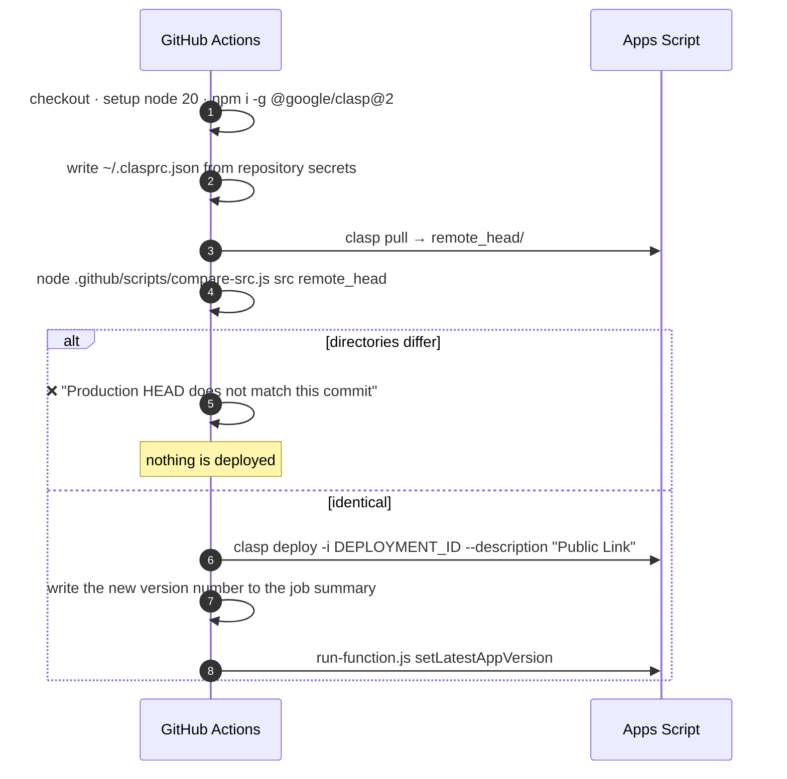
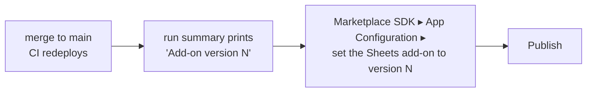
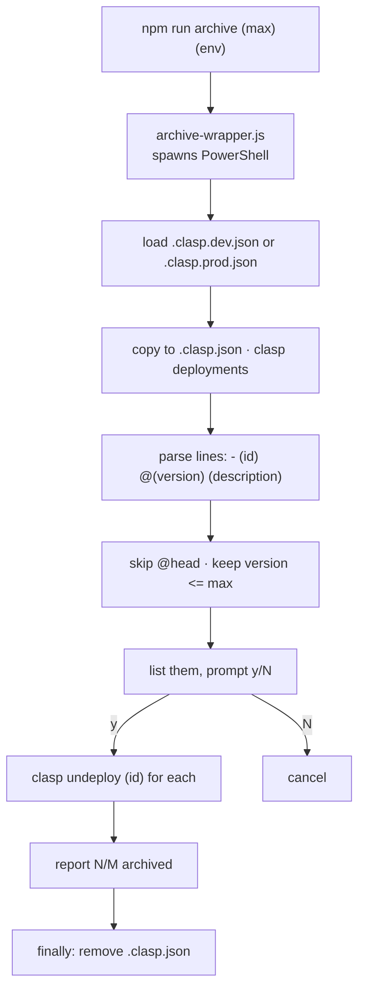

# 07 — Deployment & operations

Two Apps Script projects, one repository, and a CI guard whose whole purpose is
to make sure the code that ships is the code that was tested.

- [Environments](#environments)
- [Local setup](#local-setup)
- [Versioning](#versioning)
- [npm scripts](#npm-scripts)
- [The release path](#the-release-path)
- [The CI guard](#the-ci-guard)
- [Add-on releases](#add-on-releases)
- [Archiving deployments](#archiving-deployments)
- [Project configuration](#project-configuration)
- [Troubleshooting](#troubleshooting)

---

## Environments

| | Dev / sandbox | Production |
| --- | --- | --- |
| Config file | `.clasp.dev.json` | `.clasp.prod.json` |
| Script ID | `1oXmFuPujfTMoJznzG6rAUG8vgwIoJttQdoagwnHlhcf9gmv1X8XCinhE` | `14cE_sgi8iyYjUKQlgjoCPYISUjP_BMndZbWYX2YY7A4cDNXcOqxOxgKL` |
| GCP project | `832137601831` | `1031925368251` |
| Pushed by | `npm run sandbox` | `npm run dev` / `npm run draft` |
| Deployed by | manual | GitHub Actions on `main` |

Both configs share the same shape: `rootDir: "src"`, `.js`/`.gs` as script
extensions, `.html` and `.json` passed through, and an empty `filePushOrder`
(Apps Script concatenates all `.js` files).

`.clasp.json` — the file clasp actually reads — is **git-ignored and
transient**. Every npm script copies the right config into place, runs clasp,
and deletes it again.

---

## Local setup

```bash
npm install      # @google/clasp ^2.4.2
clasp login      # once; writes ~/.clasprc.json
```

The account you log in with must have edit access to whichever script project
you intend to push to.

Four **Script Properties** are read at runtime. The first two must exist on
each project or the Google Picker will not initialise; the other two are the
versioning pointers, and the app copes with either being absent:

| Property | Purpose |
| --- | --- |
| `API_KEY` | Picker developer key |
| `APP_ID` | Picker app (GCP project number) |
| `LATEST_APP_VERSION` | The newest published release. |
| `MINIMUM_APP_VERSION` | The oldest release still supported. |

Set `API_KEY` and `APP_ID` under *Project Settings ▸ Script Properties* in the
Apps Script editor. The two version properties are written after a release —
see [Publishing the version](#publishing-the-version).

---

## Versioning

The running release is **baked into the source** as `appVersion.VERSION` in
[00_Version.js](../src/00_Version.js). That file is the source of truth: it
is the only copy that ships, because clasp pushes just `src/`.

```
npm run bump patch              1.4.1 -> 1.4.2
npm run bump minor              1.4.1 -> 1.5.0
npm run bump major              1.4.1 -> 2.0.0
npm run bump minor min          … and raise the supported floor to it
```

It gets the current version by *evaluating* `00_Version.js` and calling
`appVersion.running()`, then increments it and writes it back along with the
floor. **It edits files only**: nothing is committed, tagged or staged, and it
does not care whether the working tree is clean. Commit the change along with
the work it belongs to.

The write is textual, then verified: the file is re-evaluated afterwards to
check the edit produced valid JavaScript carrying the intended values, and is
put back untouched if it did not. A bump that cannot finish leaves the file
unchanged rather than half-applied — whether the version is unreadable, the
file will not evaluate, or the write reads back wrong.

`appVersion.MINIMUM` is read as a member, not through `minimum()`, which
returns the floor that has been *published* to the script property rather than
the one this release declares.

`package.json` has **no `version` field**. `npm run` and `npm install` both
work without it.

Three values work together:

| | Where it lives | What it means | Who sets it |
| --- | --- | --- | --- |
| `appVersion.VERSION` | Baked into the source | The release **this** user is running | `npm run bump` |
| `LATEST_APP_VERSION` | Script property | The newest release **anyone** is running | `setLatestAppVersion`, run by CI after the redeploy |
| `MINIMUM_APP_VERSION` | Script property | The oldest release still supported | `npm run bump … min` declares it; the same run publishes it |

### The two thresholds

| Running version | What happens |
| --- | --- |
| At or above `LATEST` | Nothing |
| Below `LATEST`, at or above `MINIMUM` | Nothing up front. If an error happens, the panel adds a line saying an update is available and may fix it. |
| Below `MINIMUM` | A banner on page load, before the user does anything, telling them to update. |

Raise `MINIMUM` only for a release an older copy cannot live without.

The status reaches the page two ways: `getAppVersionStatus()` on load for the
banner, and an `outdated: { running, latest, minimum, unsupported }` field on
every failure envelope for the panel line. See [08](08-error-handling.md).

### Publishing the version

Both properties are written by `setLatestAppVersion`, which the deploy workflow
calls automatically once the redeploy has succeeded — see
[The CI guard](#the-ci-guard).

It takes `LATEST_APP_VERSION` from the version baked into the code it is
running as, and `MINIMUM_APP_VERSION` from the floor that release declares, so
it publishes what actually shipped. The step logs both, and what they were
before:

```
setLatestAppVersion returned {"success":true,"version":"5.0.0",
  "previous":"4.0.0","minimum":"5.0.0","previousMinimum":"4.0.0"}
```

It runs after the deployment, never before. `LATEST_APP_VERSION` is what tells
every other copy it is behind, so writing it while the release is still only on
HEAD would point users at something they cannot get yet.

To publish outside a deploy — after a failed step, for instance — there are
three routes, in order of convenience:

1. Re-run the failed job from the Actions tab.
2. Run the **Test Apps Script run** workflow from the Actions tab with
   `setLatestAppVersion` as the function input.
3. Open the production project in the Apps Script editor, pick
   `setLatestAppVersion` from the function dropdown and press **Run**.

Setting the two properties by hand under *Project Settings ▸ Script Properties*
does the same thing.

**Apps Script's own version numbers.** `clasp version` assigns a number
(229, 230, …) only *after* a push, and it differs between the dev and
production projects. The semver in `00_Version.js` is stable across both.

---

## npm scripts

| Command | What it does |
| --- | --- |
| `npm run sandbox` | Copy `.clasp.dev.json` → `.clasp.json`, `clasp push` (auto-confirmed), remove `.clasp.json`. |
| `npm run dev` | Same, against **production**. Pushes to HEAD only — live users are unaffected until a deployment is cut. |
| `npm run draft` | `npm run dev` + `clasp version "add-on draft"`, then prints a reminder to point the Marketplace SDK draft at the new version. |
| `npm run archive <version> [dev\|prod]` | `archive-wrapper.js` → `archive-deployments.ps1`; archives every deployment at or below `<version>`. |
| `npm run bump <major\|minor\|patch> [min]` | Bump the version in `src/00_Version.js`, optionally raising the supported floor. Edits files only — no commit, no tag. |

`sandbox`, `dev`, `draft` and `archive` shell out to PowerShell, so on
Windows they work as-is; on other platforms `pwsh` must be on `PATH`. `bump`
is plain node and runs anywhere.

> **`npm run dev` pushes to production.** Pushing changes HEAD, not the
> published deployment, but it is not a sandbox. For that, use
> `npm run sandbox`.

---

## The release path



The invariant CI enforces: **`main` may only be merged with code that has
already been pushed to production HEAD and tested there.**

---

## The CI guard

[deploy-apps-script.yml](../.github/workflows/deploy-apps-script.yml) runs on
every push to `main`. It never pushes code — it deploys what is already there.



### `compare-src.js`

Compares only the extensions clasp manages — `.js`, `.gs`, `.html`, `.json` —
and normalises away differences clasp itself introduces on a round trip:

| Normalisation | Reason |
| --- | --- |
| `\r\n` → `\n` | Windows checkouts vs. clasp output |
| Strip trailing whitespace per line, and at EOF | clasp reformats |
| JSON compared **structurally** with sorted keys | Apps Script reorders and reindents `appsscript.json` |

Output is a per-file diff summary:

```
Branch source and project HEAD are NOT identical:
  ~ differs:              11_Modules.js
  - only on branch:       18_NewThing.js
```

### `run-function.js`

[run-function.js](../.github/scripts/run-function.js) calls a top-level
function in the production project through the Apps Script API:

```bash
node .github/scripts/run-function.js [functionName]   # default setLatestAppVersion
```

It reads `CLIENT_ID`, `CLIENT_SECRET` and `REFRESH_TOKEN` from the
environment, and the script id from `.clasp.prod.json` unless `SCRIPT_ID`
overrides it. The call runs in `devMode`, so it executes HEAD — which
`compare-src.js` has already proven equals the deployed commit.

Three preconditions on the production project, all one-time:

| Requirement | Where |
| --- | --- |
| `"executionApi": { "access": "MYSELF" }` | `src/appsscript.json` |
| Apps Script API enabled | GCP project `1031925368251` |
| Apps Script API enabled for the account | script.google.com/home/usersettings |

### `test-run-function.yml`

[test-run-function.yml](../.github/workflows/test-run-function.yml) runs the
same script on demand. Trigger it from the Actions tab and give it a function
name; it defaults to `getAppVersionStatus`, which writes nothing. Being
`workflow_dispatch` only, it appears in the Actions tab once the file is on
`main`.

### Required secrets

| Secret | Purpose |
| --- | --- |
| `CLASP_REFRESH_TOKEN` | OAuth refresh token for the deploying account |
| `CLASP_CLIENT_ID` | OAuth client ID |
| `CLASP_CLIENT_SECRET` | OAuth client secret |
| `DEPLOYMENT_ID` | The **existing** deployment to redeploy — the public link's ID |
| `RUN_REFRESH_TOKEN` | Refresh token for `run-function.js` |
| `RUN_CLIENT_ID` | OAuth client ID for `run-function.js` |
| `RUN_CLIENT_SECRET` | OAuth client secret for `run-function.js` |

Redeploying an existing ID rather than creating a new one is what keeps the
public web-app URL stable across releases.

The two credentials are not interchangeable. `CLASP_*` carries clasp's
management scopes and pushes and deploys. `RUN_*` must come from an OAuth
client created in GCP project `1031925368251` — the same project as the
script — and carry every scope in `src/appsscript.json`. Mint it with:

```bash
clasp login --creds client_secret.json --use-project-scopes
```

then copy `client_id`, `client_secret` and `refresh_token` out of
`~/.clasprc.json`. That login replaces the management credential in the same
file, so run `clasp login` again afterwards to push or deploy locally.

---

## Add-on releases

The Sheets add-on is published through the Google Workspace Marketplace SDK,
which pins a **version number**, not HEAD. So an add-on release is a separate,
manual step taken after CI has deployed:



`clasp deploy` creates a new version from HEAD on every run, and the workflow
lifts that number out of the deploy output into the job summary, alongside a
link to the Marketplace SDK App Configuration page for the project:

> ### Add-on version 231
> [Open Marketplace SDK ▸ App Configuration](…) and set **Sheets add-on script
> version** to:
> ```
> 231
> ```
> then publish.

The page has no way to take the number from a URL, so it still has to be
pasted into the field by hand.

If the summary says the version is unknown, the number is under *Deployments*
in the Apps Script editor.

The web app and the add-on can therefore be on different versions at the same
time — the web app follows the deployment CI redeploys, the add-on follows
whichever version the Marketplace config points at.

---

## Archiving deployments

Versions accumulate. `archive-deployments.ps1` bulk-archives old ones via
`clasp undeploy` (archived, not deleted).

```bash
npm run archive 35          # dev, everything at or below v35
npm run archive 35 prod     # production
```



The `@head` pseudo-deployment is always skipped, and the currently published
`DEPLOYMENT_ID` should be kept — archiving it would break the public link.

---

## Project configuration

`src/appsscript.json`:

```json
{
  "timeZone": "Europe/Berlin",
  "runtimeVersion": "V8",
  "dependencies": {
    "enabledAdvancedServices": [
      { "userSymbol": "Drive",  "version": "v3", "serviceId": "drive"  },
      { "userSymbol": "Sheets", "version": "v4", "serviceId": "sheets" }
    ]
  },
  "oauthScopes": [
    "openid",
    "https://www.googleapis.com/auth/userinfo.email",
    "https://www.googleapis.com/auth/drive.file",
    "https://www.googleapis.com/auth/spreadsheets.currentonly",
    "https://www.googleapis.com/auth/script.container.ui"
  ],
  "webapp": { "executeAs": "USER_ACCESSING", "access": "ANYONE" },
  "executionApi": { "access": "MYSELF" }
}
```

| Setting | Consequence |
| --- | --- |
| `executeAs: USER_ACCESSING` | The script runs as the visitor, using *their* Drive quota and permissions. It can never touch a file the visitor cannot. |
| `access: ANYONE` | No sign-in wall on the web app, but every visitor still goes through the OAuth consent flow. |
| `executionApi` | Makes the project callable through the Apps Script API, which is how CI runs `setLatestAppVersion`. |
| `drive.file` | Per-file access only — the reason for the Picker cycle everywhere. |
| Advanced services | `Drive` v3 and `Sheets` v4 must also be enabled in the GCP project, not just declared here. |

Adding a scope invalidates every existing user's authorization — they are
re-prompted on next use.

---

## Troubleshooting

| Symptom | Cause | Fix |
| --- | --- | --- |
| CI: *"Production HEAD does not match this commit"* | `main` contains code never pushed to production | `git checkout main && npm run dev`, retest, re-run the workflow |
| CI: `~ differs: <file>` for a file you did not touch | Someone edited that file in the Apps Script editor | Pull it down (`clasp pull`), reconcile, commit |
| Picker never appears; "Initialization error" | `API_KEY` / `APP_ID` script properties missing or wrong | Set them in *Project Settings ▸ Script Properties* |
| "Additional permissions are required" loop | Scopes changed since the user last authorized | Expected once; the consent flow re-prompts. If it repeats, check that `drive.file` is still declared |
| `Drive is not defined` / `Sheets is not defined` | Advanced service not enabled in the GCP project | Enable Drive API v3 and Sheets API v4 |
| `npm run *` fails on macOS/Linux | Scripts invoke `powershell` | Install `pwsh`, or run the clasp commands by hand |
| Deployed but users see the old version | A new deployment was created instead of redeploying `DEPLOYMENT_ID` | Redeploy the existing ID; the public link is bound to it |
| Add-on shows old behaviour after a deploy | The Marketplace config points at a pinned version | Set App Configuration to the version in the run summary, then publish |
| CI: *"Apps Script API has not been used in project …"* | The API is off, or was only just enabled | Enable it on the GCP project, wait a few minutes, re-run the job |
| CI: *"Could not refresh the access token: invalid_grant"* | The `RUN_*` credential was revoked, or belongs to the wrong OAuth client | Re-mint it with `clasp login --creds … --use-project-scopes` and update the secrets |
| CI: *"The API refused the call"* | `executionApi` is not on production HEAD | `npm run dev` with the manifest in place, then re-run the job |
| A user reports a failure but you cannot find it | They did not quote the reference from the error panel | Ask for it, then query `jsonPayload.reference="…"` — see [08](08-error-handling.md) |
| Error Reporting is empty although users hit errors | The Error Reporting API is not enabled on the GCP project | Enable it; the payloads are already in the right shape |
