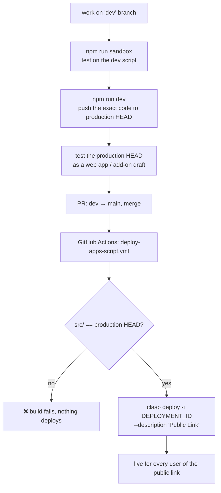
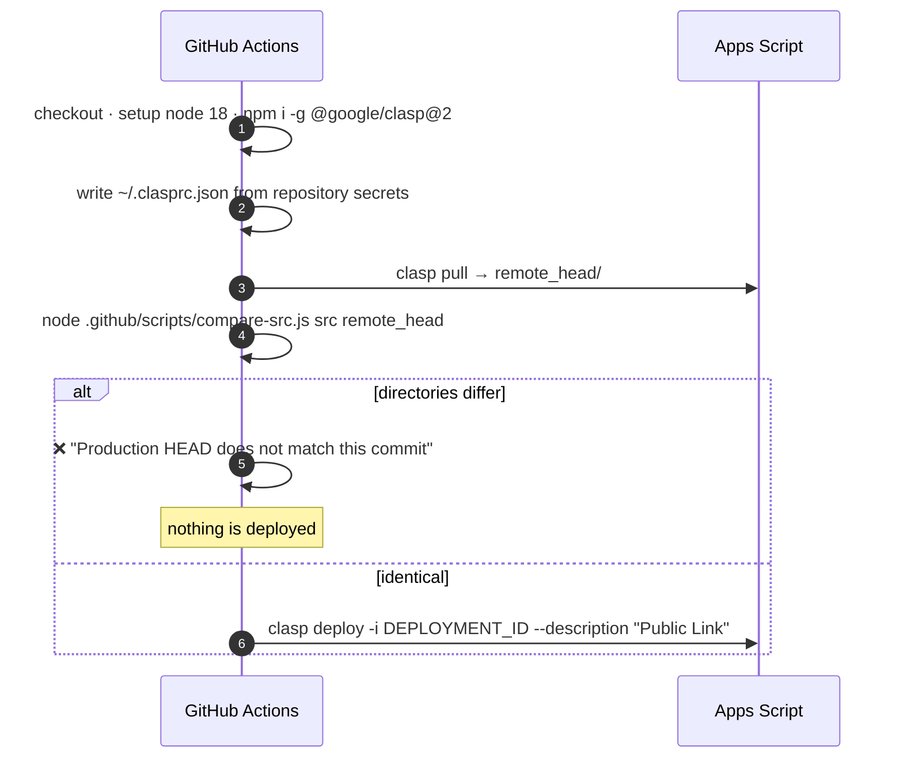
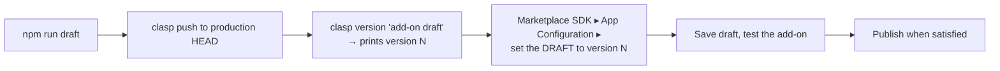
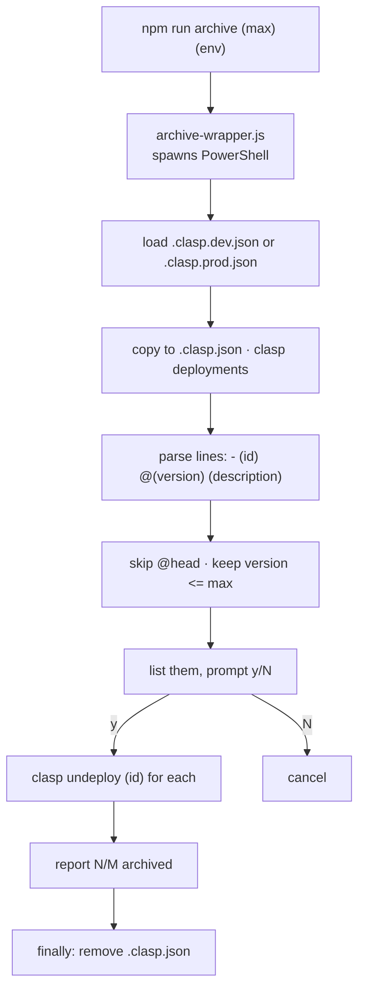

# 07 — Deployment & operations

Two Apps Script projects, one repository, and a CI guard whose whole purpose is
to make sure the code that ships is the code that was tested.

- [Environments](#environments)
- [Local setup](#local-setup)
- [npm scripts](#npm-scripts)
- [The release path](#the-release-path)
- [The CI guard](#the-ci-guard)
- [Add-on releases](#add-on-releases)
- [Archiving deployments](#archiving-deployments)
- [Project configuration](#project-configuration)
- [Troubleshooting](#troubleshooting)

---

## Environments

| | Dev / sandbox | Production |
| --- | --- | --- |
| Config file | `.clasp.dev.json` | `.clasp.prod.json` |
| Script ID | `1oXmFuPujfTMoJznzG6rAUG8vgwIoJttQdoagwnHlhcf9gmv1X8XCinhE` | `14cE_sgi8iyYjUKQlgjoCPYISUjP_BMndZbWYX2YY7A4cDNXcOqxOxgKL` |
| GCP project | `832137601831` | `1031925368251` |
| Pushed by | `npm run sandbox` | `npm run dev` / `npm run draft` |
| Deployed by | manual | GitHub Actions on `main` |

Both configs share the same shape: `rootDir: "src"`, `.js`/`.gs` as script
extensions, `.html` and `.json` passed through, and an empty `filePushOrder`
(Apps Script concatenates all `.js` files, so declaration order does not matter
for the `const` module objects).

`.clasp.json` — the file clasp actually reads — is **git-ignored and
transient**. Every npm script copies the right config into place, runs clasp,
and deletes it again.

---

## Local setup

```bash
npm install      # @google/clasp ^2.4.2
clasp login      # once; writes ~/.clasprc.json
```

The account you log in with must have edit access to whichever script project
you intend to push to.

Two **Script Properties** must exist on each Apps Script project or the Google
Picker will not initialise:

| Property | Purpose |
| --- | --- |
| `API_KEY` | Picker developer key |
| `APP_ID` | Picker app (GCP project number) |

Set them under *Project Settings ▸ Script Properties* in the Apps Script editor.

---

## npm scripts

| Command | What it does |
| --- | --- |
| `npm run sandbox` | Copy `.clasp.dev.json` → `.clasp.json`, `clasp push` (auto-confirmed), remove `.clasp.json`. |
| `npm run dev` | Same, against **production**. Pushes to HEAD only — live users are unaffected until a deployment is cut. |
| `npm run draft` | `npm run dev` + `clasp version "add-on draft"`, then prints a reminder to point the Marketplace SDK draft at the new version. |
| `npm run archive <version> [dev\|prod]` | `archive-wrapper.js` → `archive-deployments.ps1`; archives every deployment at or below `<version>`. |

All four shell out to PowerShell, so on Windows they work as-is; on other
platforms `pwsh` must be on `PATH`.

> **`npm run dev` pushes to production.** The naming is inherited. It is safe —
> pushing changes HEAD, not the published deployment — but it is not a sandbox.
> For that, use `npm run sandbox`.

---

## The release path



The invariant: **`main` may only be merged with code that has already been
pushed to production HEAD and tested there.** CI enforces it rather than
trusting the process.

---

## The CI guard

[deploy-apps-script.yml](../.github/workflows/deploy-apps-script.yml) runs on
every push to `main`. It never pushes code — it deploys what is already there.



### `compare-src.js`

Compares only the extensions clasp manages — `.js`, `.gs`, `.html`, `.json` —
and normalises away differences clasp itself introduces on a round trip:

| Normalisation | Reason |
| --- | --- |
| `\r\n` → `\n` | Windows checkouts vs. clasp output |
| Strip trailing whitespace per line, and at EOF | clasp reformats |
| JSON compared **structurally** with sorted keys | Apps Script reorders and reindents `appsscript.json` |

Output is a per-file diff summary:

```
Branch source and project HEAD are NOT identical:
  ~ differs:              11_Modules.js
  - only on branch:       18_NewThing.js
```

### Required secrets

| Secret | Purpose |
| --- | --- |
| `CLASP_REFRESH_TOKEN` | OAuth refresh token for the deploying account |
| `CLASP_CLIENT_ID` | OAuth client ID |
| `CLASP_CLIENT_SECRET` | OAuth client secret |
| `DEPLOYMENT_ID` | The **existing** deployment to redeploy — the public link's ID |

Redeploying an existing ID rather than creating a new one is what keeps the
public web-app URL stable across releases.

---

## Add-on releases

The Sheets add-on is published through the Google Workspace Marketplace SDK,
which pins a **version number**, not HEAD. So an add-on release is a separate,
manual step:



The script prints the reminder itself:

> *"Now set the add-on DRAFT config (Marketplace SDK) to the version number
> above, save the draft, and test."*

The web app and the add-on can therefore be on different versions at the same
time — the web app follows the deployment CI redeploys, the add-on follows
whichever version the Marketplace draft/published config points at.

---

## Archiving deployments

Versions accumulate. `archive-deployments.ps1` bulk-archives old ones via
`clasp undeploy` (archived, not deleted).

```bash
npm run archive 35          # dev, everything at or below v35
npm run archive 35 prod     # production
```



The `@head` pseudo-deployment is always skipped, and the currently published
`DEPLOYMENT_ID` should be kept — archiving it would break the public link.

---

## Project configuration

`src/appsscript.json`:

```json
{
  "timeZone": "Europe/Berlin",
  "runtimeVersion": "V8",
  "dependencies": {
    "enabledAdvancedServices": [
      { "userSymbol": "Drive",  "version": "v3", "serviceId": "drive"  },
      { "userSymbol": "Sheets", "version": "v4", "serviceId": "sheets" }
    ]
  },
  "oauthScopes": [
    "openid",
    "https://www.googleapis.com/auth/userinfo.email",
    "https://www.googleapis.com/auth/drive.file",
    "https://www.googleapis.com/auth/spreadsheets.currentonly",
    "https://www.googleapis.com/auth/script.container.ui"
  ],
  "webapp": { "executeAs": "USER_ACCESSING", "access": "ANYONE" }
}
```

| Setting | Consequence |
| --- | --- |
| `executeAs: USER_ACCESSING` | The script runs as the visitor, using *their* Drive quota and permissions. It can never touch a file the visitor cannot. |
| `access: ANYONE` | No sign-in wall on the web app, but every visitor still goes through the OAuth consent flow. |
| `drive.file` | Per-file access only — the reason for the Picker cycle everywhere. |
| Advanced services | `Drive` v3 and `Sheets` v4 must also be enabled in the GCP project, not just declared here. |

Adding a scope invalidates every existing user's authorization — they will be
re-prompted on next use. It is the single most disruptive change that can be
made to this file.

---

## Troubleshooting

| Symptom | Cause | Fix |
| --- | --- | --- |
| CI: *"Production HEAD does not match this commit"* | `main` contains code never pushed to production | `git checkout main && npm run dev`, retest, re-run the workflow |
| CI: `~ differs: <file>` for a file you did not touch | Someone edited that file in the Apps Script editor | Pull it down (`clasp pull`), reconcile, commit |
| Picker never appears; "Initialization error" | `API_KEY` / `APP_ID` script properties missing or wrong | Set them in *Project Settings ▸ Script Properties* |
| "Additional permissions are required" loop | Scopes changed since the user last authorized | Expected once; the consent flow re-prompts. If it repeats, check that `drive.file` is still declared |
| `Drive is not defined` / `Sheets is not defined` | Advanced service not enabled in the GCP project | Enable Drive API v3 and Sheets API v4 |
| `npm run *` fails on macOS/Linux | Scripts invoke `powershell` | Install `pwsh`, or run the clasp commands by hand |
| Deployed but users see the old version | A new deployment was created instead of redeploying `DEPLOYMENT_ID` | Redeploy the existing ID; the public link is bound to it |
| Add-on shows old behaviour after a deploy | The Marketplace config points at a pinned version | `npm run draft`, then repoint the SDK config |
