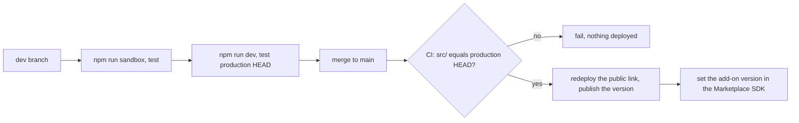

# 07 — Deployment

Two Apps Script projects and a CI guard that ships only code already tested on production HEAD.

## Environments

| | Dev / sandbox | Production |
| --- | --- | --- |
| clasp config | `.clasp.dev.json` | `.clasp.prod.json` |
| GCP project | `832137601831` | `1031925368251` |
| Pushed by | `npm run sandbox` | `npm run dev` / `npm run draft` |
| Deployed by | by hand | GitHub Actions on `main` |

The npm scripts copy the right config to `.clasp.json` (git-ignored), run clasp and delete it.
clasp pushes all of `src/`, subfolders included.

## Setup

```bash
npm install
clasp login      # an account with edit access to the project you push to
```

Script properties on each project:

| Property | Purpose |
| --- | --- |
| `API_KEY`, `APP_ID` | Google Picker — required |
| `LATEST_APP_VERSION`, `MINIMUM_APP_VERSION` | Newest release and oldest supported one — written by CI |

## Commands

| Command | Does |
| --- | --- |
| `npm run check` | Local checks — see [CLAUDE.md](../CLAUDE.md#commands) |
| `npm run sandbox` | Push to the dev project |
| `npm run dev` | Push to **production HEAD** — live users are unaffected until a deploy |
| `npm run draft` | `dev`, then cut a version for the add-on draft |
| `npm run bump <major\|minor\|patch> [min] [no-push]` | Bump the version, optionally raise the supported floor, then `dev` |
| `npm run archive <version> [dev\|prod]` | Archive every deployment at or below a version (asks first) |

`sandbox`, `dev`, `draft` and `archive` run PowerShell (`pwsh` elsewhere than Windows).

## Versioning

The running version lives in `src/server/core/app_version.js`. `npm run bump` reads it by evaluating
the file, writes the new version (and floor, with `min`), checks the result evaluates, and restores
the file if anything fails. It commits nothing.

| Running version | User sees |
| --- | --- |
| at or above latest | nothing |
| below latest, at or above the floor | on an error, a note that an update may fix it |
| below the floor | a banner on load asking them to update |

After a successful deploy, CI runs `setLatestAppVersion`, which publishes the shipped version and
floor to the script properties. To publish by hand: re-run the job, run the **Test Apps Script run**
workflow with `setLatestAppVersion`, or run it from the Apps Script editor.

## Release path


```mermaid
flowchart LR
    A["dev branch"] --> B["npm run sandbox, test"]
    B --> C["npm run dev, test production HEAD"]
    C --> D["merge to main"]
    D --> E{"CI: src/ equals production HEAD?"}
    E -->|no| F["fail, nothing deployed"]
    E -->|yes| G["redeploy the public link, publish the version"]
    G --> H["set the add-on version in the Marketplace SDK"]
```

## The CI guard

`deploy-apps-script.yml` runs on every push to `main`. It never pushes code: it pulls production
HEAD, compares it with `src/` (`.github/scripts/compare-src.js` ignores line endings, trailing
whitespace and JSON key order), and only when they match redeploys the existing `DEPLOYMENT_ID` —
keeping the public URL stable — then runs `setLatestAppVersion` through
`.github/scripts/run-function.js`.

| Secret | Purpose |
| --- | --- |
| `CLASP_REFRESH_TOKEN`, `CLASP_CLIENT_ID`, `CLASP_CLIENT_SECRET` | clasp: pull and deploy |
| `DEPLOYMENT_ID` | The public link's deployment |
| `RUN_REFRESH_TOKEN`, `RUN_CLIENT_ID`, `RUN_CLIENT_SECRET` | Apps Script API calls |

The `RUN_*` credential must come from an OAuth client in the production GCP project and carry every
scope in `appsscript.json`: `clasp login --creds client_secret.json --use-project-scopes`, then copy
the values from `~/.clasprc.json` and run `clasp login` again for normal use. The production project
also needs the Apps Script API enabled and `executionApi` in the manifest.

## Add-on releases

The Marketplace SDK pins a version number, not HEAD. CI prints the new version in the job summary;
set it under *Marketplace SDK ▸ App Configuration* and publish. The web app and add-on can run
different versions until then.

## Manifest

`src/appsscript.json` runs the web app as the visiting user, open to anyone (each still goes through
consent), with the Drive v3 and Sheets v4 advanced services (also enable them in the GCP project).
`drive.file` limits access to files the user picks. Adding a scope re-prompts every user.

## Troubleshooting

| Symptom | Fix |
| --- | --- |
| CI: "Production HEAD does not match this commit" | `npm run dev` from `main`, retest, re-run the job |
| CI: a file you did not touch differs | Someone edited it in the Apps Script editor — pull, reconcile, commit |
| Picker never appears | Set `API_KEY` / `APP_ID` |
| `Drive` / `Sheets is not defined` | Enable Drive v3 and Sheets v4 in the GCP project |
| Users still see the old version | Redeploy the existing `DEPLOYMENT_ID`, not a new deployment |
| Add-on shows old behaviour | Set the Marketplace version from the job summary |
| CI: "Apps Script API has not been used…" | Enable it on the GCP project, wait, re-run |
| CI: `invalid_grant` | Re-mint the `RUN_*` credential |
| Error Reporting stays empty | Enable the Error Reporting API |
