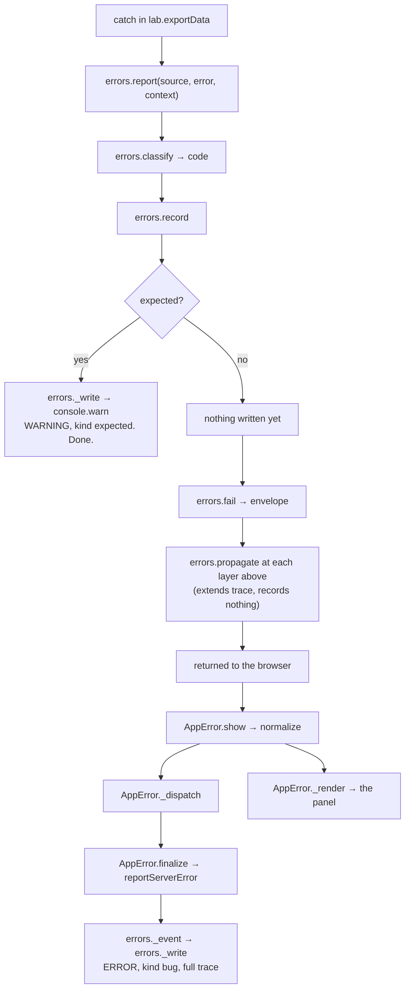

# 08 — Error handling & reporting

One path from a thrown exception to a line in Cloud Logging and a message the
user can act on. Every backend `catch` and every precondition the code checks
goes through it, and every page renders the result the same way.

**Files**

| | |
| --- | --- |
| Backend | [00_Errors.js](../src/00_Errors.js) — the `errors` object, plus the two client-callable intake functions |
| Frontend logic | [22_error_scripts.html](../src/22_error_scripts.html) — `AppError` and `runAppsScript` |
| Panel markup | [22_error_section.html](../src/22_error_section.html) |
| Panel styles | [22_error_styles.html](../src/22_error_styles.html) |

The three frontend files are included by every page:
[20_WebApp.html](../src/20_WebApp.html),
[20_getStartedApp.html](../src/20_getStartedApp.html),
[20_SavedFileApp.html](../src/20_SavedFileApp.html) and
[29_addon_consent_dialog.html](../src/29_addon_consent_dialog.html).

- [Two kinds of failure](#two-kinds-of-failure)
- [Backend API](#backend-api)
- [The envelope](#the-envelope)
- [Frontend API](#frontend-api)
- [How a failure travels](#how-a-failure-travels)
- [Where each workflow reports](#where-each-workflow-reports)
- [Codes](#codes)
- [Google Cloud](#google-cloud)
- [Runbook](#runbook)
- [Conventions](#conventions)

---

## Two kinds of failure

The error **code** decides everything else. Nothing else is consulted.

| | EXPECTED | BUG |
| --- | --- | --- |
| What it is | The app working as designed on input it cannot accept | Something we got wrong |
| Examples | Sheet too old to convert · file never granted · Google rate-limiting the account · a mistyped link | A range that should have been there · an unclassified exception · a browser crash |
| Severity | `WARNING` | `ERROR` |
| Error Reporting | No | Yes, with a stack |
| Reference shown | No | Yes, with a copy button |
| Panel | ⚠️ amber | ⛔ red |

The expected codes live in one object, `errors.EXPECTED`, mirrored in
`AppError.EXPECTED` on the client.

Every entry carries `jsonPayload.kind`, matching that split:

| `kind` | Severity | Reference | Error Reporting | Written by |
| --- | --- | --- | --- | --- |
| `expected` | `WARNING` | none | no | `errors.record`, immediately |
| `bug` | `ERROR` | `TWR-…` | yes | `reportServerError`, on the browser's round trip |

### `RECOVERED`

An expected code for a `catch` that logs and then carries on — a cache that
would not open, an optional cleanup step, a name update that did not take. The
script took another route, so nothing is returned and nothing reaches the user;
the `WARNING` exists only so we can look, if we ever need to.

Pass it explicitly. Left to `errors.classify`, an exception it does not
recognise lands on `INTERNAL`, which is a bug code — and a bug that is never
returned is never written, because a bug's entry waits for a browser round trip
that is not coming. The explicit code is what guarantees the entry.

`propagate` will borrow a recovered failure's `detail`, `trace`, `note` and
`data` — that is how a later failure gets the full picture of what went wrong
underneath it — but never its `code`. `RECOVERED` describes the moment the
script carried on, not whatever failed afterwards.

---

## Backend API

`errors` in [00_Errors.js](../src/00_Errors.js).

| Call | Use when |
| --- | --- |
| `errors.report(source, error, context?, code?)` | Any `catch`. Classifies the exception and records it. |
| `errors.fail(report, message?, extra?)` | Turn what `report` returned into the client envelope. |
| `errors.reject(source, code, message, extra?, context?)` | A precondition **you** checked — no exception behind it. |
| `errors.propagate(source, inner, message?, extra?)` | An inner call already failed and you are passing it on. |
| `errors.report(source, error, context, errors.CODES.RECOVERED)` | A `catch` that logs and carries on, returning no envelope. |
| `errors.snapshot(value, …)` | Rarely called directly; `report` and `reject` run it over `context`. |

Supporting members: `classify`, `text`, `stack`, `record`, `_event`, `_write`,
`reference`, `userKey`, `version`, `budget`, `isExpected`.

Two client-callable intake functions sit outside the object:
`reportClientError(payload)` and `reportServerError(payload)`.

### What `context` may hold

Anything: the function's own parameters, whatever it had computed. Every value
runs through `errors.snapshot` first, so raw locals are safe to pass.

| Cap | Value |
| --- | --- |
| Depth | 6 levels of containers |
| Breadth | 10 array items, 25 object keys |
| Strings | 300 characters |
| Whole entry | 5000 values, 100 000 characters, shared across one `record` |

Scalars are never refused — only containers — so a short value late in a large
context still reaches the log. `note` is the one reserved key: what the code was
doing, in words. Never pass a raw email; `errors.userKey()` already identifies
the user as a truncated hash.

---

## The envelope

Every server function returns this on failure. No server function throws across
the boundary.

```javascript
{
  success: false,
  code: "SHEET_STRUCTURE",
  expected: false,
  message: "Cards: Could not read required data from spreadsheet",
  reference: "TWR-M4X2K9-A7F3",   // "" when expected
  detail: "API call to sheets.spreadsheets.values.batchGet failed with error: …",
  trace: ["SheetsAPI.batchGetValues", "importData"],
  // bugs only, carried so the browser can hand them back for logging:
  note: "…", data: { … }, stack: "…",
}
```

`detail` and `trace` belong to the layer that actually failed, not to whichever
layer wrote the message. `propagate` carries both outward untouched and appends
its own frame. `message` is for the person in the sidebar; `detail` shows only
behind *Technical details*.

Callers add fields with `extra` — `collection: true`, `accessible: false`, and
similar.

---

## Frontend API

`AppError` in [22_error_scripts.html](../src/22_error_scripts.html).

| Call | Use when |
| --- | --- |
| `AppError.show(raw, { source, message?, actions? })` | A failed envelope, an `Error`, or a string. |
| `AppError.showAll(rawList, { source, message?, label? })` | Several failures at once, each with its own row and reference. |
| `AppError.surfaceBatch(entries, { source })` | A per-sheet failure list: panel for the first bug, an entry for every bug. |
| `AppError.check(result, source)` | Show if failed; returns `true` when it did. |
| `AppError.log(raw, source)` | Record it, do not interrupt the user. |
| `AppError.clear()` | Retire the panel. `setStatusWithSpinner` calls this. |
| `runAppsScript(method, …args)` | The one way to call the server. Rejects with a normalised error. |

`AppError.normalize` turns any of those inputs into one shape and is
idempotent — normalising an already-normalised error extends its trace instead
of reclassifying it.

`window.onerror` and `unhandledrejection` are wired in. Cross-origin
`"Script error."` is ignored, since it carries nothing to report.

---

## How a failure travels

### A caught exception in a sheet module



A bug's entry is written on that round trip, not at the `catch`, because the
`trace` is not complete until the failure stops moving. The cost: if the tab
closes before `reportServerError` lands, there is no entry at all.

### A precondition the code checks itself

`errors.reject` → `errors.record` → same split as above. An expected reject is
written immediately and its `note` and `data` stay server-side; a bug reject
rides out to the browser like a caught exception.

### A failure the script recovers from

`errors.report(source, error, context, errors.CODES.RECOVERED)` →
`errors.record` → `errors._write`. Written on the spot as a `WARNING`, with no
reference and no envelope, because the script carried on. It stays in
`errors._last*`, so if the request does fail later, `propagate` picks up its
`detail` and `trace` and the eventual entry shows what went wrong underneath.

### A browser-side failure

`AppError.show` → `_dispatch` → `AppError.report` → `reportClientError`, which
logs under `serviceContext.service = "the-tower-app-script-client"`.

### Throttling

`_throttleReference` collapses identical failures — same source, same detail —
to one entry per user per 5 minutes, and hands later callers the reference of
the entry that *was* written so the panel never shows an id with nothing behind
it.

---

## Where each workflow reports

| Workflow | File | Function | Raises |
| --- | --- | --- | --- |
| Update sheets — import/export | [25_fileAccess_scripts.html](../src/25_fileAccess_scripts.html) | `surfaceFailureIfBug` | `AppError.surfaceBatch` |
| Update sheets — template copy | [21_shared_scripts.html](../src/21_shared_scripts.html) | `proceedWithTemplateCopying` | `AppError.surfaceBatch` |
| Update sheets — master + subsheets | [21_shared_scripts.html](../src/21_shared_scripts.html) | `proceedWithCombinedUpdate` | `AppError.surfaceBatch` |
| Get Started | [23_getStarted_scripts.html](../src/23_getStarted_scripts.html) | `renderGetStartedCopyResult` | `AppError.surfaceBatch` |
| Save-file parse | [28_saveFile_scripts.html](../src/28_saveFile_scripts.html) | `renderSaveFileParseFailures` | `AppError.showAll` |

The per-sheet lists these render are the record of what happened to each sheet
and show no references. `surfaceBatch` puts the panel up for the first failure
that is a bug and still logs the others — a failure it skipped would otherwise
never be written, since a bug's entry depends on the browser handing it back.

Each failure entry must carry its `envelope`; without it there is no code and
no reference to report.

---

## Codes

| Code | Kind | Raised when | What the user is told |
| --- | :-: | --- | --- |
| `ACCESS_DENIED` | expected | Drive/Sheets refused, or a file was never granted | Grant access and try again |
| `NOT_FOUND` | expected | The file is gone, or was never shared | The sheet could not be opened |
| `INVALID_LINK` | expected | What the user typed is not a sheet link or ID | Check the link and try again |
| `INVALID_FILE` | expected | The picked file is not a valid `playerInfo.dat` | Check you picked the right file |
| `QUOTA` | expected | Google is rate-limiting the account | Wait and retry |
| `TIMEOUT` | expected | Execution time exceeded | Try fewer sheets at once |
| `VERSION_OUTDATED` | expected | The sheet is too old for this template | What the call site says |
| `RECOVERED` | expected | A `catch` logged it and the script carried on | Nothing — it never reaches the user |
| `INVALID_INPUT` | **bug** | A required parameter never arrived | Reload and try again |
| `SHEET_STRUCTURE` | **bug** | A tab or label the code scans for is not there | Could not find something it needs |
| `CLIENT` | **bug** | Reported from the browser | Something went wrong in the page |
| `INTERNAL` | **bug** | Anything unclassified | Something went wrong on our side |

`INVALID_INPUT` and `SHEET_STRUCTURE` sit on the bug side because both are also
how a regression in our own label scanning shows up, and only the log can tell
that apart from a user editing their sheet.

### Classification

`errors.classify` matches Google's wording. Sheets throws the same exception
class for a bad range and a quota, and the text is what separates them:

| Failure | What comes back | Code |
| --- | --- | --- |
| Range/tab does not exist | 400 `Unable to parse range: …` | `SHEET_STRUCTURE` |
| Read quota | 429 `Quota exceeded for quota metric …` | `QUOTA` |
| Per-user rate limit | 429 `User rate limit exceeded` | `QUOTA` |
| Apps Script daily cap | `Service invoked too many times for one day` | `QUOTA` |

`NOT_FOUND` matching is deliberately narrow — only Drive's and Sheets'
file-level phrasings — because a bare "not found" also matches our own
"IDS sheet not found" wording, and a missing tab is a defect.

Pass the code explicitly where the `catch` is one of the answers the function
was called to give. `checkSheetAccess`, `checkTemplateAccess` and
`checkScopePermissions` pass `ACCESS_DENIED`; `deleteOldSheet` passes
`NOT_FOUND`.

### Never tell the user to update their sheet

Updating sheets is what this app **is**. `MESSAGES.VERSION_OUTDATED` says only
*"That sheet is not a version this step can work with"*, and every call site
that knows more says it itself. The save-file workflow is the one place where
"update it first" is genuine advice, and it gives that through
`renderSaveFileOutdatedSheets` and `renderSaveFileCollectionOutdated` without
raising anything.

---

## Google Cloud

Both script projects are attached to standard GCP projects:

| | Dev / sandbox | Production |
| --- | --- | --- |
| GCP project | `832137601831` | `1031925368251` |

### The entry

`errors._event` builds it; `errors._write` emits it.

```javascript
{
  "@type": "type.googleapis.com/google.devtools.clouderrorreporting.v1beta1.ReportedErrorEvent",
  message: "<the stack trace>",
  serviceContext: { service: "the-tower-app-script", version: "<APP_VERSION>" },
  context: { reportLocation: { functionName: "SheetsAPI.batchGetValues" }, user: "<hashed>" },
  reference: "TWR-…",                  // "" when expected
  source: "SheetsAPI.batchGetValues",  // trace[0], the deepest frame
  code: "SHEET_STRUCTURE",
  expected: false,
  kind: "bug",                         // "expected" | "bug"
  detail: "…",                         // the exception text, or the reject's reason
  trace: ["SheetsAPI.batchGetValues", "importData", "importAllData"],
  note: "…",                           // only when the call site passed one
  data: { sheetID: "1aBcD" },          // only when the call site passed one
}
```

Three things are load-bearing:

1. **Severity ERROR.** `console.error` maps to it; `console.log` does not.
2. **A stack trace in `message`, with a non-empty first line.** Events without
   one are dropped, and the first line is what Error Reporting names the group.
   `errors.text` and `errors.stack` both guard this — do not simplify either.
3. **`serviceContext.version`**, read from the `APP_VERSION` script property, so
   a regression can be attributed to a release. It falls back to
   `"unversioned"`.

### One-time setup per project

1. Enable the **Error Reporting API**.
2. Grant whoever is on call *Error Reporting Viewer* and *Logs Viewer*.
3. Logging ▸ Log-based metrics ▸ Create:
   - Name `app_script_errors`, type Counter
   - Filter `severity>=ERROR AND jsonPayload.code!=""`
   - Labels `code`, `source` and `kind` from the matching `jsonPayload` fields
4. Monitoring ▸ Alerting ▸ Create policy on `app_script_errors`, grouped by
   `code` and `kind`, above ~10 in 5 minutes.

### Privacy

- Never pass a raw email. `errors.userKey()` is an MD5 truncated to 12 hex
  characters — enough to count affected users, not to identify one.
- Don't reach for a password, token or payment detail because it happened to be
  in scope. Nothing here holds any today; the rule outlives the code.
- Cloud Logging access is scoped by the GCP project's IAM. The access list on
  the project is the real privacy boundary.
- For a **bug**, `note`, `data` and `detail` transit the browser on their way to
  being logged. For an expected outcome they never leave the server.

---

## Runbook

**A user quotes a reference**

```
jsonPayload.reference="TWR-M4X2K9-A7F3"
```

**By kind**

```
jsonPayload.kind="expected"   the app working as designed — product signal, not a bug queue
jsonPayload.kind="bug"        our defect, the user has the reference
```

**How often, and to how many people**

```
severity>=ERROR AND jsonPayload.source="collection.importData"
```

Then group by `jsonPayload.context.user` for distinct users.

**What broke in the last release**

```
severity>=ERROR AND jsonPayload.serviceContext.version="4.2.4"
```

**Browser-side only**

```
jsonPayload.serviceContext.service="the-tower-app-script-client"
```

**Why an entry might not be there.** A bug whose round trip never completed —
closed tab, dropped connection — is not written at all. Identical failures
inside 5 minutes are one entry, and the panel shows that entry's reference.
Anything expected — `RECOVERED` included — is written server-side as it happens
and does not depend on the round trip.

---

## Conventions

| Situation | Use |
| --- | --- |
| `catch` around anything | `errors.report(source, error, context)` then `errors.fail(report)` |
| What to put in `context` | The function's own parameters, always. Add a mid-computation local when it would narrow down where things went wrong. Pass the raw value. |
| A precondition you checked yourself | `errors.reject(source, code, message)` |
| An inner call already failed | `errors.propagate(source, inner, message?)` — never `reject`, or one incident is recorded twice |
| A `catch` that is one of the answers the function was called to give | Pass the code explicitly, e.g. `errors.CODES.ACCESS_DENIED` |
| Something recovered on its own | `errors.report(source, error, context, errors.CODES.RECOVERED)` and carry on. The explicit code is what makes it a `WARNING` that is written immediately; without it an unrecognised exception classifies as `INTERNAL` and is never written at all. |
| A wrapper that reports and returns `null` for its caller to relay | `errors.report(...)` — the `null` is the handoff |
| Deciding the code | Would *we* have to change something? Then it is a bug. Add new codes to `errors.EXPECTED` and the mirror in `22_error_scripts.html`. |
| Client: a failed envelope | `AppError.show(result, { source })` |
| Client: a caught exception | `AppError.show(error, { source, message })` |
| Client: a failure the user need not see | `AppError.log(error, source)` |
| Client: a list of per-sheet failures | `AppError.surfaceBatch(entries, { source })` |

`source` is `functionName` for a top-level function and `module.method` for a
sheet-module method — 15 modules share those method names, and the qualifier is
the only thing that tells the log which one failed.

Do not write `console.log` for an error. It is INFO severity, it has no stack,
and nothing will ever alert on it.
